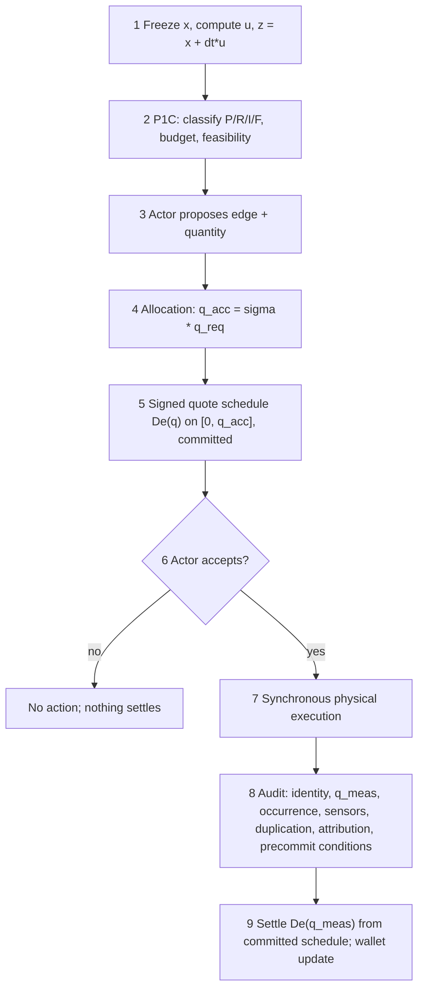

# EBP V3.0 Gate 0 — Local Signed EBU Transaction Foundation (DRAFT)

**Status: design-and-mathematics gate only.** This note formalises the original
EBU concept — a **signed, local, pre-action physical transaction signal** —
before any code is written. It implements nothing: no EBU engine, no wallet, no
market, no exchange, no actor economy, no experiment, no PDF, no release, no
repository reorganisation. Baseline: released tag `v2.9.0`
(peeled commit `e1c6000f7b050e56e6fd0aa4b23e56c5d9e641d0`); the repository is
the authoritative source, and no released artifact is modified by this gate.

Epistemic labels are strict and load-bearing: **Definition / Lemma / Theorem /
Proposition / Proof / Proof sketch / Observation / Counterexample / Candidate
design / Hypothesis / Open problem / Non-claim.** Worked numerical examples are
illustrations of derived algebra, never proof.

Author context: independent research project; not peer reviewed.

---

## 1. Plain-language purpose

The Energy Balance Project has, as of V2.9, an honest physical substrate (the
synchronous loss-aware D0 law, `d0_v29.py`) and a candidate physical
preservation layer (P1C, `p1c_v29.py`) that can hold a regenerative source at
its certified reserve and report infeasible demand honestly. What it does not
yet have is the layer the project was named for: **EBU**, the transaction
signal that tells an actor, *before acting*, what a proposed physical action is
worth to the local represented world.

The idea this note formalises:

> Before an actor performs a physical action, the **present local field**
> quotes a **signed number of EBU** for it. An action that locally improves the
> represented physical state may receive a positive quote. An action that
> worsens it receives a negative quote. A neutral action is quoted
> approximately zero before unavoidable action costs. The **same equation**
> produces both signs: extraction and restoration are not governed by
> different rules — they are the two signs of one local valuation.

The quote is computed from present, local, declared data only. It is an
*offer*, cryptographically or procedurally committed before execution. After
execution, an audit verifies that the declared action physically happened as
declared; settlement then pays out the *already-committed* quote (or the
corresponding point of an already-committed quote schedule). The audit never
invents a new valuation after seeing the outcome.

This gate derives the candidate quote equation, audits its units, proves what
can be proved about it (no reward for natural regeneration, no perpetual
reward from cycles, under stated assumptions), exhibits where it can fail, and
registers everything else as labelled open problems.

---

## 2. Relationship to the original EBP/EBU concept

The original concept (restated from the project's stated objective hierarchy,
`V2.9_OBJECTIVE_ALIGNMENT_DRAFT.md` §1, and constrained by guardrails G1/G2):

1. EBU is a **physical transaction signal**, not money-first: it prices the
   local physical consequence of a represented action.
2. It is **pre-action**: the actor receives the quote before accepting or
   performing the action, and can accept, reject, or redesign.
3. It is **local**: computed from the permitted local field only — never from
   global `V`, whole-world viability, future rollouts, or a central planner's
   after-the-fact judgement.
4. It is **signed and single-ruled**: restoration is not rewarded by a separate
   moral, political, or global rule; damage and repair are valued by the same
   equation with opposite signs.
5. It is **subordinate to physical feasibility**: a positive quote never
   authorises an action that violates the accepted local preservation budget
   (P1C). "Positive quote" and "physically permitted" are separate conditions.
6. It obeys the project's central principle: **"the consequences of the future
   must be encoded in the present field."** Where the present field cannot yet
   carry a consequence (persistent restoration, capacity repair), this note
   says so explicitly instead of smuggling in a rollout (§7.4).

This note deliberately does **not** treat any earlier EBU ledger (V2.2–V2.6)
as the final V3.0 architecture. Those ledgers are evidence — §3 reconstructs
what they attempted, what they got right, and where they were broken.

---

## 3. Reconstruction of the prior record

### 3.1 What V2.8 proves

For **Model D0** — the synchronous, frozen-state, unconstrained, loss-aware
explicit-Euler law `x^{n+1} = x^n + Δt(u(x^n) + S J(x^n))` with the loss-aware
force `f_e = μ_i − η_e μ_j` and Onsager flux `J_e = M_e[f_e − θ_e]₊` — V2.8
proves (at its stated scope): the finite-step burden inequality
`V(x^{n+1}) − V(x^n) ≤ Δt μᵀu − Δt Σ_e(J_e²/M_e + θ_e J_e) + (L_V Δt²/2)‖u+SJ‖²`
(Thm 4.4/6.1), sufficient step-size bounds (Thm 5.1/5.2/5.5/5.6), the exact
stock/loss ledger `1ᵀΔx = Δt[1ᵀu − Σ(1−η_e)J_e]` (Thm 8.1), and one-tick
locality (Thm 9.1). It also proves the **loss-blind force is wrong** for
`η < 1` (Counterexample D). None of this is a statement about EBU; V2.8 §11
explicitly excludes "ledger incentives, EBU issuance" from every theorem.

### 3.2 What P1C (V2.9) preserves

P1C classifies each configured source on the frozen state into P/R/I/F,
computes the **aggregate** robust safe-export budget
`Q_max^rob = [(x−ε_x) + Δt(u−ε_u) − R_eff]₊/Δt` (A4.5), scales all outgoing
requests by one factor `σ = min(1, Q_max^rob/Q_req)`, and applies one
simultaneous update. Under the Gate-2.1B review's Theorem 4.1 (state P,
feasibility `x + Δt·u ≥ R_eff`, budget-capped aggregate export), the successor
stays at or above `R_eff` — **one step, synchronous, margin-conditional**.
Feasibility is a hypothesis, not a conclusion: in state I zero export cannot
save the boundary and P1C reports that instead of masking it. P1C is outside
the V2.8 theorem (constrained/projected law); the joint
preservation-plus-dissipation theorem is open. D9/D10 validated P1C's
behaviour deterministically (hard cap preserves where soft χ and unconstrained
flow collapse); validation, never proof.

### 3.3 What V2.5/V2.6 accounting attempted

The V2.5 guarded ledger (`ebu_v25.py`) is the nearest existing analogue of an
EBU layer. Mechanisms it got **right** (each with a passing property test in
`test_v25.py`):

- **live-state telescoping credit**: `dEBU_a = [B_R(before_a) − B_R(after_a)]
  − λ_L·loss − λ_F·F_a`, issued sequentially so two actors are never paid for
  the same reduction;
- **symmetric burden-increase debit** (required so round trips and
  damage-then-repair are non-positive);
- **natural regeneration excluded**: credit is measured on the post-natural
  state, so nature's own recovery is never the actor's income;
- **transport dissipation debited** (`λ_L`), **irreversible sub-Allee
  extraction debited** (`λ_F`);
- **splitting neutral**: a split transfer telescopes to the same total;
- **observational separation**: with `selection="physics"` the physical
  trajectory is bit-identical whether the ledger runs or not.

What it got **wrong or left unresolved**:

- it is **post-hoc observational accounting**, not a pre-action quote: value
  is computed at execution time on live state, so there is no committed offer
  an audit could hold an actor to;
- it is **sequential against live state**, inheriting the multi-hop causality
  leak (V2.8 Observation 9.2) and order-dependent balances;
- its value functional `B_R` uses the **soft** reserve term, which under-prices
  irreversible harm (the penalty and its marginal vanish at the boundary);
- it is scalar over one implicit resource, with no debt/irreversibility layer.

### 3.4 Which exploits V2.5/V2.6 exposed

- **Naive-ledger exploits (V2.5, closed by "guarded")**: crediting natural
  regeneration; measuring against the fixed pre-tick field (double credit
  across actors); ignoring transport loss; ignoring reserve sacrifice.
- **The confirmed guarded exploit (V2.6, OPEN)**: deterministic red-team beam
  search over 12 randomized Allee layouts found **1 confirmed profitable
  persistent-harm exploit** (seed 0): the coalition earns **+260 guarded EBU
  while every regenerative source dies** (viability → 0%). Kept as a
  regression fixture (`test_v26.test_seed0_guarded_exploit_regression`), never
  fixed. Any V3.0 credit rule **inherits this risk until re-audited**; §8.4
  explains, in the new framework, *why* this family of exploit exists
  (drive-coupled telescoping residual + soft irreversibility pricing).

### 3.5 Which claims remain open (inherited)

Joint constrained preservation + dissipation theorem; infinite-horizon
viability kernel `K∞`; V2.7 Conjecture C-2 (constant `R_eff` dominating the
driven root); multi-source joint invariance; overdraw attribution; the
operational "verified restoration" predicate; multi-actor credit attribution;
scalarisation weights; adversarial robustness of any credit layer (V2.6
seed-0). This note adds new open problems in §16; it closes none of the above.

---

## 4. Layer separation and the information boundary

### 4.1 Six layers, strictly separated

| # | Layer | What it is | What it may write |
|---|-------|------------|-------------------|
| 1 | **Physical field** | per-cell stock `x_i` and declared local parameters; the D0/P1C update is the only writer | `x` (physics only) |
| 2 | **P1C permission** | source-local P/R/I/F classification, aggregate budget, proportional allocation — decides what is *physically permitted* | accepted quantities `q_acc` |
| 3 | **Local EBU quote** | the signed pre-action valuation (this note) — decides what an accepted action is *worth*; computed after allocation, before execution | a committed quote schedule (a record, not a state change) |
| 4 | **Physical execution** | one synchronous application of all accepted actions | `x` |
| 5 | **Verification / settlement** | post-action audit of identity, measured quantity, occurrence, sensor integrity, duplication, attribution, precommit conditions; settles the committed schedule at the measured point | transaction record finalisation; wallet entries |
| 6 | **Wallet / later exchange** | per-actor signed EBU balances (per resource account) and transfers | wallet balances only — **never** the field, never physical debt |

No layer reads upward beyond its declared inputs; layer 6 cannot influence
layers 1–4 in this design (transfers move responsibility, not physics — G2).

### 4.2 Complete list of allowed information (quote inputs)

A quote for an action at source `i` on edge `e = (i→j)` MAY use, and only use:

1. the current **permitted local field**: frozen `x_i`, `x_j` (adjacent-cell
   information already permitted by the local law — the `d0_v29.LocalView`
   boundary), and the declared local parameters of `i` and `j`
   (`α, β, χ, L, U, R, K`);
2. the **declared proposed action**: edge `e`, direction, proposed quantity
   (schedule domain);
3. the **accepted physical quantity** `q_acc` (post-P1C allocation) — the
   quote schedule's upper endpoint;
4. **local source parameters**: source type, `ρ, K, A`, declared `s, d, λ, κ`,
   the frozen local drive `u_i` (and `u_j`) computed from them;
5. **transport efficiency and physical action cost**: `η_e`, `θ_e`-class
   activation data, the declared unavoidable action-burden function `C_a(q)`;
6. the **locally stored certified reserve or threshold**: `R_i^eff` (and the
   declared margins `ε_x, ε_u`), i.e. design-time-certified constants stored
   in the present field;
7. the tick length `Δt` and the source's remaining aggregate budget (a
   source-local scalar).

### 4.3 Complete list of forbidden information

The quote MUST NOT use: global `V`; whole-world viability; any global
ecological score; **future simulation or rollout of any horizon**; the final
outcome of the economy; the realised post-action state (at quote time);
evaluation-only diagnostics; other sources' states beyond the permitted
adjacent views; any wallet balance; any price signal; an after-the-fact moral
judgement; a central planner's assessment of social value.

The audit (layer 5) MAY read measured physical facts about the executed action
(identity, measured quantity, sensor records, timestamps, duplication and
attribution evidence) and the committed schedule. It MUST NOT recompute value
under a new rule, use outcome information to change the valuation rule, or
invent a global reward after observing the outcome.

---

## 5. Formal event ordering

One accounting tick, in frozen order (extending the P1C tick order, Amendment
4 §20.6, with the quote and settlement events):

1. **Freeze** the state `x^n`; compute on-site drives `u(x^n)`; form the local
   no-action successor `z = x^n + Δt·u(x^n)` (per-cell algebra on frozen data
   — *not* a rollout, see §6.1).
2. **P1C permission**: classify every configured source (P/R/I/F); compute
   aggregate budgets `Q_max^rob`; feasibility is evaluated and reported.
3. **Proposal**: an actor declares (edge, quantity request `q_req`) — a local
   need or opportunity made explicit.
4. **Allocation**: P1C proportional scaling yields the accepted quantity
   `q_acc = σ·q_req`. Accepted quantities are physical caps, not valuations.
5. **Quote**: the signed EBU quote schedule `Δe(q)`, `q ∈ [0, q_acc]`, is
   computed from the frozen data of §4.2 and **committed** (recorded
   immutably, associated with the actor, edge, tick, and inputs).
6. **Decision**: the actor accepts, rejects, or redesigns. (A rejection wastes
   no physics; the released budget is *not* re-allocated within the same tick
   in the first model — conservative, order-free.)
7. **Execution**: all accepted actions are applied in **one synchronous
   update** `x^{n+1} = z + Δt Σ_a S_a q_a` (equivalently the A4.1/P1C update).
8. **Audit**: verify identity; measured quantity `q_meas`; that the declared
   action occurred; sensor integrity; no duplication; attribution; that the
   precommitted quote conditions held (frozen inputs within declared margins
   `ε_x, ε_u`).
9. **Settlement**: pay `Δe(q_meas)` — the corresponding point of the
   already-committed schedule (`q_meas ≤ q_acc`; a shortfall settles lower on
   the same schedule; an overshoot beyond `q_acc` is a violation, not a bigger
   payment). Wallet (Store C) updated; physical-debt accounts (Store B), when
   they exist, updated only from verified physical facts.



**Timing answers (explicit).** EBU is calculated **before** the action (event
5 precedes event 7). Verification is **an audit, not a re-valuation**: it may
select the point `q_meas` on the committed schedule; it may not create a new
rule (event 9). The quote is issued on the **accepted** quantity — after
physical permission, so a quote can never be an authorisation.

### 5.1 Quote epochs and rejection (first-model protocol semantics; Gate 1A.1)

**Candidate design 5.1 (quote epoch).** Every committed quote schedule is
bound to a **quote epoch** committing at least:

1. the equation/version identifier of the quote law;
2. the allocation-pass identifier (which P1C σ-computation produced
   `q_acc`);
3. the frozen local state used, or its deterministic commitment (hash);
4. source and destination cell identifiers;
5. the source configuration and reserve identifier (`R_eff`, margins,
   source type);
6. `Δt`;
7. `η_e`;
8. `q_req`;
9. `q_acc`;
10. the complete committed schedule `q ↦ Δe(q)` on `[0, q_acc]`;
11. the cost-function identifier (`C_a` declaration);
12. an expiration / micro-step identifier (the tick and micro-step the
    epoch is valid for).

**Frozen first-model rejection rule.** If an actor rejects after P1C
allocation (event 6):

- its action becomes zero;
- the freed capacity is **not** reallocated during that quote epoch;
- every other actor's accepted quantity and committed schedule remain
  **unchanged**;
- the unused capacity remains unused for the tick (conservative
  under-export — preservation-safe).

**Reallocation rule.** If reallocation is ever desired, it must:

- open a **new allocation pass**;
- create a **new epoch identifier**;
- **invalidate every affected old schedule**;
- compute new accepted quantities;
- commit **new schedules**;
- require **new acceptance** from every affected actor.

A rejected action must never silently cause another actor to receive a
different quantity under an old quote. **Settlement against a stale epoch
must be rejected** (with a violation record), never honoured. These are
**first-model protocol semantics, not a universal economic theorem**; they
are validated by preregistered groups Q20 (epoch invalidation) and Q12
(duplicate settlement).

---

## 6. The candidate transaction law: derivation and audit

### 6.1 Setting and the no-action baseline

**Definition 6.1 (declared local state functional).** Each cell `i` carries a
declared convex `C¹` local functional `v_i : ℝ → ℝ≥0` (in the current model the
piecewise quadratic `v_i(x) = α_i[L_i−x]₊² + β_i[x−U_i]₊² + χ_i[R_i−x]₊²`,
`d0_v29.penalty`), with marginal `μ_i = v_i'`. For a set `A` of cells,
`V_A(x) = Σ_{i∈A} v_i(x_i)`.

**Definition 6.2 (local no-action state).** From the frozen `x^n` and frozen
on-site drive `u(x^n)`:

```
z = x^n + Δt · u(x^n).
```

`z` is used **only algebraically**: it is one explicit-Euler application of
already-local, already-frozen data — exactly the same object the D0 update and
the P1C budget already use (`x + Δt·u` is the "no-export successor" of A4.4).
It is not a future rollout: no dynamics are simulated, no second tick is
evaluated, and every symbol in `z_i` is on-site frozen data.

**Definition 6.3 (accepted local action).** An accepted transfer of rate
`q ≥ 0` from source `i` to adjacent `j` over edge `e` with efficiency
`η_e ∈ [0,1]` changes the state by `Δt S_e q`, where `S_e` has `−1` at `i` and
`+η_e` at `j` (V2.8 Def 2.2):

```
Δx_i = −Δt q ,      Δx_j = +Δt η_e q .
```

`q` must already satisfy the P1C preservation allocation (`q ≤ q_acc`).

**Definition 6.4 (unavoidable action burden — corrected at Gate 1A.1 per the
independent review, §E).** `C_a : [0, q_acc] → ℝ≥0` is a declared,
non-negative, committed-before-execution function representing **only the
declared action-process burden of physically performing the action** — burden
that is *not already represented* by the physical state transition, the
source withdrawal `q`, the destination receipt `η_e q`, transport loss
already visible through the state, any local field coordinate, or the
`V_loc` finite difference. Requirements: `C_a(q) ≥ 0`; `C_a(0) = 0` for the
no-action point (a fixed activation component `c₀·1[q>0]` is permitted for
`q > 0` — see Definition 6.13a); `C_a` is declared and audited, never
negative (a negative `C_a` is a subsidy that breaks §8).

**Four-way cost classification (adopted from the Gate-1A review).** Every
candidate cost term must be classified before it may be declared:

1. **State-carried physical burden** — already represented in the state
   transition or `V_loc` (the destination's `η`-reduced relief, source
   drawdown of a regenerative or finite stock, reserve-term activation).
   **Must NOT also be subtracted through `C_a`** (source-depletion charges
   belong to the state functional now and, for finite/irreversible stocks,
   to the future debt layer `D_r` — never to `C_a`).
2. **Unrepresented action-process burden** — burden whose physical carrier
   has **no state coordinate** in `V_loc`'s arguments (the dissipated stock
   itself priced as process burden, activation work, wear on unmodelled
   equipment). **May be included in `C_a` only when it has a declared
   physical interpretation, unit calibration into B, and no corresponding
   state coordinate.**
3. **Monetary, labour, inconvenience, or time cost** — **must not silently
   become physical EBU cost**; such quantities require a separately
   justified layer (Store-C economics), never the physical transaction
   functional.
4. **Audit, fraud, or protocol penalties** — belong to the
   security/governance layer (layer 5 violation records) and **must not be
   disguised as the physical transaction functional**.

**No-double-count condition (normative).**

> No represented physical contribution may appear both inside
> `V_loc(z) − V_loc(z + Δt S_e q)` and inside `C_a(q)`. Equivalently: if a
> burden can be expressed as a `V_loc` difference under the declared (or any
> admissible extended) state functional, it is a **field** burden and is
> priced only there; `C_a` prices the **action process**, never the state
> consequence. (Validated by the preregistered negative control Q19.)

A candidate consistent with the V2.5 debits is
`C_a(q) = c₀·1[q>0] + λ_L·Δt(1−η_e)q`, with `λ_L` a declared
burden-per-stock conversion weight — the `λ_L` term is **category 2**
(the state vector has no "destroyed stock" coordinate, so pricing the
dissipated stock as process burden is not a state-difference double count).
**Open problem O9 (partially represented dissipation).** Where a dissipation
channel is *partially* represented by state coordinates, the split between
the field-priced and process-priced components must be declared explicitly;
a complete treatment of such partially represented channels is open.

### 6.2 The candidate exact signed quote

**Candidate design 6.5 (exact local signed EBU quote).** For one accepted
action `a = (e, q)` evaluated at the frozen tick data:

```
Δe_quote(q) = V_loc(z) − V_loc(z + Δt S_e q) − C_a(q)
            = [ v_i(z_i) + v_j(z_j) ]
              − [ v_i(z_i − Δt q) + v_j(z_j + Δt η_e q) ]
              − C_a(q) ,                                                (6.1)
```

where `V_loc = V_A` with `A = {i, j}` the cells the action directly affects.

**Derivation (why this form, not another).** The intended meaning is: *the
burden the represented local world avoids because this action happens, valued
against what the same world would have been without it, net of the unavoidable
burden of doing it.* Both compared states are one Euler step from the same
frozen data; they differ **only** by the actor-induced change `Δt S_e q`.
`z + Δt S_e q` is exactly the true D0/P1C successor of the affected cells
(A4.1 restricted to `{i,j}` for a single action), and `z` is exactly the
no-action successor. So (6.1) is the counterfactual difference of the actual
one-tick outcome — computed entirely from present frozen data.

**Lemma 6.6 (locality is exact, not approximate).** Because `V` is separable
and the action changes only cells `i` and `j`,

```
V_loc(z) − V_loc(z + Δt S_e q)  =  V(z) − V(z + Δt S_e q)
```

for the *global* functional `V` — every unaffected cell cancels identically.
*Proof.* Immediate from separability: `v_k(z_k)` appears in both terms for
`k ∉ {i,j}`. ∎

(The quote is therefore simultaneously honest and local: restricting to
affected cells loses nothing. For an aggregate multi-edge action of one source
the affected set is the source plus its destinations, and Lemma 6.6 holds
verbatim.)

### 6.3 Dimensional audit

Let `[stock]` be the resource unit of the field and `B` the unit of the
declared functional (`[v_i] = B`; for the quadratic form `[α_i] = B·stock⁻²`).

| quantity | units | check |
|---|---|---|
| `q` | stock·time⁻¹ | rate, matching `d0`/P1C `q_e` |
| `Δt q` | stock | argument shift of `v_i` ✓ |
| `v_i(·)`, `V_loc` | B | ✓ |
| `μ_i = v_i'` | B·stock⁻¹ | ✓ |
| `Δt q (μ_i − η μ_j)` | stock · B·stock⁻¹ = B | ✓ first-order form consistent |
| `C_a(q)` | B | must be declared in burden units ✓ |
| `Δe_quote` | **B** | EBU is denominated in units of the declared local functional |

**Observation 6.7 (what one EBU is).** One EBU is **one calibrated unit of
verified local burden reduction** — the unit of the declared state functional
`v`. It is *not* a joule and *not* a unit of stock. It becomes energy-like or
stock-like only through the declared calibration of the weights
(`α, β, χ, λ_L, c₀`), which is a per-resource-account design declaration
(§13). Within one homogeneous resource field with one declared weight set,
quotes are comparable across transactions; across resource fields they are
not, absent a separately justified conversion law (§13).

### 6.4 Exact versus first-order form

**Definition 6.8 (first-order form).** For small `Δt q`, the first-order
expansion of (6.1) at `z` is

```
Δe_lin(q) = Δt q ( μ_i(z_i) − η_e μ_j(z_j) ) − C_a(q)
          = Δt q f_e(z) − C_a(q) ,                                      (6.2)
```

with `f_e` the V2.8 loss-aware force (Def 2.3) evaluated at `z`. The quote's
marginal rate is exactly the derived thermodynamic force — the valuation layer
and the physical law price the same gradient. (Consistency check passed: the
sign convention makes moving down the η-weighted burden gradient positive.)

**Theorem 6.9 (the linear form over-quotes; the exact form does not).** Let
`ψ(q) = v_i(z_i − Δt q) + v_j(z_j + Δt η_e q)` with each `v` convex. Then for
all `q ≥ 0`:

```
Δe_quote(q) ≤ Δe_lin(q),
```

with equality iff `ψ` is affine on `[0, q]` (no penalty branch is crossed).
Moreover `q ↦ V_loc(z) − ψ(q)` is concave on `[0, q_acc]`. **Concavity of the
full schedule `Δe_quote(q)` requires, in addition, that `C_a` be convex on
`[0, q_acc]` with `C_a(0) = 0`** — non-negativity of `C_a` alone does not
suffice. In particular, the Def 6.4 candidate with a fixed activation
component `c₀·1[q>0]`, `c₀ > 0`, is **not** convex at `q = 0`: the schedule
is then concave on `(0, q_acc]` with a downward jump at `0⁺`, and not concave
on the closed interval. The inequality `Δe_quote(q) ≤ Δe_lin(q)` is unaffected
by the shape of `C_a` (both forms subtract the same `C_a(q)`).

*Proof.* `ψ` is a sum of convex functions composed with affine maps, hence
convex, and `ψ'(0) = −Δt(μ_i(z_i) − η_e μ_j(z_j)) = −Δt f_e(z)`. Convexity
gives `ψ(q) ≥ ψ(0) + q ψ'(0)`, i.e.
`V_loc(z) − ψ(q) ≤ −q ψ'(0) = Δt q f_e(z)`. Subtract `C_a(q)` from both
sides. Concavity of `−ψ` is immediate; concavity of the full schedule adds
`−C_a` concave, i.e. `C_a` convex. ∎

**Counterexample 6.10 (first-order overshoot exploit).** Worked example E2
(§9): both cells in the flat viable band (`μ = 0`), `q = 8`, `η = 0.9`. The
linear quote is `−C = −0.08` — essentially free — while the exact quote is
`−5.52`: the transfer rams the source into deficit and the destination into
excess. A linear-quoted ledger would let an actor perform arbitrarily large
damaging moves for the price of the action cost whenever the frozen marginals
vanish, and would quote `Δt q f` **unboundedly increasing in q** on a fixed
active branch (E1: linear 15.18 vs exact 7.94) — claimed credit exceeding the
physically possible burden reduction. This is precisely the accounting-exploit
class the gate instruction warns about.

**Decision 6.11 (which form defines EBU).** The **exact finite-difference form
(6.1) defines the quote**; the first-order form (6.2) is retained only as an
analytical link to the V2.8 force and as a diagnostic. A third form considered
— the path integral of the marginal force along the action — is not distinct:

**Observation 6.12 (the exact form is the path integral).**
`∫₀^q Δt f_e(z + Δt S_e s) ds = ψ(0) − ψ(q) = V_loc(z) − V_loc(z + Δt S_e q)`.
The exact quote is the integral of the loss-aware force along the action —
options "exact" and "integral" coincide for a single action; the distinction
only matters for multi-actor allocation (§10).

**Definition 6.13 (quote schedule).** The committed object is the *function*
`q ↦ Δe_quote(q)` on `[0, q_acc]` (finitely represented: a piecewise
polynomial with breakpoints at the penalty-branch crossings of `z_i − Δt q`
and `z_j + Δt η q`, exact for the quadratic family). If the actual quantity
differs from the accepted quantity, the audit settles at `Δe_quote(q_meas)`,
a point on the committed schedule — never a new valuation rule. **Settlement
at the measured point is safe because** (i) the complete schedule was
committed before execution, (ii) the settled value is the exact
finite-difference quote evaluated at `q_meas`, and (iii) no new valuation
rule is introduced after the outcome is observed. It is *not* a consequence
of any shape property: concavity (where it holds, Thm 6.9) is a useful shape
fact for actor-side optimisation and for bounding linear interpolation of a
discretised schedule representation, and **concavity alone is not claimed to
establish any audit or anti-manipulation property**.

**Definition 6.13a (activation branch at `q = 0`; Gate 1A.1).** With a fixed
activation cost, the committed cost function is

```
C_a(0) = 0 ;      C_a(q) = c₀ + C_cont(q)  for q > 0 ,   c₀ > 0 ,
```

with `C_cont` the continuous declared part. Consequences, all binding on any
schedule representation: (i) **`q = 0` is a separate exact branch** of the
committed schedule, carried explicitly and never derived by limit; (ii) the
schedule has a **downward jump at `0⁺`** of size `c₀`; (iii) it is **not
concave on the closed interval `[0, q_acc]`**; (iv) it may be concave on
`(0, q_acc]` when `C_cont` satisfies the Theorem-6.9 assumptions (convex,
anchored); (v) **implementations must not interpolate between `q = 0` and
`q > 0` as though the schedule were continuous** — settlement at `q_meas = 0`
uses the exact zero branch, settlement at any `q_meas > 0` uses the exact
`q > 0` branch. The exact finite-difference settlement rule is unchanged and
is not weakened by any representation choice.

**Definition 6.13b (overexecution envelope; Open problem O8; Gate 1A.1).**
For `0 ≤ q_meas ≤ q_acc`, settlement at the corresponding point of the
complete schedule committed before execution is the reviewed rule and **is
not post-hoc revaluation** (the rule, the function, and the domain all
predate the outcome). For `q_meas > q_acc` the committed schedule does not
extend, and **the settlement semantics are open (O8)**. Only the minimum
fail-closed envelope is frozen:

- **no positive EBU credit** under any circumstances — the positive schedule
  is never silently extended beyond the physically accepted quantity;
- a **protocol-violation record is mandatory**;
- the **physical overdraw is reported to the physical/ecological-debt
  layer**, never absorbed by a wallet;
- **no claim is made that the settlement problem is fully solved**;
- any future **debit schedule must itself be committed before execution** —
  an after-the-fact debit formula is the same defect as an after-the-fact
  credit formula;
- **an auditor may not invent an arbitrary punishment after observing the
  result** (layer 5 verifies and settles committed objects; it never
  creates valuation).

Gate 1B implements **only** this minimum fail-closed envelope (validation
group Q9); anything richer requires a new authorised design gate.

---

## 7. Natural regeneration is not credited

### 7.1 The construction and the claim

Both compared states in (6.1) contain the **same** natural drive: `z` appears
on both sides, so sunlight, rainfall, logistic growth, and any other change
that would occur without the action is common to minuend and subtrahend.

**Proposition 7.1 (no-action neutrality; drive cancellation).** For every
drive `u` and every frozen state: (i) `Δe_quote(0) = −C_a(0) = 0` — an idle
actor earns nothing, whatever nature does; (ii) the quote depends on the drive
only through the shared baseline `z`; the drive's own burden change
`δ = V(z) − V(x^n)` never enters the quote. Formally, comparing with the
"naive" rule that quotes against the pre-tick field,

```
Δe_naive(q) := V_loc(x^n) − V_loc(x^n + Δt(u + S_e q)|_loc) − C_a(q)
             = Δe_quote(q) − δ_loc ,      δ_loc = V_loc(z) − V_loc(x^n),
```

so the naive rule mis-credits (or mis-charges) the actor by exactly the
natural term `δ_loc`, and the baseline-at-`z` rule removes it identically.

*Proof.* (i) `V_loc(z) − V_loc(z + 0) = 0`. (ii) Expand `Δe_naive` by adding
and subtracting `V_loc(z)`; the actor term reproduces (6.1) and the remainder
is `δ_loc`, independent of `q`. ∎

This is the theoretical form of the V2.5 guarded-vs-naive distinction
validated in `test_v25.test_natural_regen_not_credited` (guarded credit equals
exactly the action-only post-regeneration reduction) and of the V2.0
counterfactual precedent ("natural inflow/regen not credited to actor,
impact = 0").

**Worked check (regeneration invisible in the quote).** Logistic source
`ρ = 0.4, K = 20`, `x_i = 10`, band `[4,16]`, `Δt = 1`: `g = 2`, `z_i = 12`.
An idle actor is quoted `0` although the source grew by 2. An actor extracting
`q = 2` is quoted `v(12) − v(10) − C = 0 − C`: extracting the regeneration
increment from a healthy interior source is neutral-before-costs; the +2 of
natural growth never appears as anyone's income.

### 7.2 Proof status

Within the model of §6 — one tick, frozen drive, declared `v` — Proposition
7.1 **proves** the construction removes natural regeneration from the quote.
The statement is exact, not asymptotic. It is also strictly **per-tick
(immediate) cancellation**: the drive's effect is removed within the quoted
tick; the proposition makes no statement about an action's influence on
*future* drives (persistent capacity effects), which enter later baselines
`z` and are the subject of §7.4 / Open problem 7.2. What it does *not* cover
are the edge cases below, each of which perturbs an assumption.

### 7.3 Edge cases (each labelled)

1. **Changing external input between quote and execution.** The quote uses
   `u(x^n)` declared at freeze. If the realised drive differs, the committed
   schedule was computed on stale data. Treatment: the audit checks the
   precommit conditions within the declared margins `ε_x, ε_u` (the same
   robust-margin discipline as A4.5); within margins the schedule stands (the
   margins should be priced conservatively into `z`, i.e. quote from
   `z_rob = (x−ε_x) + Δt(u−ε_u)` for credit-side terms — **Candidate
   design**, not yet fixed); outside margins the transaction is void, never
   re-valued upward. **Residual risk: Open problem 16.O5.**
2. **Measurement delay.** Same treatment as 1 (stale `x` is an `ε_x` case).
3. **Source growth during a long action.** An action must complete within the
   tick of its quote. A longer physical process is a *sequence* of per-tick
   accepted actions, each quoted on its own frozen field; growth between ticks
   accrues to the field (enters the next `z`), never to the actor. This is a
   protocol restriction, not a theorem.
4. **Actions that enable future regeneration** (e.g. lifting an Allee source
   from below its certified reserve back above it). Priced **exactly insofar
   as the present functional encodes the future**: the reserve term
   `χ[R_eff−x]₊²` with a design-time-certified `R_eff` is the existing
   mechanism by which future regenerative risk lives in the present field
   (Gate-2.1B Observation 6.2). The quote pays the χ-term reduction *now*.
   What it does **not** pay is any stream of future benefit beyond what the
   present functional carries. See §7.4.
5. **Restoration whose effect persists over multiple ticks.** A stock-only
   functional pays once, for the stock change. If the restored thing is not
   stock but *capacity* (soil quality, `ρ`, `K`, infrastructure), the present
   field has **no coordinate that changes**, so the quote is blind to it.
   See §7.4.

### 7.4 Open problem: pricing persistent restoration in the present field

**Open problem 7.2 (persistent restoration).** The one-tick stock functional
cannot price restoration whose value is a persistent change to regenerative
*capacity* rather than to stock. Resolving this with a future rollout is
forbidden by design. **Proposed carrier (Candidate design, not adopted):**
promote the certified capacity itself to a **slow local state coordinate** —
e.g. a per-cell certified-capacity variable `k_i` (carrying capacity, or an
abstract "regenerative health" coordinate) with its own declared penalty term
`v_i^cap(k_i) = χ^cap_i [k_i^ref − k_i]₊²` in the local functional, updated
only by verified physical works (layer 5) and by slow monitoring
(re-certification). Then capacity restoration is an ordinary quotable action:
it changes a present field coordinate, the same equation (6.1) prices it, and
persistence is automatic because the coordinate persists. This follows the
project's central principle — the future consequence (a lasting regeneration
stream) is encoded as a present field property (`k_i`), certified at design
time exactly as `R_eff` is. The settlement-layer alternative (a vesting
horizon `H`, review §7.2) is a *payout-timing* device and must never become a
hidden second valuation rule. Sizing, certification, and the interaction of
`k_i` with `R_eff` are unresolved.

---

## 8. No perpetual reward

### 8.1 The telescoping identity

Consider a sequence of accepted actions `n = 0, …, N−1`, each quoted by (6.1)
on its own frozen tick data (`z^n = x^n + Δt·u(x^n)`, successor
`x^{n+1} = z^n + Δt S_n q_n`), all using the same declared functional `V`.

**Proposition 8.1 (exact driven ledger identity).** With
`δ^n := V(z^n) − V(x^n)` (the natural drive's burden change at tick `n`):

```
Σ_{n=0}^{N−1} Δe_n  =  V(x⁰) − V(x^N)  +  Σ_{n=0}^{N−1} δ^n  −  Σ_n C_n .   (8.1)
```

*Proof.* `Δe_n = V(z^n) − V(x^{n+1}) − C_n = [V(x^n) − V(x^{n+1})] + δ^n −
C_n`; sum and telescope the first bracket. (Lemma 6.6 lets every term be
computed locally.) ∎

Identity (8.1) is exact — no approximation, any `Δt`. It cleanly splits every
cumulative balance into: physical burden actually removed
(`V(x⁰) − V(x^N)`), the drive residual (`Σδ^n`), and paid action costs.

### 8.2 The no-perpetual-reward theorem (undriven case)

**Theorem 8.2 (no perpetual reward; closed cycles are non-positive).**
Assume:

- (T1) one declared functional `V = Σ v_i` with **fixed parameters**
  (including `R_eff`) throughout the sequence — the same equation for damage
  and repair;
- (T2) `u ≡ 0` on the affected cells for the duration (no natural drive
  between transactions), so `z^n = x^n`;
- (T3) one accepted action per micro-step, quoted on the live pre-action
  frozen state (the §10 first-model restriction);
- (T4) every action's realised change equals its quoted change (audit-clean:
  `q_meas = q` on the committed schedule; no hidden withdrawals);
- (T5) `C_n ≥ 0`, no re-quoting, no rewriting of earlier quotes;
- (T6) no duplication: each physical action settles exactly one quote.

Then

```
Σ_n Δe_n = V(x⁰) − V(x^N) − Σ_n C_n ,
```

and for any closed physical cycle `x^N = x⁰`:

```
Σ_n Δe_n = −Σ_n C_n ≤ 0 .
```

*Proof.* (T2) makes `δ^n = 0` in (8.1). The cycle case sets the telescoped
difference to zero; non-negativity of each `C_n` gives the bound. ∎

*Remark (scope of T3).* T3 requires globally sequential micro-steps only for
actions whose affected cell sets overlap: simultaneous accepted actions on
pairwise-disjoint `{i, j}` pairs commute and telescope unchanged, by
separability (Lemma 6.6). Shared-cell simultaneity is exactly the case
delegated to the §10 aggregate treatment; T3 is the conservative statement
that avoids it entirely.

**Corollary 8.3 (bounded issuance).** Under (T1)–(T6) — in particular the
undriven condition (T2) — **and the additional standing property `V ≥ 0`**
(true for the declared penalty family, every term of which is a non-negative
square, so `inf V ≥ 0`), cumulative net EBU issued over any sequence is at
most `V(x⁰) − inf V ≤ V(x⁰)`: a region's initial burden is a hard ceiling on
extractable EBU. There is no perpetual EBU source without physical burden
reduction. (For a functional not bounded below the bound is
`V(x⁰) − inf V`, which may be vacuous; the non-negativity is an assumption
on the declared family, not a theorem.)

Consequences covered by Theorem 8.2: a **damage → repair loop** returning to
the start nets `−ΣC ≤ 0` (worked example E3, §9); **back-and-forth transfer**
likewise; a **split action** telescopes to the same total as the unsplit
action (T3 sequences; the V2.5 splitting test is the numerical shadow of
this); a **closed local cycle** of any length is non-positive. Restoration is
rewarded only when the endpoint burden is genuinely lower than the start —
there is **no special restoration bonus**, which is exactly why telescoping
holds (a bonus term outside (6.1) would break (8.1) immediately).

### 8.3 When telescoping fails (each mechanism examined)

| Mechanism | Effect on (8.1)/Thm 8.2 | Status |
|---|---|---|
| **natural drive between transactions** | `δ^n ≠ 0`; cycles net `Σδ^n − ΣC` (Prop 8.1). See §8.4 | exact identity; exploit risk analysed below |
| **moving reserve baselines** (`R_eff` re-certified mid-sequence) | breaks T1: damage priced under one functional, repair under another; the difference is arbitrage | forbidden within an accounting epoch; re-certification must close the epoch (settle all open schedules first). **Open problem 16.O6** |
| **changing parameters** (`α, β, χ, L, U` edits) | same as above | same epoch rule |
| **different functionals for damage and repair** | destroys the identity by construction | forbidden by the single-equation principle (T1) |
| **duplicated claims** | breaks T6: one physical change settles twice | audit layer duty (identity, duplication checks) |
| **concurrent actors** (same source, same tick, independent quotes) | breaks T3; convexity makes independent frozen quotes over-issue | §10; Counterexample 10.1 |
| **simultaneous split actions** (sock puppets) | special case of the above | §10 |
| **delayed settlement** | harmless **iff** settlement is a point on the committed schedule; harmful if delay permits re-valuation | protocol rule: schedules are immutable |
| **source-to-source / multi-hop laundering** | a chain `i→j→k` inside one tick would need live-state application (breaks synchrony and locality, V2.8 Obs 9.2); in the synchronous model each hop is a separate tick and each hop pays its own `C` and its own convex damage | excluded by synchronous execution; multi-tick chains are covered by (8.1) |
| **negative or omitted action cost** | `C < 0` is a subsidy: cycles net `−ΣC > 0` | forbidden by Def 6.4; audit checks declared `C` |
| **cross-resource conversion** | converts telescoping-in-one-account into a two-account pump | forbidden absent a declared conversion law (§13) |
| **auditors rewriting an earlier quote** | retroactive re-valuation defeats precommitment | forbidden by layer 5's definition (§4.1, §5) |

### 8.4 The driven residual, and why V2.6's exploit exists

**Observation 8.4 (drive-harvest).** By Proposition 8.1, a closed physical
cycle in a *driven* field nets `Σδ^n − ΣC`. When `δ^n > 0` (the drive keeps
re-creating burden — standing demand deepening a sink's deficit), an actor
who repeatedly relieves it earns positive EBU per cycle. That is **payment
for recurring real service**, not free EBU: each tick's relief was a genuine
burden reduction at quote time, and the drive (the represented world's need)
re-created it. This is desired behaviour.

The dangerous sub-case is **self-induced drive amplification**: the actor's
own earlier action changes the sign or size of `δ^n` — e.g. pushing an Allee
source below its threshold makes regeneration negative, so the field then
deteriorates "naturally", and the actor (or coalition) harvests quotes for
relief of a decline they caused. The V2.5/V2.6 guarded ledger is a live-state
instance of exactly this algebra, and **V2.6 seed-0 is the empirical
witness**: +260 guarded EBU with all sources dead. In the present framework
the exploit decomposes into (i) the drive residual `Σδ^n` harvested across
ticks, and (ii) under-pricing of the irreversible component by the **soft**
`χ` term (whose marginal vanishes at the boundary — Observation 5.1 of the
alignment draft). The V3.0 design answers with **separation, not pricing
alone**: the P1C permission layer (hard cap, State R/I zero-export) forbids
the destructive branch physically, regardless of any quote (G1: cost is never
permission); and irreversible loss must additionally enter the (future)
irreversible debt account `D_r^irr`, which no credit offsets.

**Open problem 8.5.** Bound the drive residual `Σδ^n` harvestable by a
coalition whose actions influence `u` (through regeneration terms), under the
P1C cap. Conjecture: with all critical sources held at or above `R_eff` by
P1C, the exploit class of V2.6 seed-0 (profit while sources die) is
unreachable because the lethal trajectory is not physically permitted; the
weaker question — bounded profit from *non-lethal* self-induced oscillation —
is fully open. The V2.6 red-team harness re-targeted at the quote+P1C stack
is the registered falsification instrument (Gate 1 plan, §17).

---

## 9. Worked numerical examples

All examples: quadratic band penalty with `α = β = 1`, `L = 4`, `U = 16`,
`χ = 0` unless stated, `Δt = 1`, `u ≡ 0` (so `z = x`; §7.1 already showed a
driven example), `C_a(q) = c₀·1[q>0] + λ_L·Δt(1−η)q` with `λ_L = 0.1`,
`c₀ = 0` unless stated. Units: EBU in burden units B. (Arithmetic
machine-checked at this gate; illustrations, not proof.)

### E1 — locally beneficial transfer: positive EBU

Source `x_i = 18` (excess 2, `v_i = 4`), destination `x_j = 2` (deficit 2,
`v_j = 4`), `η = 0.9`, accepted `q = 2`.

```
before: V_loc = 4 + 4 = 8
after : x_i' = 16 (v=0),  x_j' = 2 + 1.8 = 3.8 (v = 0.2² = 0.04)
C_a    = 0.1 · (1−0.9) · 2 = 0.02
Δe_quote = 8 − 0.04 − 0.02 = +7.94   (positive: genuine local improvement)
```

First-order comparison: `μ_i = +4`, `μ_j = −4`, `f = 4 − 0.9·(−4) = 7.6`,
`Δe_lin = 15.2 − 0.02 = +15.18` — the linear form over-quotes by nearly 2×
(Theorem 6.9 in action; the transfer crosses both cells' penalty knees).

### E2 — damaging transfer: negative EBU

Both cells healthy, `x_i = x_j = 10`, `η = 0.9`, `q = 8` (an oversized move).

```
before: V_loc = 0
after : x_i' = 2 (v = 4),  x_j' = 17.2 (v = 1.2² = 1.44)
C_a    = 0.1 · 0.1 · 8 = 0.08
Δe_quote = 0 − 5.44 − 0.08 = −5.52   (negative: the action manufactures burden)
```

First-order comparison: `μ_i = μ_j = 0` ⇒ `Δe_lin = −0.08` — the linear form
calls this near-free (Counterexample 6.10). The exact form charges the full
manufactured burden. Note the P1C layer might well *permit* this action
(a State-P source with slack budget): permitted and negative are independent
(§11).

### E3 — damage followed by repair, returning to the start: net ≤ 0

`η = 1` (lossless, so the cycle can close exactly), `c₀ = 0.05` per action.
Start `x = (10, 10)`.

```
tick 1 (damage): q = 8, i→j.  x → (2, 18).
   Δe₁ = 0 − (4 + 4) − 0.05 = −8.05
tick 2 (repair): q = 8, j→i.  x → (10, 10)  (start restored exactly).
   Δe₂ = 8 − 0 − 0.05 = +7.95
net: Δe₁ + Δe₂ = −0.10 = −(C₁ + C₂) ≤ 0        (Theorem 8.2, N = 2)
```

The repair is quoted by the same equation and earns back exactly the damage
value; the actor is left holding both action costs. No bonus, no profit, and
symmetrically: an actor who *repairs first* someone else's damage is paid
positively by the very same formula — restoration needs no separate rule.

(§7.1 contains the fourth worked check — natural regeneration invisible in
the quote — and §10 contains the fifth — the split-action over-issuance
counterexample.)

---

## 10. Multiple actors and splitting

Setting: several actors request capacity from the same source `i` in one
tick. P1C already protects the **physical** aggregate (`Σ q_acc ≤ Q_max^rob`,
proportional σ). The question here is the **valuation**: how much signed EBU
each accepted action settles, without over- or under-issuing.

### 10.1 Independent per-action quotes over-issue

**Counterexample 10.1 (duplicated-credit / sock-puppet split).** `η = 1`,
`u ≡ 0`, `C ≡ 0`. Source `x_i = 18` (`v = 4`), destination `x_j = 0`
(`v = 16`); two actors each accepted `q = 2` on the same edge, each quoted
independently from the same frozen baseline:

```
each independent quote: [4 + 16] − [v(16) + v(2)] = 20 − 4 = +16 ;  sum = 32
actual joint change   : [4 + 16] − [v(14) + v(4)] = 20 − 0 = +20
over-issuance         : 32 − 20 = 12 phantom EBU
```

Both actors claim the steep first stretch of the deficit relief (and are
under-charged for joint source drawdown, by the same convexity argument
run in the other direction). One actor splitting into `k` sock puppets
multiplies the effect. **Proposition 10.2.** For convex `v`, the sum of
independent same-baseline quotes on a shared cell is always ≥ the true joint
quote on the credit side (and ≤ on the damage side): independent frozen
per-action quotes are structurally non-conservative. *Proof sketch.* For
convex `v`, increments are monotone: `v(z−a−b) − v(z−b) ≥ v(z−a) − v(z)` and
`v(z+a+b) − v(z+a) ≥ v(z+b) − v(z)`; apply per shared endpoint. ∎

### 10.2 Allocation schemes compared

Requirements, mirroring the P1C allocator audit (review §7.2): **(V-cons)**
conservativity — total settled EBU for a source-group equals the true joint
quote `V_loc(z) − V_loc(z + Δt Σ_e S_e q_e^acc) − Σ C`; **(V-split)**
split-invariance — dividing one request into several changes no one's total;
**(V-ord)** order invariance; **(V-loc)** locality — only the source, its
out-edges, and their permitted endpoint views.

| # | Scheme | V-cons | V-split | V-ord | V-loc | Cost | Verdict |
|---|--------|--------|---------|-------|-------|------|---------|
| 1 | independent per-action quotes | ✗ (Cex 10.1) | ✗ | ✓ | ✓ | trivial | **rejected** for shared sources |
| 2 | one aggregate source-group quote, distributed **proportionally to `q_acc`** | ✓ by construction | ✓ (shares are linear in q) | ✓ (frozen aggregate) | ✓ (same data P1C's σ already uses) | one extra evaluation of `V_loc` at the joint successor | **candidate default** |
| 3 | sequential marginal quotes (live state) | ✓ (telescopes) | ✓ | ✗ (first mover takes the steep marginal) | ✗ (live-state chains leak locality, V2.8 Obs 9.2) | trivial | rejected |
| 4 | Aumann–Shapley path allocation: edge `e` gets `∫₀¹ Δt q_e f_e(z + t·ΔtΣS q) dt − C_e` | ✓ | ✓ (homogeneous along the path) | ✓ | ✓ (same joint data as #2) | closed-form for piecewise quadratics, but adds branch-crossing case analysis | **registered refinement**, not required |
| 5 | one action per source per micro-step | ✓ (trivially; Thm 8.2's T3) | ✓ (splits become sequential, telescope) | ✓ | ✓ | none | **adopted for the first formal model** |

Notes. Scheme 2 differs from 4 only in how the joint value is shared when
destinations differ (proportional shares are not marginal shares); both are
conservative, so no phantom EBU is created either way — the difference is
fairness between cooperating actors, not soundness of issuance. Per the gate
instruction, the expensive-elegant option is not chosen merely for elegance:
the token calculation must stay small and local, and scheme 2 needs exactly
the data P1C's σ computation already touches.

**Decision 10.3 (first model).** The first V3.0 formal model restricts to
**one accepted action per source per micro-step** (scheme 5) — the smallest
honest case, under which Theorem 8.2 holds as stated. **Scheme 2** (aggregate
quote, proportional distribution) is registered as the candidate multi-actor
extension; its conservativity and split-invariance are proved above at the
one-source-one-tick level, but **joint multi-source, multi-tick
split-invariance and its incentive properties (does inflating `q_req` to
capture allocation share pay?) are Open problem 16.O3** — the general case is
registered, not solved.

Answers to the gate's specific hazards: *every actor claiming the complete
source improvement* — excluded by conservativity of schemes 2/4/5;
*splitting for extra EBU* — excluded by V-split (schemes 2/4/5), exhibited
against scheme 1 in Cex 10.1; *duplicated destination credit* — same;
*order-dependent balances* — excluded by V-ord (frozen aggregate; scheme 3
rejected); *independent use of the same local baseline* — the defining defect
of scheme 1.

---

## 11. Preservation-controller compatibility

P1C remains the **physical feasibility layer**; the quote is a **valuation
layer**. They are computed from the same frozen field, in the order of §5
(permission before quote), and neither implies the other:

**Observation 11.1 (positive quote ⇏ permitted).** A State-R or State-I
source has zero export budget whatever the quote says; a State-P source caps
the aggregate at `Q_max^rob`. A quote is only ever issued on the *accepted*
quantity, so by construction **a positive quote can never authorise an action
the preservation budget forbids**. Example: destination in deep deficit,
source just below `R_eff` (State R): the deficit-relief quote would be large
and positive; the permitted quantity is zero; no quote schedule with positive
domain exists.

**Observation 11.2 (permitted ⇏ positive quote).** Worked example E2: a
healthy State-P source with ample budget may be permitted to make a transfer
whose quote is strongly negative (manufacturing burden at both endpoints), or
a pointless in-band lossy move quoted `−C < 0`. P1C answers "may this
happen?"; the quote answers "is this worth doing?" — the actor's decision
(event 6) is where the two meet.

Consistency details: the quote's baseline `z = x + Δt·u` is the same
"no-export successor" P1C's feasibility condition (A4.4) evaluates; the quote
consumes `q_acc` (post-σ), so rationing automatically shrinks the quote's
domain; if an actor rejects after allocation, unused budget is *not*
re-allocated within the tick (conservative under-export — preservation-safe;
an intra-tick re-allocation round would reintroduce order dependence).

---

## 12. What is stored where

- **Local field (per cell):** stock `x_i`; declared parameters
  (`α, β, χ, L, U, R_eff, K, s, d, λ, κ, ρ, A`, source type); certified
  constants (`R_eff`, margins `ε_x, ε_u`, and — if adopted per §7.4 — the
  capacity coordinate `k_i` and its reference); nothing global, nothing
  future.
- **Transaction record (per settled action):** actor identity; edge and tick;
  the frozen inputs used (`x_i, x_j, u_i, u_j, z_i, z_j`, parameters, `η_e`,
  `Δt`); the declared `C_a`; the P1C context (state class, σ, `q_acc`); the
  **committed quote schedule**; the measured `q_meas`; audit verdicts
  (identity, occurrence, sensors, duplication, attribution, precommit
  conditions); the settled `Δe_quote(q_meas)`. Immutable once settled.
- **Wallet (per actor, per resource account):** the signed cumulative EBU
  balance and references to its transaction records. **No physical
  quantities, no debt.** Wallet operations (transfers, when they exist) touch
  wallets only.

---

## 13. Resource accounts: scalar within a field, vector across fields

**Decision 13.1 (scope of the first formal model).** V3.0's first formal
model uses **one homogeneous resource field**; within it, EBU is a scalar in
the burden unit B of that field's declared functional (Observation 6.7).
Everything in §6–§11 is stated and proved at that scope.

**For multiple resources** (carbon, water, soil, biodiversity, energy, finite
minerals), the honest object is a **vector of resource-specific EBU
accounts** — the independent review's Observation 10.1, adopted in Amendment
4 §20.11, stands unweakened. The reason is dimensional before it is ethical:
each field's burden unit B_r is calibrated by that field's declared weights;
a universal fungible scalar presupposes conversion weights `w_r` (an
ecological exchange rate) between **non-substitutable** quantities. Such a
law may exist for genuinely substitutable pairs; it must be **derived,
declared, and separately reviewed**, never introduced silently — a silent
scalarisation is exactly the cross-resource laundering channel (§8.3). This
does not reject the long-term one-token idea; it sequences it behind a
justified conversion law.

**Physical debt is not reducible by tokens.** Ecological debt `D_r` (design
target A4.9, not implemented) changes only through certified physical events:
overdraw and verified restoration. It has no term in any wallet balance.
Therefore, structurally: transferring tokens, paying another actor, working
unrelated hours, and moving EBU between wallets **cannot** reduce represented
physical debt (G2); only a represented physical action, verified at layer 5,
can. Wallet ownership (Store C) and physical debt (Store B) are different
layers with different writers (§4.1); the irreversible sub-account `D_r^irr`
is monotone and no credit reduces it.

---

## 14. Failure cases and adversarial attacks (consolidated)

| Attack | Mechanism | Defence in this design | Status |
|---|---|---|---|
| overshoot claim | linear quote grows unboundedly in `q` | exact form defines the quote (Thm 6.9, Cex 6.10) | closed at design level |
| sock-puppet split / duplicated destination credit | independent frozen quotes on a shared cell | conservative aggregate quote or one-action-per-source (Prop 10.2, Cex 10.1) | closed for one source-tick; general case O3 |
| round-trip / damage-then-repair | hoping repair pays more than damage cost | same-equation telescoping (Thm 8.2); worked E3 | closed under T1–T6 |
| drive-harvest (self-induced) | damage the drive, sell the relief | P1C hard cap forbids the lethal branch; residual bounded-profit question open (Obs 8.4) | **open (O2)**; V2.6 seed-0 is the standing witness |
| negative/omitted `C` | subsidised cycles | `C ≥ 0` declared + audited (Def 6.4) | protocol rule |
| baseline rewrite / re-quote | revalue after outcome | immutable committed schedules; audit selects a point only (§5) | protocol rule |
| parameter-change arbitrage | damage under old `R_eff`, repair under new | accounting epochs close at re-certification (§8.3) | **open (O6)** |
| multi-hop laundering in one tick | live-state chains | synchronous execution only; chains take ticks and pay per hop | closed by execution model |
| cross-resource laundering | convert accounts | vector accounts; no silent conversion law (§13) | closed by construction until a conversion law is proposed |
| wallet laundering of physical debt | pay tokens to erase debt | debt update has no wallet term (§13, G2) | closed by construction |
| phantom measurement / replay / duplication | settle twice or on false `q_meas` | layer-5 audit duties (identity, sensors, duplication) | design duty; not proved |
| allocation-share inflation | inflate `q_req` to capture share of aggregate quote | proportional shares are of a concave total; incentive analysis open | **open (O3)** |
| collusion against the audit | forged attribution | outside this note's mathematics | open (inherited, O-inh) |

---

## 15. Explicit answers to the required questions

1. **Is EBU calculated before the action?** Yes — event 5 precedes execution
   (event 7); the quote (or schedule) is committed pre-execution and the
   audit can only select a point on it.
2. **Exactly what local information is required?** The §4.2 list: frozen
   `x_i, x_j`, declared parameters of both endpoints, the declared action and
   accepted quantity, `u_i, u_j` from declared local terms, `η_e`, `C_a`,
   `R_eff` (+ margins), `Δt`, and the source's remaining aggregate budget.
   Nothing else.
3. **Is verification merely an audit, or does it recompute value?** It is an
   audit. It verifies facts (identity, `q_meas`, occurrence, sensors,
   duplication, attribution, precommit conditions) and settles the committed
   schedule at `q_meas`. It never recomputes value under a new rule (§5).
4. **Why is natural regeneration not credited?** Both compared states share
   the same no-action baseline `z`; the drive term cancels identically
   (Proposition 7.1); an idle actor is quoted exactly zero.
5. **Why can damage followed by repair not produce profit?** The same
   functional prices both signs, so the sequence telescopes:
   a closed cycle nets `−ΣC ≤ 0` (Theorem 8.2; example E3). In driven fields
   the residual is exactly the drive term (Prop 8.1), analysed in §8.4.
6. **Can splitting an action increase credit?** Not under the adopted
   schemes: sequential splits telescope (Thm 8.2), aggregate-proportional
   shares are linear in `q` (V-split). Independent frozen per-action quotes
   *would* allow it — Counterexample 10.1 — which is why they are rejected.
7. **Does positive EBU imply the action is physically permitted?** No.
   Permission is P1C's, decided before the quote exists; quotes are only
   issued on accepted quantities (Observation 11.1).
8. **Does P1C preservation imply positive EBU?** No. A permitted action can
   be quoted negative (E2) or trivially `−C` (Observation 11.2).
9. **What exactly is stored in the local field?** §12 first bullet: stock,
   declared parameters, certified constants (`R_eff`, margins, optionally the
   capacity coordinate). Present, local data only.
10. **What exactly is stored in the transaction record?** §12 second bullet:
    identities, frozen inputs, P1C context, the committed schedule,
    `q_meas`, audit verdicts, the settled amount. Immutable.
11. **What exactly is stored in a wallet?** §12 third bullet: the signed
    per-account EBU balance and provenance references — no physical
    quantities, no debt.
12. **Is EBU joules, stock, or a calibrated unit of local burden reduction?**
    The last: one EBU is one unit of the declared local functional — a
    calibrated unit of verified local burden reduction, resource-specific
    (Observation 6.7).
13. **What prevents cross-resource laundering?** Account-scoped vector EBU
    with no netting and no silent conversion law (§13); the debt update has
    no wallet term (G2).
14. **Which conclusions are proved, and which remain proposals?** See the
    register in §16: proved here are Lemma 6.6, Theorem 6.9, Observation
    6.12, Proposition 7.1, Proposition 8.1, Theorem 8.2 + Corollary 8.3,
    Proposition 10.2 (with Cex 10.1) — all within the stated one-field,
    frozen-tick model. Everything else is candidate design, hypothesis, or
    open problem.

---

## 16. Epistemic register

**Definitions:** 6.1–6.4 (functional, no-action state, accepted action,
action burden), 6.13 (quote schedule).

**Candidate designs (not adopted as truth):** 6.5 (the exact quote law
itself — the object Gate 1 must validate and attack), robust quoting from
`z_rob` (§7.3.1), capacity coordinate `k_i` (§7.4), scheme 2 aggregate
allocation (§10.2), `C_a` shape (Def 6.4, constrained at Gate 1A.1 by the
four-way classification and the normative no-double-count condition), quote
epochs with the frozen no-reallocation rejection rule and stale-epoch
invalidation (§5.1, first-model protocol semantics).

**Normative constraints adopted at Gate 1A.1 (from the independent
review):** the `C_a` no-double-count restriction (Def 6.4; Q19); the
activation-cost discontinuity treatment — `q = 0` as a separate exact
branch, downward jump at `0⁺`, no concavity on the closed interval, no
interpolation across the jump (Def 6.13a; Q7); quote-epoch semantics with
no intra-tick reallocation and mandatory stale-epoch rejection (§5.1; Q20);
the overexecution minimum fail-closed envelope with O8 open — **Gate 1B
implements only that minimum envelope** (Def 6.13b; Q9).

**Lemmas / Theorems / Propositions (proved in this note's model):**
- Lemma 6.6 — exact locality of the difference under separability.
- Theorem 6.9 — exact quote ≤ linear quote for convex `v`; schedule concave
  given additionally `C_a` convex with `C_a(0) = 0` (Gate-0.1 correction).
- Observation 6.12 — exact form = path integral of the loss-aware force.
- Proposition 7.1 — no-action neutrality; exact drive cancellation
  (natural-regeneration exclusion).
- Proposition 8.1 — exact driven ledger identity (8.1).
- Theorem 8.2 / Corollary 8.3 — no perpetual reward, closed cycles ≤ 0,
  bounded issuance, under (T1)–(T6).
- Proposition 10.2 — independent frozen quotes are non-conservative on
  shared cells.

**Counterexamples:** 6.10 (linear-form overshoot, E1/E2 numbers), 10.1
(split over-issuance, 32 vs 20), E3 as the constructive cycle instance.

**Numerical observations (machine-checked illustrations):** E1 (+7.94),
E2 (−5.52), E3 (−0.10 = −ΣC), regeneration demo (§7.1), split demo (§10.1).

**Hypothesis (behavioural, NOT a theorem):** H1 — the EBU learning effect.
(1) a local need appears; (2) an actor proposes an action and quantity;
(3) the present field returns a signed quote; (4) the actor accepts, rejects,
or redesigns; (5) the accepted action changes the physical field; (6) the
next field produces new quotes; (7) repeated exposure teaches actors which
actions are efficient and restorative — not by moral instruction, but because
actions consuming scarce regenerative capacity become expensive while actions
restoring useful capacity can earn. Expected expressions: using less material
for the same service; packing/storing/routing/parking more efficiently;
reducing transport loss; restoring soil, water, forest, or infrastructure
capacity; avoiding unnecessary depletion; substituting away from critical
sources. This is a design objective and hypothesis about a system that does
not exist yet; V2.9's Hypothesis 1.1 discipline applies unchanged, including
all its failure modes (rebound, burden-shifting, metric gaming).

**Open problems (new in V3.0, numbered for Gate 1+):**
- **O1 — persistent restoration pricing** (§7.4): certify and integrate a
  capacity coordinate `k_i`; until then, capacity repair is unquotable and
  must be reported as such, never approximated by a rollout.
- **O2 — drive-harvest bound** (§8.4/Obs 8.4): bound coalition profit from
  self-induced drive changes under the P1C cap; re-audit the V2.6 seed-0
  family against the quote+P1C stack.
- **O3 — general multi-actor allocation** (§10): joint multi-source
  split-invariance; incentive analysis of proportional shares
  (request-inflation); Aumann–Shapley as refinement.
- **O4 — joint theorem**: quote-layer conservativity composed with the still
  open P1C preservation+dissipation theorem (inherited V2.9 §16.1).
- **O5 — robust quoting** (§7.3): worst-case-margin quote (`z_rob`) semantics
  and its interaction with settlement when realised drive deviates.
- **O6 — accounting epochs** (§8.3): sound re-certification of `R_eff` and
  parameter changes without arbitrage.
- **O8 — overexecution settlement** (Def 6.13b): full settlement semantics
  for `q_meas > q_acc`; only the minimum fail-closed envelope is frozen (no
  positive credit, mandatory violation record, overdraw to the
  physical/debt layer, precommitted debit schedules only, no post-hoc
  auditor-invented punishment). Gate 1B implements only the envelope.
- **O9 — partially represented dissipation** (Def 6.4): the field/process
  split for dissipation channels only partially carried by state
  coordinates.
- **Inherited open problems** of §3.5 remain open and are not restated.
  (O7 — social design of the actor economy — is registered in §19.5.)

**Non-claims (explicit).** This note does **not** claim: that any economy,
market, price formation, or exchange rule is designed or justified; that the
learning effect (H1) occurs; that the quote law is incentive-compatible
against unrestricted coalitions (O2/O3 open; V2.6 seed-0 unresolved); that
persistent restoration is priced (O1 open); that scalar cross-resource EBU is
justified (it is not — §13); that any long-horizon, stochastic, or
whole-system sustainability property holds; that P1C's open theorems are
closed; that passing any existing or future test proves any statement here.
No statement is a consequence of the V2.8 theorem unless proved above.

---

## 17. Proposed V3.0 Gate 1 validation plan (not executed here)

Gate 1 (separately authorised) should implement the quote as a **pure
function** over LocalView-grade inputs plus `(z, q_acc, C_a)` — no engine
change, observational only, in the V2.5 "physics selection" sense — and
validate:

1. **Conformance:** zero-action ⇒ zero quote; regeneration-exclusion fixture
   (§7.1 numbers); E1/E2/E3 as committed fixtures; exact-vs-linear overshoot
   (Thm 6.9 inequality sampled across branch crossings); schedule concavity;
   settlement-at-`q_meas` semantics.
2. **Telescoping:** undriven closed cycles net `−ΣC` to numerical tolerance;
   driven identity (8.1) checked exactly (it is an identity — residual at
   machine precision); bounded issuance (Cor 8.3).
3. **Allocation:** Counterexample 10.1 reproduced as a *negative control*
   (the wrong scheme must fail); conservativity and split-invariance of the
   aggregate-proportional scheme; permutation invariance.
4. **P1C orthogonality:** permitted∧negative-quote and
   positive-quote∧rationed fixtures; quotes never issued beyond `q_acc`;
   State R/I sources issue no positive-domain schedules.
5. **Information boundary:** AST + runtime-poison tests in the
   `test_v29_p1c.py` group-11 style — the quote function must be unable to
   read global `V`, world state, wallets, or diagnostics.
6. **Adversarial re-audit (registered falsifier):** re-run the V2.6
   deterministic red-team search with the quote+P1C stack replacing the
   guarded ledger, including the seed-0 layout. Falsifiers: (F-1) a closed
   undriven cycle with positive net quote; (F-2) a split strategy earning
   more than its unsplit equivalent; (F-3) profitable persistent harm
   (V2.6-style predicate) reachable under P1C permission; (F-4) settlement
   differing from the committed schedule. Any triggered falsifier is reported
   as such, never tuned away.
7. **Discipline:** all fixtures preregistered analytically (no parameter
   search); deterministic; results write-once; existing suites re-run
   unchanged as no-change checks.

The full staged gate order — including the actor-economy stages registered at
Gate 0.1 — is fixed in §19.7; nothing beyond Gate 1's scope may begin before
Gate 1 conformance.

---

## 18. Relationship summary (exact, per prior version)

| Prior object | What V3.0 takes | What V3.0 changes / rejects |
|---|---|---|
| **V2.5 guarded ledger** | telescoping credit, symmetric debit, regen exclusion, loss/irreversibility debits, split neutrality, observational separation | post-hoc live-state accounting → **pre-action committed quote on the frozen field**; sequential → synchronous; quotes precede execution |
| **V2.6 adversarial study** | the red-team harness and the seed-0 exploit as the standing falsifier and regression fixture | nothing is assumed fixed; §8.4 explains the exploit's algebra; Gate 1 must re-attack |
| **V2.8 discrete foundation** | the loss-aware force `f_e` (the quote's exact marginal, Obs 6.12), separable `V`, D0 synchrony, the drive/dissipation decomposition mirrored in (8.1) | no V2.8 theorem is claimed to cover the quote layer; V2.8 §11 excluded EBU explicitly |
| **V2.9 / P1C** | the frozen tick order, the no-action successor `x + Δt·u` (= the quote baseline `z`), the aggregate-budget/σ allocation as the permission layer, A4.5 margins, the information boundary and its test style | the quote is inserted between allocation and execution (events 5–6); P1C semantics untouched; positive quote never overrides P/R/I/F |

---

## 19. Actor needs, survival, and the economic incentive boundary (Gate 0.1)

**Status: additive design registration (Gate 0.1).** Nothing in this section
is implemented: no actors, no wallets, no health, no experiments, no tests.
Every equation below is a **Candidate design** to be preregistered at Gate 2
and implemented no earlier than Gate 3 (§19.7). Epistemic labels continue the
§16 register.

**Gate 0.1 audit result.** The Gate-0 note (§§1–18) contained no individual
physical needs, no actor health, no heterogeneous need levels, no health
deterioration or death, and no wallet-balance-versus-health distinction; it
contained wallets only as storage semantics (§4.1 layer 6, §12, §13), the
incentive loop only as the work-side learning hypothesis H1 (§16), demand
feasibility only at field level (P1C states, §3.2), and no treatment of
personal EBU debt. This section closes those gaps by registration — not by
implementation — and does not restate what §§1–18 already carry.

### 19.1 Registered candidate actor state

Per actor `a` and resource account `r` (per-tick quantities, i.e. rates
integrated over `Δt`, in the stock unit of account `r` unless noted):

| symbol | meaning | kind |
|---|---|---|
| `n_{a,r}(t)` | minimum physical need of actor `a` for resource/service `r` | declared physical parameter (may vary in `t`) |
| `s_{a,r}(t)` | physical service actually **delivered** to `a` — post-loss delivery only, consistent with A4.7 (`η·q_acc`); requested or projected service is never `s` | physical measurement |
| `u_{a,r}(t) = max(0, n_{a,r}(t) − s_{a,r}(t))` | unmet physical need | derived physical quantity |
| `h_a(t)` | health / viability reserve, in a declared health unit, `0 ≤ h_a ≤ h_{a,max}` | physical state |
| `w_{a,r}(t)` | actor's resource-account-specific EBU wallet (units: B_r, §6.3/§13; **signed** — whether negative values are permitted is an open design question, §19.6) | accounting record |

Actors may differ in: minimum need `n_{a,r}`; metabolism / consumption
requirement; vulnerability to unmet need (`κ_{a,r}` below); health reserve
`h_{a,max}`; recovery rate; and capacity to perform different kinds of work.
These are **physical and positional parameters. No moral worth is assigned to
any of them**, and no EBU quantity measures a person: the organisational
guardrails of this project apply — EBU prices *actions on the represented
field*, never actors.

**Candidate design 19.1 (health update — candidate, not final).**

```
h_a(t+1) = clip( h_a(t) − Σ_r κ_{a,r} · u_{a,r}(t) + recovery_a(t),  0,  h_{a,max} ),
```

with `κ_{a,r} ≥ 0` the declared vulnerability weight (health units per unit
of unmet need in account `r`) and `recovery_a(t) ≥ 0` a declared recovery
term (candidate: positive only when all essential needs are met). The linear
form, the additivity across accounts, and the clip are all unvalidated
modelling choices — registered for Gate 2 preregistration, not asserted.

**Candidate design 19.2 (death semantics).** Death is declared through a
threshold **and** a persistence window: actor `a` is dead at `t` iff
`h_a(τ) ≤ h_death` for **all** `τ` in a declared window of `W ≥ 2`
consecutive ticks. A one-tick numerical fluctuation below the threshold is
never death; `h_death`, `W`, and the tie to `Δt` must be preregistered before
any experiment (the same discipline as the A4.5 margins: never fitted after
observing outcomes).

> **Prominent statement (wallet ≠ health).**
> **An actor does not die because its wallet is negative. It dies because
> physical minimum needs remain unmet long enough to exhaust its health
> reserve.** Wallet balance influences *access to service*; it is not itself
> a biological state. The health update reads `u_{a,r}` (physical), never
> `w_{a,r}` (accounting); any coupling from wallet to health passes through
> the physical delivery `s_{a,r}` and nothing else.

### 19.2 The economic incentive cycle

**Hypothesis H2 (economic incentive cycle — behavioural, NOT a theorem;
extends H1 of §16 with the need/consumption side).**

1. an actor has a physical need (`n_{a,r} > 0`);
2. access to safely available service requires EBU (a candidate access rule,
   not a law of the physics; essential-needs exemptions are open, §19.6);
3. the actor searches for useful local work;
4. the present local field produces a signed quote **before** action (§5–§6);
5. the actor accepts, rejects, or redesigns the action;
6. accepted useful work may earn EBU (positive settled quotes);
7. damaging work costs EBU **under the same equation** (negative settled
   quotes — no separate penalty rule);
8. the actor spends or transfers EBU to obtain service;
9. delivered service or unmet need changes physical health (19.1);
10. repeated experience teaches which actions earn more EBU or consume less.

Steps 1–9 are mechanism registrations; step 10 — the learning effect — is a
**behavioural hypothesis**, exactly as H1, with all of H1's failure modes
(rebound, burden-shifting, metric gaming) inherited. Nothing here is implied
by any theorem in this note.

**Candidate design 19.3 (wallet update).**

```
w_{a,r}(t+1) = w_{a,r}(t) + Σ_k Δe_{a,r,k}(t) + T_{a,r}(t),
```

where `Δe_{a,r,k}(t)` are actor `a`'s settled quotes in account `r` during
tick `t` (layer 5, §5 event 9) and `T_{a,r}(t)` is the net of transfers
between wallets (with `Σ_a T_{a,r}(t) = 0` for pure transfers; whether
consumption burns, transfers, or conserves EBU is open, §19.6). Wallet
**transfers**:

- redistribute claims among actors;
- do **not** change the physical field (no `T` term appears in any state
  update of §5–§6);
- **cannot erase ecological debt** (the debt update A4.9 has no wallet term —
  G2, §13);
- **cannot create regenerative capacity**;
- **cannot make a P1C-forbidden action physically permissible** (§19.3
  below).

**Personal EBU debt vs ecological debt.** A negative wallet balance (if
permitted at all) is a **personal accounting state in Store C**: a claim
structure between the actor and the accounting layer. Ecological debt `D_r`
is a **physical fact recorded in Store B**, changed only by certified
physical overdraw/damage and verified restoration. They are **separate state
variables in separate stores with separate writers**, are never netted
against each other, and neither converts into the other: repaying personal
EBU debt does not reduce `D_r`; ecological restoration does not repay
anyone's personal balance except through its ordinary settled quote.

### 19.3 Physical preservation remains the veto

```
permitted consumption  ≤  P1C safely available capacity.
```

Need, illness, poverty, wealth, high willingness to pay, or a negative wallet
balance **must not override the regenerative reserve**. A positive EBU quote
does not override P1C (Observation 11.1). A social or emergency rule may
redistribute claims (transfers, credit, protected allocations) or permit
personal debt — those are Store-C operations — but it **cannot change the
local physical availability reported by P1C** (Store A/layer 2). This is
guardrail G1 restated at the actor boundary: cost, willingness to pay, and
hardship are never permission for reserve violation; when safe capacity
cannot meet needs, the honest outputs are the scarcity classes of §19.4, not
a quietly relaxed cap.

### 19.4 Feasible and infeasible worlds — registered outcome classes

The later actor simulation (Gate 4) must include **both** feasible and
infeasible demand — the D10 lesson (preservation read jointly with service;
P0 "preserves" by serving nothing) extends to actors: preservation must be
read jointly with **survival**. Registered classes (evaluated by the
experiment harness, first match after the precedence note):

1. **preserve and serve** — protected sources hold their reserves and every
   actor's minimum needs are met (`u_{a,r} ≡ 0` post-burn-in);
2. **distributive failure** — sufficient safe supply exists (the §19.4
   boundary holds), but allocation or wallet structure leaves some actors'
   minimum needs unmet;
3. **safe scarcity** — preservation succeeds, but available safe capacity
   cannot satisfy every minimum need (the boundary fails): honest rationing
   at actor level;
4. **destructive service** — needs are temporarily served by reserve
   violation or source depletion (`O_physical > 0` or reserve crossings);
5. **physical impossibility** — aggregate minimum need exceeds maximum safely
   deliverable capacity under any allocation;
6. **systemic collapse** — protected sources fail and actor health
   subsequently collapses.

Classes 4–6 must take precedence over any "served" reading (the
anti-laundering ordering of the V2.9 outcome-class candidate, §12.1 of the
alignment draft). Distinguishing 2 from 3/5 is precisely why needs, wallets,
and allocation must be separate registered objects.

**Feasibility boundary (conceptual, evaluator-only).** For account `r`:

```
Σ_a n_{a,r}^min   ≤   S_{r,safe}
```

— aggregate minimum need within safely deliverable capacity (P1C budgets
composed with transport losses and topology) — is **necessary** for universal
service in `r` (not sufficient: distribution can still fail, class 2). This
quantity **may be calculated by the experiment evaluator to classify a
world**; it is a global sum and therefore **must never become an
instantaneous input to a local actor decision** (§4.3 information boundary —
it lives with `V` on the evaluation-only side).

> **Impossibility statement.** If aggregate minimum needs exceed safely
> deliverable capacity, **no EBU law can guarantee both preservation and
> universal survival.** One of the two must yield, and the design order is
> fixed: preservation holds (P1C veto), scarcity is reported honestly
> (classes 3/5), and the shortfall is a matter for the regulatory layer.
> This is an **impossibility boundary of the physical world, not an
> accounting defect** — the actor-level analogue of P1C's State I ("zero
> export cannot save the boundary") and of Impossibility 6.4 of the
> Gate-2.1B review.

### 19.5 What this section deliberately does not decide

**EBU is not yet a complete welfare, justice, or governance system.** The
following are **registered open social-design questions**, none answered
here, none answerable by the quote mathematics alone:

initial wallet distribution; whether negative personal balances are allowed;
personal debt limits; emergency survival credit; transfers and mutual aid;
actors unable to perform positive-EBU work; children, illness, disability,
and dependency; inheritance; common-service funding; rationing rules;
fairness criteria; population change; whether essential needs receive a
protected allocation ahead of any market; how actors find available
positive-EBU work (discovery/matching); and whether EBU is burned,
transferred, or conserved when consumed (issuance/retirement semantics).

Collectively registered as **Open problem O7 (social design of the actor
economy)**. Any Gate-2 preregistration must fix explicit choices for the
subset it needs and label them as social-design choices, not derived results.

### 19.6 Register addendum (Gate 0.1)

Candidate designs: 19.1 (health update), 19.2 (death semantics), 19.3 (wallet
update and transfer semantics), the §19.4 outcome classes and feasibility
boundary. Hypothesis: H2 (economic incentive cycle). Open problems: O7
(§19.5). Prominent invariants: wallet ≠ health (§19.1); P1C veto over all
economic states (§19.3); personal EBU debt ≠ ecological debt (§19.2).

### 19.7 Updated gate roadmap (stages explicitly separated)

- **Gate 1B — quote implementation and conformance.** Implement the pure
  observational quote module and run the preregistered conformance groups
  (committed quote schedule with the Def-6.13a activation branch,
  natural-regeneration exclusion, telescoping, split-action controls, P1C
  orthogonality, information boundary, the Def-6.13b minimum overexecution
  envelope, and epoch invalidation) under the hash-locked plan
  `v30_quote_validation_plan.json`.
- **Gate 1C — registered adversarial replay.** Run the preregistered V2.6
  red-team replay (plan group Q22: three arms over the frozen V2.6 layouts
  including seed 0) as a falsification search, kept separate from
  conformance and separately authorised.
- **Gate 2 — actor-economy preregistration.** Preregister the minimal actor
  economy: needs, health, wallets, work, consumption, personal debt, service
  allocation, death persistence (`h_death`, `W`), and the §19.4 feasibility
  classes — all parameters fixed analytically before implementation, O7
  choices declared explicitly.
- **Gate 3 — actor mechanics.** Implement actor mechanics and deterministic
  conformance tests (no behavioural experiment yet).
- **Gate 4 — paired behavioural experiments.** Run paired feasible/infeasible
  worlds testing whether the EBU learning cycle (H1/H2) produces preservation
  together with need fulfilment, with the §19.4 classes as registered
  outcomes and the impossibility boundary as a registered control.

None of these gates is begun by Gate 0.1.

---

*End of V3.0 Gate 0 design note, amended at Gate 0.1 (appended §19; narrow
mathematical wording corrections in §6.4, §6.13-definition, §7.2, §8.2
remark, Corollary 8.3, and the §16 register line for Theorem 6.9) and at
Gate 1A.1 (adopted the independent-review corrections: corrected Def 6.4
with the four-way cost classification and normative no-double-count
condition plus O9; added Def 6.13a activation branch and Def 6.13b
overexecution envelope with O8; added §5.1 quote epochs with the frozen
no-reallocation rejection rule and stale-epoch invalidation; updated the
§16 registers and split the §19.7 roadmap into Gates 1B/1C/2/3/4). No code,
test, experiment, result, manifest, README, CI, CITATION, PDF, or released
artifact was created or modified by these gates other than this single file.*
