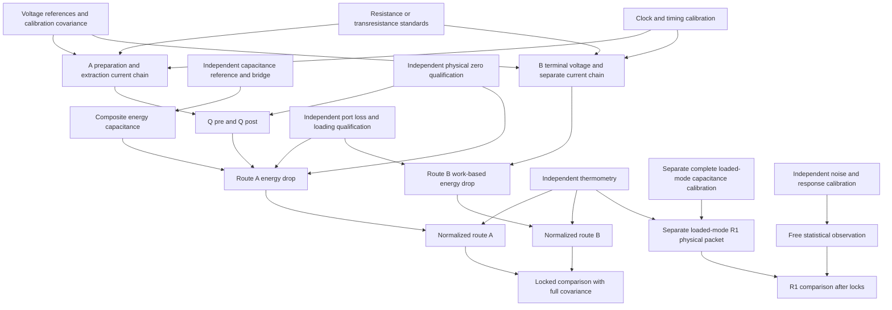

STATUS:
NON-CONTROLLING PROSPECTIVE PHYSICAL QUALIFICATION DESIGN

AUDIT STATUS:
PENDING INDEPENDENT AUDIT

SCIENTIFIC AUTHORITY:
UNCHANGED

IMPLEMENTATION AUTHORIZATION:
NONE

PHYSICAL EXECUTION:
NOT AUTHORIZED

# EBU capacitor root/source-transfer physical qualification design

Date: 2026-10-09. Prospective scientific design only. No laboratory has been contacted, no equipment ordered, no data collected and no implementation or experiment executed.

## 1. Executive design verdict

**Principal outcome B: TWO OR MORE DESIGNS REMAIN COMPETITIVE; ONE NARROW PRE-DESIGN STUDY IS REQUIRED.**

This report specifies one common qualification architecture: **independent charge-endpoint and capacitance construction, checked against a separately measured electrical-work contrast, with a covariance-aware calibration loop**. Two implementations survive: a warm, thermostated macroscopic vacuum-gap cell and a conditioned cryogenic macroscopic vacuum-gap cell. Neither has a supplied device-specific terminal, slow-response and measurement-loading certificate. The literature does not establish which has the smaller complete uncertainty for this particular observable. A winner is therefore not selected.

R0 is physically credible in principle. The present **R0 design is partial**, not ready to freeze as a confirmatory protocol. R1 is included as an optional, separately locked design and is also **partial**. Its outstanding measurement-loading and noise constraints are explicit; no evidence currently warrants declaring it impossible. Thus outcome C would overstate what has been learned. Outcomes D and E are not supported: the obstacle is a realization/discrimination specification, not a contradiction of electrostatic energy or the cleared source contract.

The one necessary pre-design study is a **two-configuration terminal-and-timescale feasibility comparison** (§6): warm versus cryogenic vacuum-gap cells, using the same measurement equations and the same scientific discrimination targets. It must deliver a numerical, independently supported envelope for energy capacitance, current/voltage observation, reference, leakage, memory and work corrections. It must not search confirmatory outcomes for a favorable design. Its immediate predecessor is independent audit of this report; neither that comparison nor implementation is begun here.

The audit's critical distinction is retained verbatim: **R0 ABSOLUTE SCALE: DEFINITIONALLY FIXED BUT PHYSICAL UNIQUENESS DEPENDS ON R1.** R0 tests reproducible realization of an adopted normalized-energy convention. R1 tests the canonical coefficient one against an independently observed law. Agreement of two energy meters cannot, by itself, prove that nature uniquely selects the normalization.

This is a source storage/root-transfer witness. The capacitor remains **unsuitable for the intended scarcity sign interpretation**. Discharge toward zero field gives positive source EBU, without implying environmental restoration, welfare, actor credit or a complete source–driver–bath settlement.

## 2. Repository coordinate and authority

| Item | Identity / treatment |
|---|---|
| Starting commit | `27b54f0060c09982b6b64d4e6926b2f18807f5b8` |
| Starting tree | `4122cf9e616e7aa6405fbbb3726f6c9cd10bbd07` |
| Parent report P | [Quadratic physical identification](../theory/EBU_QUADRATIC_REFERENCE_CURVATURE_PHYSICAL_IDENTIFICATION_REVIEW.md) |
| P SHA-256 | `923fa9cc51dff768bce8cb06b939fad5a069f3421860c85d37548e2bb9f2d568` |
| Commission | Attachment `553afe16-4851-45f5-99e1-4ccfa1780286/Pasted text.txt` |
| Commission SHA-256 | `e38593dca6281f03cadc45c7dc5f596777b01e7a4143681bda21478db259183f` |
| Design branch | `codex/capacitor-qualification-design` |
| Design worktree | `/Users/konrad.grzyb/code/ebu-capacitor-qualification-design` |
| Preserved parent checkout | `/Users/konrad.grzyb/code/ebu-quadratic-physical-identification`, clean at starting commit |
| Original repository checkout | `/Users/konrad.grzyb/code/ebu`, unrelated branch/work preserved |
| Cached origin/main | `660d6e5a56cb096fe6d1e4d202f592155d982c79`; not freshly fetched; no publication target |
| Publication | One local report-only commit; no push, merge or release |

The user supplies independent clearance of P at the exact commit/tree, no material findings and no human scientific decision requirement, together with the R0/R1 interpretation above. This report records that supplied audit authority without pretending to be the auditor or modifying P's historical audit-pending header. No separately committed audit attestation is claimed. Final report commit/tree and digest belong in the completion response, not in a self-referential header.

AGENTS applies. The frozen foundation F and working baseline B were read in order; their frozen identities and limitations remain intact. P is the governing source contract for this design. S supplies canonical/support/P4 distinctions; RF/M supply calibration composition and recursive sufficiency. T/U are inspected only for information independence and covariance lessons. Their numeric thresholds, optical hardware and execution machinery do not apply here. B's old experimental chronology is not silently rewritten. W1 remains unchanged.

The report uses the suggested `docs/e1a/` location for an experimental-design artifact. Its distinct `EBU_CAPACITOR_` name and this scope statement prevent it from amending optical E1a T/U/V.

### Source identity ledger

SHA-256 identities below were checked against the exact starting checkout. External literature is listed separately in §29.

| Key | Repository source | SHA-256 |
|---|---|---|
| AGENTS | [AGENTS.md](../../AGENTS.md) | `168307e07f79d980a5545bc4283619f44e5ba54eb750212783daf65356bb2e94` |
| F | [EBU_PHYSICAL_FOUNDATION_CANONICAL.md](../physical_foundation/EBU_PHYSICAL_FOUNDATION_CANONICAL.md) | `6d9aed2440196f7f85d9651649b7168574f365adf8057b8d4ae2709b03f01507` |
| B | [EBU_THEORY_BASELINE.md](../theory/EBU_THEORY_BASELINE.md) | `0a01b3566c5ba37674f87ba827732e8d7f694fb5a532901e5883ea8317b74eaa` |
| Q | [EBU_QUADRATIC_REFERENCE_STATE_PHYSICAL_REQUIREMENTS.md](../theory/EBU_QUADRATIC_REFERENCE_STATE_PHYSICAL_REQUIREMENTS.md) | `0f42699aa72d4467afacb3c5e0ab695feceef83326c4aa65caa37e70c353fc02` |
| S | [EBU_EQUILIBRIUM_THERMODYNAMIC_ANCHOR.md](../theory/EBU_EQUILIBRIUM_THERMODYNAMIC_ANCHOR.md) | `5b92fdf5749ee05db63f32320e2b34a10afa2c98ceaf2e7a996f78b2df60505f` |
| RF | [EBU_FIELD_RELATION_AND_RECURSIVE_SUFFICIENCY.md](../theory/EBU_FIELD_RELATION_AND_RECURSIVE_SUFFICIENCY.md) | `685b90eb6acef40b5a8277a9652ef3dceaf4017f91c47df3853a75e2a7f139e3` |
| SFE | [EBU_SOURCE_FACTOR_EMBEDDING_AND_ORIENTATION_THEOREM.md](../theory/EBU_SOURCE_FACTOR_EMBEDDING_AND_ORIENTATION_THEOREM.md) | `684dbda50a27b5c53aff9747c9fabc7683fc610b53afe325179cd9698e25f839` |
| M | [EBU_RECURSIVE_FIELD_SOURCE_FACTOR_CONTINUITY_UNIFICATION_THEOREM.md](../theory/EBU_RECURSIVE_FIELD_SOURCE_FACTOR_CONTINUITY_UNIFICATION_THEOREM.md) | `3d5d352dde4f89d711abbc5d860b2a49656aa180d77557970f6c752b8c831fe6` |
| UNI | [EBU_UNIFIED_MARGINAL_VECTOR_DIRECTIONAL_ACTION_SEMANTICS.md](../theory/EBU_UNIFIED_MARGINAL_VECTOR_DIRECTIONAL_ACTION_SEMANTICS.md) | `660efdf962871898faef95f2c4e957e091b459ae2e9b48897f1ebf2aadb79171` |
| W1 | [EBU_SOURCE_FIELD_W1_WATER_ADMISSION.md](../theory/EBU_SOURCE_FIELD_W1_WATER_ADMISSION.md) | `70efbc4988dc32fdc5d49e98020c81afe3f33c04ceb8e4b151dd75426f0ebf85` |
| T | [E1A_MINIMAL_EQUILIBRIUM_EXPERIMENT_DESIGN.md](E1A_MINIMAL_EQUILIBRIUM_EXPERIMENT_DESIGN.md) | `10ddfdceb90454a87cd83a7868c65a1e1b7a7147cc4e8360faf70225ba6d4519` |
| U | [E1A_BRANCH_A_PHYSICAL_CALIBRATION_QUALIFICATION.md](E1A_BRANCH_A_PHYSICAL_CALIBRATION_QUALIFICATION.md) | `af66f3fe640c25b5bf0bc11e61f3b77e944c70f2e4a2a040841b65a12d4b8d0a` |
| V6 | [EBU_V6_FAILURE_CONSOLIDATION_AND_MINIMAL_RECOVERY.md](EBU_V6_FAILURE_CONSOLIDATION_AND_MINIMAL_RECOVERY.md) | `a2f8d74000d896e7e8fc04903af65d7dc653424086998442e1903c6a20828dc3` |
| U-F | [E1A_U_PHYSICAL_METROLOGY_FEASIBILITY_REVIEW.md](E1A_U_PHYSICAL_METROLOGY_FEASIBILITY_REVIEW.md) | `e69398bba6a4688c4e8c150eb69896e20569fdd7f78e10810744d52a08bf5fa1` |
| P | [EBU_QUADRATIC_REFERENCE_CURVATURE_PHYSICAL_IDENTIFICATION_REVIEW.md](../theory/EBU_QUADRATIC_REFERENCE_CURVATURE_PHYSICAL_IDENTIFICATION_REVIEW.md) | `923fa9cc51dff768bce8cb06b939fad5a069f3421860c85d37548e2bb9f2d568` |

## 3. Exact scientific claims being tested

For fixed physical context, positive measured temperature and the specified charge mode:

\[
\Phi(Q)-\Phi(0)=\frac{Q^2}{2C_e},\quad
H_Q=\frac{1}{C_e k_BT},\quad
E=\frac{Q_0^2-Q_1^2}{2C_e k_BT}.
\tag{1}
\]

| Claim | Independent comparison | Scope of a favorable result |
|---|---|---|
| R0 constitutive construction | Corrected conjugate voltage and finite work versus independently obtained Q and C_e | A bounded quadratic storage observable with a remainder certificate |
| Reference | Charge-zero preparation versus work-derived minimum, polarity reversals and history challenges | Physical Q*=0 within a declared uncertainty, not merely instrument zero |
| Source transfer | Route A energy drop versus separately measured corrected route B work | Same energy contrast under the same root convention |
| Prospective action | Locked delivered-charge prediction versus independent endpoint | Qualified action response, separately from the potential |
| Recursion | Different preparation histories at matched retained states followed by matched challenges | Sufficiency within a stated history class and horizon |
| Optional R1 | Independently constructed H versus a freely observed density/variance law | Canonical bridge compatibility to specified discrimination, within its tested regime |

The constant k_B is exact in current SI; realized temperature, energy and electrical standards are uncertain [L01]. E remains dimensionless. Positive discharge E is not reinterpreted. No new physical law is claimed: these are qualification and integration tests of established physics.

## 4. R0 versus R1 distinction

**R0.** Once the energy kind, boundary, standards and physical T are fixed, division by k_BT is a reproducible convention with no adjustable operator multiplier. Its tests concern identification and reproducibility of the inputs and their physical energy relation. A common wrong thermometer may leave electrical loop closure unchanged. R0 cannot demonstrate physical uniqueness of coefficient one by dividing both sides by the same k_BT.

**R1.** Under an independently justified canonical ensemble, correct state/support/measure and constant temperature, `-ln p = V + constant` predicts beta_bridge=1. For a globally quadratic, full-support classical mode this predicts Var(Q)=C_e k_BT. This branch tests the coefficient rather than defining its observed value. A variance agreement alone does not establish Gaussian shape, canonicality or every finite density contrast.

**P4.** Entropy/heat identities require the additional equilibrium, bath and no-omitted-work premises in S §13. They are not claims of the driven R0 action experiment. Across temperatures only normalized-energy meaning is carried here. Equal E at different T does not mean equal joules.

Three locks separate scientific information: **A** physical construction; **B** independent work comparison; **S** optional statistical observation. Instrument/standard information has its own **O** record. A and O are frozen before confirmatory B or S are examined. S cannot revise C_e, T, reference, frequency corrections or detector noise. Calibration uncertainties may be shared without violating this information separation.

## 5. Candidate apparatus comparison

This is a bounded family comparison, not equipment procurement. Resource classes are relative engineering judgments, not prices or confirmed laboratory access.

| Criterion | Warm thermostated vacuum-gap cell | Air/vacuum calculable cross-capacitor | Cryogenic vacuum-gap cell | Solid-dielectric / micromachined alternative |
|---|---|---|---|---|
| Energy-capacitance clarity | Good after all return/guard capacitances are included | Excellent length-to-mutual-capacitance reference; full stored-energy mode still requires reduction | Same terminal-matrix obligation; not discharged by an ECCS certificate | Dielectric/polarization or mechanical modes add obligations |
| R0 information independence | Separate current, bridge and work routes feasible | Strong bridge reference; poor reason to use an elaborate primary standard as the charged DUT | Electron-counting and bridge precedents; non-counting current routes also possible | May provide convenient capacitance, but not a demonstrably cleaner scalar |
| Reference / trapping | Surface/contact biases and support memory need measurement | Guard motion, charge offsets and gas/environment corrections | Trapping, thermal conditioning and connection changes remain relevant | More material-state dependence; no automatic admission from low loss |
| Linearity / voltage dependence | Fixed geometry; electrostatic motion and surface effects bounded | Geometry/metrology intensive; voltage dependence still tested | Static linearity and cryogenic response must both be qualified | Material-specific; RF linearity does not certify slow charging |
| Leakage | Temperature and insulation sensitive; favorable current signal possible | Not automatically a long-hold storage instrument | Strong low-leakage precedent in particular devices [L04] | Device dependent; no blanket advantage |
| Temperature | Direct thermometry and smaller gradients easier in principle | Air requires gas properties; vacuum removes bulk gas contribution | Cryostat gradients, self-heating and thermometer transfer more demanding | Depends on material and operating regime |
| Mechanical stability / memory | Accessible controls; vibration and creep remain | Alignment and guard motion are major engineering work [L09] | Conditioning and resonances cannot be assumed absent | Substrate and residual dielectric participation matter |
| Charge/work comparison | Resistive current metrology plus voltage possible without cryogenic electron pump | Can support calibration of another cell | Counting methods exist, but full setup and work route are more complex | No clear advantage for the required independence |
| Optional R1 | Higher thermal signal at the same C; active input loading still critical | Small C plus elaborate terminals complicate observation | Lower thermal signal; high-impedance readout/thermalization require a separate budget | Some noise experiments exist; not the same source contract |
| Complexity / resource class | Specialist precision electrical laboratory plus vacuum/thermal enclosure | National-metrology-scale primary standard infrastructure | Specialist cryogenic/metrology infrastructure; highest burden if electron counting added | Fabrication/material characterization or additional constitutive work |
| Disposition | **Survives** | Prefer as an external calibration reference, not selected DUT | **Survives** | Not selected: no evidenced overall advantage for this task |

Published NIST work establishes cryogenic capacitance comparison and conditioning as practical, but for particular terminal configurations [L02]. Its surface-film frequency bound used a model plus limited-band measurements [L03]. A later PTB ECCS study found cryogenic frequency structure that prevented its target accuracy; room-temperature checks behaved differently [L05]. These results do not universally refute cryogenic cells, nor qualify warm ones. They make actual terminal-and-timescale characterization decisive.

Micromachined vacuum-gap microwave capacitors demonstrate low-loss resonant devices [L10]; their measured regime does not certify a macroscopic slow-charge witness. Calculable-capacitor results establish a reference method, not equivalence between one mutual capacitance and the DUT's energy capacitance. No historical apparatus is adopted by name.

## 6. Selected realization or refusal

**Final apparatus selection: NONE.** Two physically credible design options remain competitive on the missing complete budget, not on an invented numerical score. Warm operation is the simpler engineering starting hypothesis; cryogenic operation may win if warm leakage/relaxation defeats the required horizon. The evidence does not quantify that tradeoff for a realizable cell available to this programme.

Both options use the same physical arrangement specified below: a rigid macroscopic vacuum-gap cell, one high conductor H, low conductor L and enclosure/guard G, with L and G bonded as the return during storage/action. No bulk gap dielectric and no deliberately floating internal conductor are proposed. All relevant supports and external loading remain in the model. A roughly 10 pF cryogenic standard is a demonstrated scale [L02], not an adopted value of the bonded-mode C_e. Warm nominal capacitance and all operating limits remain requirements to identify, not purchased specifications.

**One narrow pre-design study, after audit and separate authorization:** produce a terminal-and-timescale feasibility certificate for these two configurations. Use existing traceable device/instrument records where available; if targeted characterization is necessary, it requires its own prospective authorization before acquisition. The comparison has exactly these outputs:

1. One actual terminal drawing and measured/calibratable capacitance matrix per option, including the two readout configurations; no unmeasured floating conductor.
2. A jointly attainable charge/voltage/action-time interval with complete reference, loading, leakage, relaxation and constitutive envelopes, and their provenance.
3. Predicted uncertainty for the same finite-curvature and cross-route comparisons of §23, with systematic floors exposed; no assumed zero loss or perfect reset.
4. A separate optional-R1 noise/loading feasibility bound. R1 failure cannot be used to hide an otherwise useful R0 design.
5. One selected option and numerical design-freeze register, or explicit refusal/tie. Prefer the simpler option only when it satisfies the same scientific discrimination and physical bounds. Do not choose by whether a candidate's confirmatory EBU results agree.

This is one comparison of a specific missing certificate, not a new wide apparatus search. Until it is completed, no claim of freeze-ready design, achieved precision or device qualification is made. Independent audit of **this** report is still the sole immediate next task.

## 7. Physical boundary

| Boundary element | Prospective treatment |
|---|---|
| Conductors H, L, enclosure G | Fixed geometry; L/G bonded at a documented return plane. Signed charge Q is the complete controlled separation mode. |
| Guard | Passive return-potential guard for the valued mode. An actively driven guard introduces another source port and cannot be ignored. |
| Terminal plane | A named pair of physical connector/reference planes at the cell. Every current/voltage channel is mapped to those planes. |
| Supports and gap | Mechanical displacement, polarization, surface state and thermal gradients either measured or uniformly bounded. |
| Preparation/action source | External electrical port. Source resistance loss outside the plane is not capacitor heat. |
| Readout | Input admittance, cable capacitance, bias current, injected charge and energy belong in the connection model. Switching readout changes context unless proved negligible. |
| Leakage | Each path classified as an external electrical port or an internal dissipative path; never both. |
| Magnetic/inductive energy | Endpoint current and settling constraints bound residual magnetic energy; event transient work includes relevant inductance. |
| Thermal environment | Independently measured isothermal conductor context; no unrelated chosen normalization temperature. |

The primary measurand is the **storage-energy drop** `D=Phi_pre-Phi_post`. The complete source+driver+bath event has other energies and is not settled by D alone. For a control volume whose total internal energy is Phi+U_aux, with electrical/mechanical work positive into it and heat positive out,

\[
D=-W_{\rm el,in}-W_{\rm mech,in}+Q_{\rm heat,out}
  +\Delta U_{\rm aux}.
\tag{2}
\]

This sign convention will control the independent work correction. If only field storage is claimed, auxiliary storage and port losses must be bounded independently. Missing heat is not inferred from the difference of the two routes and then used to make them agree. Loading configurations are separate field IDs until a qualified transfer relates them.

## 8. Energy-capacitance definition

With the full Maxwell matrix in a consistent potential gauge and voltage mode v=b u,

\[
\Phi=\tfrac12 v^{\mathsf T}C_Mv=\tfrac12 C_e u^2,
\qquad C_e=b^{\mathsf T}C_Mb,\qquad Q=C_eu.
\tag{3}
\]

For the bonded L/G return, take b=(1,0,0) before deleting the gauge coordinate. With no other nodes, C_e=C_HL+C_HG in mutual-capacitance notation. The usual guarded bridge measurement of C_HL excludes the H–guard storage and is insufficient by itself.

Measure all independent terminal pair relations needed for C_M with the remaining terminal held at its specified potential; retain their covariance. Then independently measure the composite H versus bonded-(L,G) capacitance, counting **all** return displacement current. Require agreement with the contraction, including open/short/cable corrections. An instrument unable to measure the composite mode needs a qualified adapter/model, not an assumption that guard current is zero.

Check terminal permutations, deliberate known guard-capacitance changes in a separate control configuration and direct versus reconstructed composite measurements. No conductor is allowed to float unnoticed. A fixed trapped charge can introduce linear terms; eliminating a floating potential via a Schur complement does not erase that charge or its memory. Passive detector/cable capacitances inside the valued boundary contribute to C_e; outside ones contribute explicit port/correction terms. The matrix is repeated for every connection topology used in preparation, action, endpoint readout and optional R1.

## 9. Reference qualification

Separate instrument offset, charge-origin preparation and physical minimum. A temporary low-impedance bond between matched conductors establishes a reproducible **candidate** charge-zero state only after thermoelectric/contact potentials, surface charge and the opening-switch injection are bounded. Merely pressing a meter's zero button is not reference calibration.

Use symmetric, small positive/negative independently integrated charge increments around that state. Measure corrected conjugate voltage with a voltage chain independent of the charge integrator and obtain reversible finite work in each direction. On the qualification set fit the local form `u(Q)=a Q+b` with a>0 and its residual envelope; the physical minimum estimate is r=-b/a. Compare it with the independently prepared charge-zero state. Lead reversal and detector interchange isolate instrument offsets; physical electrode reversal or separately characterized contact-potential compensation, where feasible, tests physical offsets. Electrical lead reversal alone does not remove a true contact potential.

The admitted source remains **Q*=0 physically**. The r in subsequent measurement equations is uncertainty/correction in representing that zero, not permission to install a desired nonzero charged target. A resolved physical bias beyond the locked unbiased-reference allowance refuses this realization. A separate biased-source contract would require a new commission.

Repeat the reference challenge after opposite-polarity holds, long/short holds, the defined thermal cycle and connection changes. Refuse a drifting, history-dependent, unbounded or multiply valued minimum. Non-detection with broad uncertainty is inconclusive, not proof of zero. Convert the allowable reference error into energy error using

\[
|\delta D_r|=\frac{|Q_0-Q_1|}{C_e}|\delta r|
\tag{4}
\]

for fixed C_e and common reference shift. The permitted reference interval must be derived from §23's contrast discrimination before confirmatory acquisition.

## 10. Charge measurement

The common non-counting route is **calibrated current integration independent of the DUT capacitance**. A measurement realization may use a traceable resistor/transresistance with differential voltage observation and a calibrated clock. Its model includes burden/compliance, resistor voltage/temperature dependence, input bias, bandwidth, integration tails and every bypass current. Current metrology of this type is established; published ULCA methods demonstrate traceability through independently calibrated gain/resistance [L06]. This does not mean an ordinary grounded virtual-input ammeter can be attached to a charged high terminal without changing its state.

Choose the actual connection so that the current sensor is either isolated with qualified common-mode behavior or placed in a complete return path whose burden is measured. A low-lead sensor that misses guard current is refused. A calibrated current-source setting alone predicts delivery; it does not independently observe all delivered charge.

For route A, obtain Q_pre by integrated preparation charge from the qualified zero, corrected for leakage and parasitic-port charge before the event. Obtain Q_post by a **separate destructive extraction after the event** into the A charge integrator down to the same qualified zero. The event endpoints are defined before extraction begins. Extraction tail, switch injection, residual zero charge and interval leakage are explicitly corrected/bounded. This provides an endpoint measurement that does not use the action current record from route B or assume Q_post=C_e u_post. Noninvasive voltage readings are auxiliary endpoint monitors, not substitutes for this independence.

Schematically,

\[
Q_0=q_z+\int_{\rm prep}i_A dt-q_{\rm bypass,prep}-q_{\rm hold},
\quad Q_1=q'_z+\int_{\rm extract}i_{A,\rm out}dt+q_{\rm missed,extract}.
\tag{5}
\]

The signed corrections include connections and all unobserved transfer; their meanings are fixed by the terminal drawing. Shared zero and scale errors create Q_0/Q_1 covariance. The A integrator is not recalibrated from the B work residual.

Electron counting is an alternative only if a complete pump-error, hold-time, servo and parasitic-transfer qualification exists. Historical counting experiments establish feasibility [L07]; they do not require rebuilding an ECCS merely to measure a larger current-time charge. Counted charge is not the default tie-breaker in §6.

## 11. Voltage measurement

Use a voltage standard traceable to an SI realization, separately characterized readout chains for A current metrology and B terminal work, and recorded calibration covariances. Acquire true terminal-plane voltage, not the source's upstream setting. Characterize polarity-dependent offsets, thermoelectric EMFs, common-mode rejection, nonlinearity, aperture, phase/delay and input admittance. Direct work uses synchronized voltage/current observations with calibration of their relative delay.

At every connection, account for capacitive loading and bias current. Repeat instrument interchange and open/short/dummy-source controls without using the DUT's expected energy to calibrate the voltmeter. Calibration endpoints span the chosen voltage range; interpolation requires a response bound. The reference-location data of §9 and confirmatory finite-work data remain distinct.

The work readout's independent information is its actual u(t) and i(t), obtained with different transducers/raw records from the endpoint construction. Sharing a Josephson-linked standard makes it traceable; it also leaves a shared uncertainty that must not be declared independent.

## 12. Capacitance measurement

Route A C_e comes from a traceable bridge/composite-mode measurement, **not from Q_pre/u_pre or a fit of the work being tested**. Use substitution/interchange against calibrated reference capacitors, bridge ratio/nonlinearity checks, measured dissipation and the terminal reduction of §8. Published standard-capacitor procedures provide the measurement framework [L08].

The bridge frequency, excitation voltage and terminal definition are part of the result. Map them to the finite action/settling timescale by independently acquired low-frequency admittance and charge-step/hold response. A single 1 kHz value is not a DC storage certificate. Resolve lead inductance, electrical resonances, mechanical response and surface relaxation; do not extrapolate a convenient flat curve across an unobserved band.

Calibration data determine C_e and an allowed dependence envelope before B confirmatory work is viewed. If the actual quasi-static constitutive relation cannot be bounded by a constant C_e over the required domain, refuse that domain. A nonlinear or memory-enlarged model may be scientifically valid but is not silently substituted into this one-mode quadratic qualification.

## 13. Temperature measurement

Use traceable thermometry suited to each range: a calibrated resistance thermometer and reference/transfer checks at warm temperatures; appropriate independently calibrated cryogenic thermometers and thermal anchoring at low temperature. The packet must state thermodynamic-temperature interpretation, scale-to-thermodynamic corrections where material, self-heating extrapolation, thermal contact, gradients and lag. Neither the thermal-noise signal being tested nor capacitor variance may determine T.

Observe the conductor/support environment and the resistor environment for R1 separately. A bath setpoint does not prove equal device temperatures. Bound excursions over preparation, hold, action and readout; classify unresolved gradients or multiple temperatures as realization refusal. In R0 the charge coordinate need not itself sample thermal equilibrium, but the temperature used for the convention must remain the independently specified physical context.

The temperature bound converts directly into a common fractional normalization bound, approximately |delta E/E|=|delta T/T| at fixed measured energy. Across configurations the same thermometer/calibration contributes covariance. An independent thermometric cross-check is required to expose errors that cancel in electrical loop closure. Exact k_B does not remove thermometer uncertainty [L01].

## 14. Independent energy/work cross-check

### 14.1 Two routes to the same event

Route A constructs

\[
D_A=\frac{(Q_{0,A}-r)^2-(Q_{1,A}-r)^2}{2C_{e,A}},
\qquad E_A=D_A/(k_BT).
\tag{6}
\]

Its charge data are the separate preparation/extraction integrations; its C_e is the prior bridge calibration. Route B records the actual signed terminal current and voltage **during the intervening action**, using a different current transducer/resistor and voltage digitizer. B evaluates electrical work by calibrated integration, not by inserting C_e into a capacitor-energy formula:

\[
D_B=-\int_{t_0}^{t_1} u_B(t)i_{B,\rm in}(t)\,dt
       +\delta_{\rm other\ ports}+\delta_{\rm heat,mech,aux},
\qquad E_B=D_B/(k_BT).
\tag{7}
\]

The correction signs come from (2), with all unobserved electrical ports included in the first correction. The initial and final times and terminal boundary are identical for A and B. A Q_post is never defined as Q_pre+integral i_B dt. B never obtains its gain or missing heat from D_A-D_B. The two routes share the physical event and some standards; that is not duplicate use of the same primitive measurements.

The actual B current measurement is specified by a separately calibrated series sensing element with qualified differential/common-mode observation or a complete return-current measurement. It must account for all current into the valued mode and the measurement branch. Finite burden is permitted if its power is outside the terminal plane or explicitly corrected. The series source/sensor resistor's heat is not counted a second time as internal source loss.

The chosen slow, fixed-geometry domain must independently bound internal heat and auxiliary-energy change. Examples are measured leakage conductance with the proper internal/external classification, qualified dielectric loss/relaxation, mechanical displacement/work and residual magnetic energy. Where a path is internal ohmic loss, a bound may use integral u²/R_loss dt; an external leakage port instead enters electrical work. Polarity reversals and different action durations help distinguish reversible work from rate-dependent loss. If material loss cannot be measured or enclosed without using D_A-D_B, **the work cross-check is refused**, even if the residual looks small.

Electrostatic force/deadweight comparisons are established [L11], but measuring force versus separation alone generally identifies a derivative of capacitance, not its complete constant-energy component. Mechanical work would also add a geometry-changing event. It is therefore not the primary cross-check here; no second apparatus programme is proposed.

### 14.2 Information and standard dependencies

No arrow goes from B comparison or R1 statistics into A's capacitance, reference, temperature or correction model. A and O **methods/calibrations** lock before confirmatory events. A endpoint records and B work records necessarily concern the same later event; each is reduced and locked separately before their comparison is unblinded. Thus the lock order does not demand a final endpoint before the action has happened.

Record actual common standard IDs and cross-calibration data; separate boxes do not imply zero covariance. Independence achieved is scientific-information independence and separate raw measurement routes, not independence of every SI assumption. This is not a new quantum-metrology-triangle test of h or e.

## 15. Source-to-root calibration loop

Within each fixed context, let the empirical comparison of independently calibrated routes be

\[
D_B=\lambda D_A+b_D+\rho(D_A,\text{context}),
\tag{8}
\]

where lambda, b_D and non-affine residual rho are **diagnostics**, not permission to recalibrate B into agreement. Use nonzero contrasts of both signs, at least three nonzero magnitudes and a separate zero-change/sham comparison. A correlated errors-in-variables model or an equivalent joint measurement-model confidence region is required; treating noisy D_A as exact biases a slope. The final magnitudes and repetitions require §23's freeze certificate.

The loop is `root A -> joule representation A -> independently observed joule representation B -> root B`. The first and last factors are k_BT and 1/(k_BT), fixed by independent thermometry, not fitted inverses. Only the physical A–B comparison provides new loop information. Consequently

\[
c_{\rm loop}=\lambda,\qquad d_{\rm loop}=b_D/(k_BT).
\tag{9}
\]

Require a sufficiently narrow prospective interval around c_loop=1 and residual compatibility with the finite-energy tolerance. If reference-aligned potential levels are claimed, measure the reference-to-state work on each route and require d_loop=0 within its prospective bound. A difference-only comparison cannot certify an arbitrary potential-level gauge. Its fitted b_D is an additive **measurement-contrast bias**, not proof that a physical gauge has drifted.

Shared T cancels from a same-context energy ratio; shared current/voltage/time errors may also cancel wholly or partially. Common electrical-scale error therefore remains a limitation of the loop, resolved only by independent standard/interchange information. For positive comparison slopes use log c_loop and the full covariance of edge estimates; the usual path expression is `Var(log c_loop)=s^T Cov(log c_edges) s`. Offset and scale–offset covariance remain in the joint region. Defining the return map as the fitted inverse of (8), or projecting the loop onto closure, is forbidden.

## 16. Finite operating domain

The prospective qualification domain is

\[
\mathcal D=\{|Q|\le Q_{\max},\ |u|\le u_{\max},
T_{\min}\le T\le T_{\max},\ \theta\in\Theta,
\tau_{\min}\le\tau_a\le\tau_{\max},\ 0\le t_{\rm hold}\le t_h\}.
\tag{10}
\]

It additionally records vacuum/contamination condition, geometry displacement, preparation histories, connection topology, settling definition, calibrated frequency band and endpoint observation aperture. T_min>0. There is no claim that all Q, u and C combinations in a rectangular range are independently possible: they must satisfy the qualified constitutive envelope. Every registered event must remain inside the joint domain.

**Numerical operating domain: NOT FROZEN.** The actual cell and full loading circuit have not been identified sufficiently to assign Q_max, voltages, temperature span or horizons. Literature values are not substituted for them. The warm option uses a narrow physically stable laboratory temperature region; the cryogenic option requires its own independently established stable region. The 4.2 K scale of a published comparison [L02] is evidence of a realized regime, not permission to operate a new complete system there.

Freeze domain limits from the pre-design certificate's voltage/range limits, measured or otherwise defensible field-emission/breakdown margins, mechanical response, bounded slow memory and total uncertainty. Freeze qualification nodes at both polarities and the boundary/interior needed to enclose the domain. Confirmation cannot choose a smaller favorable domain after seeing failures; any new domain requires a separately identified design revision and fresh confirmation. Extrapolation beyond the qualified amplitude, history or timescale is refused.

## 17. Constitutive linearity/remainder qualification

On calibration data independent of confirmatory work, determine the corrected quasi-static conjugate voltage and the deviations

\[
u(Q)=\frac{Q-r}{C_e}+\delta u(Q),\qquad
|\delta u(Q)|\le b_u(Q;\theta,t,\mathcal H).
\tag{11}
\]

Here H-calligraphic denotes the admitted history class, not curvature. Forward/reverse charge sweeps and hold durations test single-valuedness; small-signal admittance tests frequency dependence; finite-work comparisons challenge the resulting integral on separate data. Differential capacitance is dQ/du, not a license to use Q²/[2C_d(Q)] for a nonlinear device.

The deterministic energy-remainder bound for an event is

\[
B_{D,\rm constit}=\left|\int_{Q_1}^{Q_0} b_u(q)\,dq\right|,
\quad B_{E,\rm constit}=B_{D,\rm constit}/(k_BT).
\tag{12}
\]

A finite set of small residuals cannot establish this uniform envelope. Between qualification nodes q_j separated by h, an independently supported Lipschitz bound L on delta u gives a nearest-node interpolation allowance at most Lh/2, added to simultaneous node uncertainty and residual magnitude. Temperature/time/history interpolation needs its own supported bounds. If derivative bounds or a defensible constitutive model are absent, restrict the claim to the measured finite states/events and report the continuum domain unqualified. Do not manufacture L by treating the largest observed slope as a guaranteed supremum.

Bound dissipative hysteresis separately from reversible nonlinearity. Nonzero measured voltage dependence is not automatically fatal: it is fatal to the proposed constant-H domain when its uncertainty-enlarged effect exceeds the frozen remainder allocation. Field emission, breakdown, uncontrolled geometry motion, unresolved multiple minima or unbounded surface storage are immediate domain/constitutive refusals. An explicitly modeled true geometry change is a separate context event, not calibration noise.

## 18. Action-response qualification

Use a programmed signed current-transfer pulse or ramp of fixed command and duration. Its prediction must be constructed from prior independent delivery calibration at matching load/compliance, temperature, switch state and timing. Include positive/negative extents, reversals, zero-command sham switching and at least one finite relative excursion where curvature is identifiable. The command-to-delivery map locks before the confirmatory endpoint is seen.

\[
Q_1=Q_0+\widehat a+\epsilon_a-\ell.
\tag{13}
\]

Define a_hat as the expected commanded transfer plus a calibrated mean switch-injection correction. Epsilon_a contains residual delivery, injection and timing errors with their dependencies; ell is separately registered signed simultaneous uncommanded leakage. If a current monitor includes leakage already, separate it through the port model rather than subtracting it twice. Estimate realized Q_1 by §10's post-event measurement. The B action current is valuable diagnostic evidence but does not define the prior prediction.

For a deterministic net charge-response bound B_a and fixed physical inputs,

\[
|E_{\rm real}-E_{\rm predicted}|
\le\frac{|Q_0-r+\widehat a|B_a+B_a^2/2}{C_e k_BT}.
\tag{14}
\]

The prospective response test compares endpoint residual `Q_1-Q_0-a_hat` to the independently locked delivery/loss law or enclosure. Potential agreement cannot rescue failed delivery. Conversely a delivery failure does not automatically refute a valid storage potential.

## 19. Passive leakage/relaxation

With preparation/action drives disconnected, compare registered hold periods from both charge polarities and matched references. Observe charge retention using independent endpoint extraction on separately prepared holds, plus minimally disturbing voltage monitoring with its loading correction. Destructive extraction means different hold times generally require different preparations; they are not one repeatedly unperturbed trajectory.

Independently characterize each internal/external leakage path, open-switch leakage, readout bias and dielectric relaxation. An ohmic model gives a candidate mean Q(t)=Q(0)exp[-t/(R_l C_e)], but a fitted decay rate alone does not identify C_e or prove thermal equilibrium. Allow a predeclared qualified memory model or deterministic envelope; do not fit a flexible decay to confirmatory residuals until it passes.

If |I_leak|<=I_max on a fixed horizon t_h, then |delta Q|<=I_max t_h and (14) supplies a conservative induced value bound. This is a physical bound only when I_max includes voltage, temperature, history and observation effects over that horizon. Zero observed mean leakage does not exclude fluctuating leakage or charge redistribution. Published low-leakage observations [L04] are feasibility evidence, not a device-specific upper bound here.

## 20. Recursive-sufficiency challenge

The matched-history design compares at least these preparation contrasts: positive versus negative previous charge excursion, short versus long dwell, approach from above versus below the same target Q, and before versus after the admitted thermal/connection conditioning. Match current Q, T, measured geometry, connection state and calibrated reference to declared tolerances before each challenge. Histories stay within the predeclared admissible class.

For each matched pair, apply the same prospectively specified passive hold and next charge-transfer command on separate matched preparations. Compare: (i) action availability/compliance limits, (ii) passive law, (iii) next-state distribution or enclosure, and (iv) **joint** next-state/energy behavior. Comparing only mean charge or only present V is insufficient. Randomized or balanced ordering and independent observer reduction are requirements for a future protocol; no seeds or order list are generated now.

Finite matching uncertainty must be propagated. For example, on |Q-r|<=Q_max the same ideal action a changes D by at most |a| |delta Q_match|/C_e, before context terms. The control must distinguish a history effect from imperfect matching, common drift and different instruments. Predeclared simultaneous regions and replication blocks handle multiple challenges; selecting only matched pairs with favorable outcomes is forbidden.

A resolved difference beyond the locked combined matching/measurement/omission allowance refuses **Q-only sufficiency**. The response is either a scientifically justified enlarged state qualified on new data or a finite-horizon approximation certificate, not automatic deletion of the discrepant history. Non-detection with inadequate discrimination is inconclusive. No finite campaign proves sufficiency for arbitrary histories outside the declared class.

## 21. Hidden-state model

The candidate retained state is `(Q, T, geometry, terminal/switch mode, m)` with calibration provenance recorded separately. The vector m may include surface polarization, trapped charge, support relaxation, mechanical stress and detector/controller state. These variables must be observable or subject to a separately qualified preparation/omission bound; naming them is not reconstruction.

A physically interpretable failure model is a main capacitance C_0 with a dielectric-relaxation branch C_d connected through R_d:

\[
C_0\dot u=-(u-w)/R_d,\qquad
C_d\dot w=(u-w)/R_d,
\]
\[
Q_{\rm total}=C_0u+C_dw,\qquad
\Phi_{\rm total}=\tfrac12 C_0u^2+\tfrac12 C_dw^2.
\tag{15}
\]

With C_0=C_d=C, the states (u,w)=(q/C,0) and (q/(2C),q/(2C)) have the same total delivered charge q but different energy and future terminal response. This static counterexample prevents treating total charge conservation as a proof of recursive sufficiency. It is not an assertion that a particular vacuum cell has exactly that circuit.

One may retain w if independently inferable with bounded uncertainty, or establish a preparation-conditioned bound on its omitted influence. Unknown relaxation branches cannot be set to equilibrium merely because they are slow. Any expanded state must supply its own physical scalar and response and be within the cleared contract; a material change of the source model goes back for scientific review. A coordinate-only change does not authorize omission of real energy.

## 22. Joint uncertainty architecture

### 22.1 Primitive model and realized packet

Each event packet contains the terminal/topology and source IDs; pre/post definitions; raw preparation, extraction and work records; reference observations; C_e and T calibration records; command and prior delivery prediction; passive/readout/switch corrections; history state; finite-domain membership; shared-standard IDs; full covariance; deterministic remainder sets; and calibrated numeric-integration error. Field, action and calibration versions are retained. The realized finite contrast uses measured endpoints:

\[
E_A=\frac{(Q_0-r)^2-(Q_1-r)^2}{2C_e k_BT},
\]
\[
dE_A=\frac{Q_0-r}{C_e k_BT}dQ_0
-\frac{Q_1-r}{C_e k_BT}dQ_1
-\frac{Q_0-Q_1}{C_e k_BT}dr
-E_A\frac{dC_e}{C_e}-E_A\frac{dT}{T}.
\tag{16}
\]

Propagate the actual primitive joint model. At first order `u_E²=g^T Sigma g`; higher-order effects require a justified enclosure or later validated nonlinear method [L12]. If charge is ever inferred from voltage for an auxiliary check, Q=C_e u induces covariance; Q and C_e are not independent. For voltage primitives the C_e derivative has the opposite sign to fixed-charge primitives. This does not create two physical energy laws.

For cross-route difference d=D_A-D_B,

\[
u_d^2=u_{D_A}^2+u_{D_B}^2-2\operatorname{Cov}(D_A,D_B).
\tag{17}
\]

A bounded unknown is not automatically a zero-mean random variable. Combine deterministic sets through the signed measurement model; sums of absolute bounds are permissible conservative enclosures, with shared terms counted once. Shared random scales retain covariance. Do not add the same capacitance nonlinearity as a stochastic calibration error and again as an unrelated full deterministic remainder.

### 22.2 Error register

| Component | Character / sharing | Required qualification |
|---|---|---|
| Observation noise | Statistical, temporally correlated, channel/action specific | Independent noise/response model, effective information and drift controls |
| Charge/current scale | Calibration, potentially common across actions/routes | Gain/resistor/voltage/time covariance, compliance and bandwidth |
| Voltage scale/offset | Shared standard plus independent readout components | Reversals, transfer linearity, common-mode and delay |
| Reference | Common within preparation; possible drift/history dependence | Physical-zero qualification, switch/contact and matching uncertainty |
| C_e | Shared within fixed context; field/topology specific | Composite-mode calibration and AC-to-action transfer |
| Temperature | Common normalization plus field/time-specific gradient/lag | Independent thermometer chain and thermal bounds |
| Delivery/switch injection | Action and state dependent; correlated with command/timing | Prior transfer law and sham controls |
| Constitutive remainder | Deterministic envelope or justified model uncertainty | Uniform conjugate-voltage/work certificate |
| Hidden-state reduction | History and horizon dependent; often correlated with loss | Matched-history challenge and omission certificate |
| Boundary omission | Physical systematic; potentially invalidates comparison | Port inventory, geometry and auxiliary-energy balance |
| Numerical work integration | Deterministic/error-controlled, channel timing dependent | Bandwidth/curvature-based quadrature and aliasing/tail bounds |

**Realized value versus prediction:** delivery uncertainty belongs in a forecast of Q_1 and E. Once Q_1 is independently measured, the realized endpoint E uncertainty uses that measurement; adding the whole delivery variability again would double count. Unobserved transfer during endpoint readout remains a correction uncertainty. Preserve both the forecast and realized packet and their joint dependencies.

The numerical budget remains unfilled until §6's certificate exists. No E1a 0.0005 threshold, standard uncertainty or bias allocation is imported. GUM/VIM measurement compatibility is guidance for constructing this budget, not evidence that this apparatus meets it [L12], [L13].

## 23. Required precision and discrimination

### 23.1 A useful physical question before a target number

A requirement to resolve one EBU would confuse a microscopic normalization with the macroscopic contrast being tested. Choose discrimination in **joules or relative finite-contrast error**, then convert consistently to EBU. The minimal study must distinguish the actual finite quadratic prediction from a local-gradient substitution, expose materially wrong scale/reference/boundary models, and bound cross-route disagreement. It need not compete with the best capacitance standard.

For fixed charge, a=-Q_0/2 and r=0 give

\[
D_{\rm quad}=\frac{3Q_0^2}{8C_e},\quad
D_{\rm linear}=\frac{Q_0^2}{2C_e},\quad
G=D_{\rm linear}-D_{\rm quad}=\frac{Q_0^2}{8C_e}
=D_{\rm quad}/3.
\tag{18}
\]

This dimensionless relative excursion is a proposed curvature-discrimination comparison, conditional on an admissible actual amplitude. No nominal voltage is thereby chosen. Its 1/3 separation gives a scientific scale for the necessary accuracy. As a conservative separation check, a complete comparison half-width less than G/2 is a useful ceiling; it is **not a final acceptance tolerance** or proof of power. Qualification must also address smaller contrasts and zero-change controls without relative-error singularities.

### 23.2 Prospective inference rules

Adopt as proposed design policy a simultaneous 95% coverage region across the frozen finite claim/control family and at least 90% planning discrimination for the specified material alternatives. These are explicit statistical choices, not physical constants or attained properties. A Bonferroni construction with m fixed comparisons is an acceptable conservative starting method; a tighter joint method requires validation. m, repetitions and critical values must be fixed before confirmation. With estimated variance, appropriate finite-sample calibration replaces automatic normal quantiles.

For residual d with statistical/calibration standard uncertainty u and a defensible absolute systematic enclosure B, report a region expanded by B. **Clear** an equivalence requirement only when that entire region lies inside the predeclared tolerance interval; **refuse** when it lies wholly outside the allowable set with a supported failure attribution; otherwise **inconclusive**. A confidence interval containing zero is not equivalence. Guards and decision risk follow the metrological distinction in JCGM 106 [L14].

For approximately normal, independently justified planning, a useful sufficient separation condition against an alternative of size delta_min is

\[
2B+[z_{1-\alpha/(2m)}+z_{0.90}]u\le\delta_{\min},
\quad \alpha=0.05.
\tag{19}
\]

The 2B protects against opposing nuisance shifts under the compared hypotheses. It cannot be reduced by collecting more samples. This analytic planning relation is not a validated finite-data performance claim.

### 23.3 Freeze register: the specific missing analysis

| Target | What fixes its useful tolerance / alternative | What the pre-design comparison must supply |
|---|---|---|
| Finite energy | G_min from (18) over the independently qualified input region, plus a chosen maximum model error tau_D smaller than the alternatives to separate | Complete A/B prediction and observation budget; attainable amplitudes and duration |
| Cross-route scale / loop | Relative tau_lambda tied to tau_D at the largest contrast; offset tau_b tied to the smallest/zero contrasts | Joint gain/offset/nonlinearity information, independent standard floors |
| Reference | Require \|Delta Q\| B_r/C_e within its tau_D allocation | Physical minimum stability across allowed histories and preparations |
| Constitutive/hidden state | Integrated residual and future-value bounds within the remaining tau_D allocation | Uniform envelope and horizon; sufficient matched-history discrimination |
| Optional beta | A declared minimum departure delta_beta and equivalence width tau_beta distinguishable from loading/noise/thermal/model floors | Independent physical and observation budget, record duration and shape/support tests |

No defensible numerical tau_D, tau_lambda, tau_b or tau_beta is available from the supplied device record. They are **not assigned** merely by choosing a convenient fraction of a historical precision. The needed analysis is the single §6 feasibility certificate linking scientifically meaningful alternatives to achievable complete metrology. Without it, apparatus selection, numerical domain, sample allocation and final criteria remain unfreezable. The partial verdict is deliberate and is not a license for an implementing agent to fill the gaps.

## 24. Optional R1 statistical branch

### 24.1 A separately calibrated loaded mode

After the R0 methods and calibration packet are locked, a separate equilibrium configuration connects a passive resistor at the independently measured T. The charging drive is physically disconnected, residual DC bias and feedback are bounded, and input loading is qualified. Calibrate its **complete loaded-mode energy capacitance C_R1** by the physical route, including resistor terminals, cables and readout admittance. Treat this as a separately identified context, not a silent use of the unloaded cell's C_e.

For example, a DUT capacitance C_D in parallel with additional passive C_L has C_R1=C_D+C_L. In equilibrium Var(u)=k_BT/(C_D+C_L), while the charge on the DUT alone is Q_D=C_D u, so

\[
\operatorname{Var}(Q_D)=\frac{C_D^2}{C_D+C_L}k_BT,
\tag{20}
\]

not C_D k_BT. Subtracting an electronic noise floor does not remove this changed physical energy. Either qualify the whole loaded mode with Q_R1=C_R1u and its own H, or derive and independently qualify the joint-to-subsystem relation. This report selects the **loaded-mode approach for the optional design**, with the bare-to-loaded relation explicitly measured. Unresolved active loading or inaccessible extra modes refuses the simple R1 realization.

Under a justified classical single-bath resistor model and fixed C_R1,

\[
dQ=-\frac{Q}{RC_{R1}}dt+\sqrt{\frac{2k_BT}{R}}dW_t,
\quad \sigma_Q^2=C_{R1}k_BT,
\quad \sigma_u^2=\frac{k_BT}{C_{R1}}.
\tag{21}
\]

The SDE is a benchmark assumption/prediction, not an EBU law of motion or an executed simulation. R comes from independently calibrated resistance and driven small-signal response, with self-heating and frequency dependence. A passive fitted time constant must not be used to adjust physical C_R1 or T.

### 24.2 Observation and non-circular comparison

Use two independently characterized low-noise voltage channels where practical. Their gain, frequency response, anti-alias response, input admittance, noise cross-spectrum, bias current and current-noise back-action are qualified with external electrical references and dummy impedances matched to the actual RC impedance. Shorted-input voltage noise alone is not sufficient. Calibrate response with known electrical signals, not by forcing measured variance to k_BT/C_R1. These controls can be acquired before S while preserving A/S separation.

The S reduction fits free mean, variance, correlation/relaxation parameters and independent shape diagnostics in measured voltage coordinates. It receives O's observation calibration but not the predicted H or target variance. After S is locked, the comparison evaluates

\[
\widehat\beta_{\rm bridge}
=\frac{k_BT_A}{C_{R1,A}\widehat{\sigma^2}_{u,S}},
\tag{22}
\]

with full covariance and model bounds. Using Q=C_R1u to report physical charge afterward does not create independent charge data; fitting voltage first keeps that dependency explicit. Mean alignment, skewness, fourth moment/tails and stationarity are tested as well as the scale. Mixtures/drift can pass a variance comparison and fail the density claim. A Gaussian likelihood used to estimate variance cannot itself certify Gaussianity.

Electronic noise may be correlated with the node it perturbs. In a simple one-channel model, the observed spectrum contains `|Z|²(S_i,thermal+S_i,backaction)+S_e+2 Re[Z S_ie]`, with the actual transfer filters. Two-channel correlation removes only genuinely uncorrelated output noise; common pickup and input back-action survive. Primary JNT work documents the significance of correlated-noise and transfer-function corrections [L15]. This proposal does not borrow its achieved uncertainty.

For a white one-sided back-action current spectrum S_i driving an ideal parallel RC, its added voltage variance is S_i R/(4C_R1), hence its fraction of thermal variance is S_i R/(4k_BT). This supplies a concrete qualification inequality for the allowed back-action allocation. An amplifier dissipative input at a different noise temperature can make the node a multiple-bath system; a Gaussian-looking histogram does not repair that failure.

### 24.3 Bandwidth, information and support

The ideal one-sided spectrum is `S_u(f)=4k_BTR/[1+(2 pi f R C_R1)²]`. For tau=R C_R1, the ideal fraction of total variance in [f_L,f_H] is

\[
\eta_{\rm band}=\frac{2}{\pi}
\{\arctan(2\pi f_H\tau)-\arctan(2\pi f_L\tau)\}.
\tag{23}
\]

Integrate the actual calibrated transfer function, not a nominal rectangular bandwidth. Missing low-frequency variance, high-frequency variance, aliasing, detector averaging and input modes need independently bounded corrections. Gain/noise/band selection cannot be tuned until beta is one. Record all predeclared blocks; do not discard unusual thermal tails or extend acquisition after inspecting the comparison.

For an ideal continuously observed stationary OU process with known zero mean (or after exact centering at a known mean), the relative variance of its time-averaged square over duration L is

\[
\frac{\operatorname{Var}(\overline{Q^2})}{\sigma_Q^4}
=\frac{2\tau}{L}-\frac{\tau^2}{L^2}(1-e^{-2L/\tau}).
\tag{24}
\]

The large-L term is 2tau/L, not 2 divided by the raw sample count. Estimated mean, finite sampling, filters, detector noise and drift require the actual acquisition model. A conservative log-beta planning calculation uses a fixed calibration/observation uncertainty floor s_fix and systematic bound B_beta. In the following equation delta_beta denotes the minimum departure in log(beta), B_beta a bound on log-scale bias, and s_fix a log-scale standard uncertainty. This fixes a common scale for the planning calculation; a tolerance in beta must first be mapped to log(beta). With Z=z_(1-alpha/(2m))+z_0.90, require delta_beta>2B_beta before squaring the gap. A positive denominator then yields

\[
L\ \gtrsim\ \frac{2\tau}
 {[(\delta_\beta-2B_\beta)/Z]^2-s_{\rm fix}^2}.
\tag{25}
\]

If delta_beta<=2B_beta or the denominator is nonpositive, more recording cannot meet that discrimination. It is an R1 feasibility refusal **at that target**, not a new physical contradiction. This is analytic planning only, not a computed sample-size commitment or validation campaign.

Qualify the classical approximation (`h f << k_BT` in the energy-bearing band and negligible discrete-charge/support effects at the occupied scale), thermalization, allowed state support, and absence of clipping. The finite physical qualification interval is not literally the full real line; tails outside it need an independent error bound. A truncated observation must be modeled as such or refused, not treated as a full Gaussian covariance identity.

As order-of-magnitude arithmetic only, a 10 pF loaded mode has sqrt(k_BT/C) about 20.4 microvolt at 300 K and 2.41 microvolt at 4.2 K. These are theoretical signal scales, not measured voltages, an adopted temperature pair or noise budgets. Published capacitor equipartition measurements show that the observable exists [L16]; their circuitry does not qualify this loaded mode. Thus R1 remains **partial but not shown impracticable**.

### 24.4 Four R1 outputs

| Output | Required interpretation |
|---|---|
| R1 CLEAR | Independent physical/observation/equilibrium premises qualified; simultaneous beta, shape and support requirements satisfy locked equivalence/discrimination criteria. Clear only within the tested domain/precision. |
| R1 CONTRADICTION | Reproducible resolved disagreement, after independent checks exclude the specified physical/observation alternatives. Challenges the scoped canonical realization/bridge, not endpoint arithmetic. Requires independent adjudication; no automatic claim that all EBU fails. |
| R1 REALIZATION REFUSAL | Single bath, loading, calibration, support, independence or observation premises cannot be established. |
| R1 INCONCLUSIVE | Premises provisionally qualified but uncertainty/discrimination cannot distinguish agreement from material disagreement. |

A failed R1 setup does not invalidate an independently qualified R0 storage contrast. If investigation isolates an erroneous energy, temperature or reference calibration shared with R0, the affected R0 claims must of course be reopened. Even an R1 clear result is replication/metrological qualification of established canonical physics, not a universal denomination proof for arbitrary resources.

## 25. Optional cross-temperature branch

Include this only if the selected cell has two independently qualified thermal contexts with repeatable geometry/reference and full readout calibration. Use a bounded warm-up/cool-down return comparison to identify irreversible conditioning. Freeze actual T_1 and T_2 only after the feasibility certificate; no two convenient setpoints are prescribed here.

Re-establish C_e(T), reference and all loading/loss terms at each T. Compare independent route A/B energy contrasts separately, then their normalized relation. For matching signed charge endpoints and unbiased reference,

\[
\frac{E(T_1)}{E(T_2)}
=\frac{C_e(T_2)T_2}{C_e(T_1)T_1}.
\tag{26}
\]

This is the R0 convention combined with the physical capacitance model. It tests transfer consistency, not the convention's unique physical selection. Choosing endpoints using a desired E and then observing that constructed E is the same would test nothing. A separately observed R1 branch at each T could test beta_bridge=1 in both contexts, with shared covariance and no entropy claim outside its stronger premises.

Heating/cooling intervals are context changes, not fixed-H charge actions. Record them separately and include physical geometry/thermal changes rather than repricing prior events. Equal normalized E across temperatures may represent different joule drops. Accumulation, if reported, retains only normalized-energy meaning in this task.

## 26. Controls and falsifiers

| Concern / class | Prospective distinguishing controls and observables | Decision boundary |
|---|---|---|
| Wrong reference — REFERENCE FAILURE | Symmetric charge/work nulls, electrode versus readout reversal, sham opening, repeated history-conditioned reference | Physical minimum shift beyond its locked bound; distinguish meter zero from physical bias |
| Wrong C_e — CURVATURE FAILURE | Independent bridge substitution and composite-mode check, charge–voltage slope on qualification data, finite B work | Constant curvature/remainder fails at correct boundary; response rate alone is insufficient |
| Terminal error — SOURCE CONSTITUTIVE REFUSAL or calibration failure | Bond/guard permutations, known added capacitance, complete return current, loading interchange | Distinguish an omitted energy mode from a faulty calibration transfer |
| Temperature error — ROOT REALIZATION REFUSAL | Independent thermometer comparison, self-heating/gradient/lag controls | T not established; an electrical loop may remain closed |
| Action error — ACTION-RESPONSE FAILURE | Prior delivery calibration, zero-command switch control, independent post extraction, current diagnostics | Endpoint residual violates the locked transfer/loss law while field may survive |
| Memory — RECURSIVE-SUFFICIENCY FAILURE | Matched-history passive and next-action comparisons with matching-error propagation | Different joint value/next-state or availability behavior beyond omission allowance |
| Nonlinearity/hysteresis — SOURCE CONSTITUTIVE REFUSAL / CURVATURE FAILURE | Both polarities, amplitude and rate dependence, work reversals, admittance transfer | No single-valued scalar, or scalar exists but constant-H domain fails; report which |
| Scale disagreement — SOURCE-TO-ROOT CALIBRATION FAILURE | Independent A/B contrast and loop estimates, external standard interchange, known gain-control branches | Resolved disagreement beyond combined uncertainty; no fitted inverse repair |
| Canonical disagreement — ROOT CONTRADICTION / R1 CONTRADICTION | Independent loaded-mode R0, free variance and shape, resistor/detector substitution, temperature checks | Only after competing realization/observation causes are excluded to the stated bounds |
| Insufficient evidence — INCONCLUSIVE METROLOGY | Full intervals and systematic-floor analysis | Neither clear nor contradiction; absence of significance is not confirmation |

A known scale perturbation may be applied only to a separately labelled blinded **analysis-control copy** in later validation: if V is multiplied by c>0, inferred beta should become 1/c. This does not alter the primary physical field or authorize software now. Physical controlled additions of guard capacitance test boundary sensitivity in a separate field ID. Meter interchange tests instrument attribution; changing resistor in optional R1 tests the predicted dynamics/variance separation, after requalifying loading.

Classifications may remain non-unique until controls isolate a cause. Report multiple plausible causes as inconclusive rather than selecting the one most favorable to EBU. An out-of-domain breakdown or topology change is a domain refusal, not a universal-law falsification. No falsifier here changes the scarcity interpretation or authorizes institutional penalties.

## 27. Decision logic

**Design verdict now: B.** The common architecture is specified; warm and cryogenic options both remain viable; the numerical feasibility/freeze certificate is missing. No experimental result has been classified. The following is future decision logic, conditional on further design completion and authorization:

1. Verify authority, registered scope, exact apparatus/calibration identities and complete freeze register. A missing field stops before implementation/execution.
2. Qualify reference, terminal mode, physical measurement branches, domain and independent remainder bounds. Refusal here cannot be converted to a pass by adjusting H.
3. Lock A/O methods and calibration; acquire only separately authorized confirmation with independent A endpoint and B work reductions. Retain invalid scheduled events and causes; no silent replacement or optional stopping.
4. Apply the simultaneous uncertainty/equivalence procedure to finite work, loop, action and history challenges. Any mandatory unresolved item prevents full R0 qualification. Scope-specific successes may be reported separately.
5. If included and independently eligible, analyze the optional S branch and return exactly one of its four outputs. Record cross-temperature status separately. Neither optional branch can repair a failed mandatory R0 construction.
6. Only an independent audit can clear the resulting scientific interpretation; this design grants no execution authority.

Outcome A would require a selected realization and a complete prospectively justified numerical register, not merely equations. C would require a credible completed R0 design plus a demonstrated present R1 limitation; that is not the evidence here. D would require evidence that this family cannot meet a useful R0 discrimination, which is absent. E would require an unresolved source-contract issue; no such issue is identified within the cleared scope.

No human scientific choice is required to issue this partial design report. The remaining choice is to be supported by the one specified scientific feasibility comparison, rather than by asking the user to pick a favorite apparatus. Its future commissioning is distinct from this report's completion.

## 28. Pre-execution stop/refusal conditions

The study cannot be frozen or executed while any of the following remains unresolved:

- No identified terminal drawing, composite C_e or compatible A/B endpoint boundary.
- No independently supported physical zero, leakage/memory envelope or allowed history class.
- No actual amplitude/temperature/time domain and no uniform or explicitly finite-state remainder claim.
- Work corrections inferred from the comparison residual, reused primitive data falsely described as independent, or unavailable calibration covariance.
- Missing numerical scientific tolerances, material alternatives, record counts/duration, simultaneous decision calibration or prospective stopping/invalidity rules.
- For an included R1 branch: loading/noise/support/equilibrium not qualified, or H/T/C fitted from the statistical relation being tested. This blocks R1; a separately qualified R0-only study remains possible unless a shared R0 input is implicated.
- Unexplained state-dependent data loss, saturation, unbounded drift, field emission, breakdown or mechanical instability.
- Missing independent audit or subsequent implementation/execution authorization.

At present the numerical and apparatus certificate conditions remain open. They are **freeze blockers**, not findings that physics has failed. No implementing worker may select permissive values silently. All conditions applicable to the included branches must be resolved within a future reviewed design before their confirmatory study.

## 29. External evidence

### 29.1 Scope and prior art

The bounded search examined the relevant precedents from P plus current-metrology, later ECCS experience, capacitor/JNT observation and metrological decision rules. Sources were consulted on 2026-10-09. Search results' crawl dates were not treated as publication dates. No published data were reanalyzed and no achieved uncertainty was imported into this design.

Electrostatic energy, current integration, capacitance bridges, thermal noise and canonical variance are established science. This study would be **replication/metrological qualification** of a source-transfer chain. Combining it with EBU's finite-event and recursive-state records is a potential integration contribution whose novelty is not established. No distinct new physical prediction is identified. The root coefficient question is experimentally meaningful but has established canonical antecedents.

| ID | Verified primary/institutional reference | Specific evidence and access limit |
|---|---|---|
| L01 | BIPM, [kelvin definition](https://www.bipm.org/en/si-base-units/kelvin) | Exact k_B and unit definition; current official entry inspected. Measurement realization still uncertain. |
| L02 | Zimmerman, El Sabbagh & Wang (2003), *Larger Value and SI Measurement of the Improved Cryogenic Capacitor for the Electron-Counting Capacitance Standard*, IEEE TIM 52, 608–611. [DOI](https://doi.org/10.1109/TIM.2003.810026); [primary text](https://tsapps.nist.gov/publication/get_pdf.cfm?pub_id=926558) | Coaxial ~10 pF cryogenic realization, three-terminal configuration, bridge comparison and thermal conditioning. Primary construction/stability/calibration sections inspected; historical precision not a new-device budget. |
| L03 | Zimmerman, Simonds & Wang (2006), *An upper bound to the frequency dependence of the cryogenic vacuum-gap capacitor*, Metrologia 43, 383–388. [DOI](https://doi.org/10.1088/0026-1394/43/5/007); [primary text](https://tsapps.nist.gov/publication/get_pdf.cfm?pub_id=32245) | Model-assisted surface-film extrapolation, not a direct all-frequency measurement. Abstract/model scope and restricted-band qualification inspected. |
| L04 | Zimmerman (1996), *Capacitors with Very Low Loss: Cryogenic Vacuum-Gap Capacitors*, IEEE TIM 45(5), 841–846. [NIST record](https://www.nist.gov/publications/capacitors-very-low-loss-cryogenic-vacuum-gap-capacitors); [paper](https://tsapps.nist.gov/publication/get_pdf.cfm?pub_id=28149) | Low-frequency leakage precedent. Institutional record rechecked; method scope inherited from P's indexed primary passages. Full-page extraction remains unavailable; no numerical leakage bound adopted. |
| L05 | Scherer, Schurr & Ahlers (2017), *Electron counting capacitance standard and quantum metrology triangle experiments at PTB*. [DOI](https://doi.org/10.1088/1681-7575/aa65f9); [author manuscript](https://arxiv.org/abs/1701.04759) | Primary setup, frequency investigation and diagnostic appendix inspected. Frequency dependence obstructed the intended precision and the experiment was discontinued. This is device/regime evidence, not a universal capacitor refusal. |
| L06 | Drung et al., *Ultrastable low-noise current amplifier*. [2014 author manuscript](https://arxiv.org/abs/1408.5088); related 2015 RSI paper, *A novel device for measuring small electric currents with high accuracy*, [DOI](https://doi.org/10.1063/1.4907358) | Author-manuscript measurement/generation architecture and traceable gain/resistance calibration inspected. DOI landing retrieval failed. Published noise is not assigned to this prospective chain. |
| L07 | Keller et al. (1999), *A Capacitance Standard Based on Counting Electrons*, Science 285, 1706–1709. [DOI](https://doi.org/10.1126/science.285.5434.1706); [primary abstract record](https://pubmed.ncbi.nlm.nih.gov/10481001/) | Counted-charge/voltage capacitance principle. P's verified abstract and the detailed primary ECCS account L05 supply scope; this turn's PubMed request hit a challenge page, and no new full-paper review is claimed. |
| L08 | Koffman, Wang & Shields (2007), *Three-Terminal Precision Standard Capacitor Calibrations at NIST*, SP 250-76. [Official text](https://nvlpubs.nist.gov/nistpubs/Legacy/SP/nistspecialpublication250-76.pdf) | Reference/bridge/substitution and frequency-transfer framework; relevant calibration and uncertainty portions inspected. Its older SI conventions require current realization records. |
| L09 | Wang et al. (2014), *Alignment and testing of the NIST Calculable Capacitor*. [NIST primary abstract](https://www.nist.gov/publications/alignment-and-testing-nist-calculable-capacitor); [DOI](https://doi.org/10.1109/CPEM.2014.6898466) | Guard-motion and alignment issues in a primary calculable standard. Abstract inspected, not a full apparatus-cost or performance audit. |
| L10 | Cicak et al. (2009), *Vacuum-Gap Capacitors for Low-Loss Superconducting Resonant Circuits*. [NIST primary record](https://www.nist.gov/publications/vacuum-gap-capacitors-low-loss-superconducting-resonant-circuits) | Microwave/millikelvin resonant-device evidence; primary abstract inspected. No transfer to slow-charge qualification asserted. |
| L11 | Pratt et al. (2006), *Force Calibration Via Electrostatics*. [NIST primary abstract](https://www.nist.gov/publications/force-calibration-electrostatics) | Electrical/length force realization compared with deadweight. Abstract inspected; does not identify a complete finite stored-energy contrast by itself. |
| L12 | JCGM 100:2008, *Guide to the expression of uncertainty in measurement*. [Official text](https://www.bipm.org/documents/20126/2071204/JCGM_100_2008_E.pdf), §§4–5 | Measurement models and correlated-input propagation. Relevant portions checked; study-specific derivatives/enclosures are derived here. |
| L13 | JCGM VIM3, [2.47 Metrological compatibility](https://jcgm.bipm.org/vim/en/2.47.html) | Correlation-aware comparison; official entry inspected. No automatic tolerance supplied. |
| L14 | JCGM 106:2012, *The role of measurement uncertainty in conformity assessment*. [Official text](https://www.bipm.org/documents/20126/2071204/JCGM_106_2012_E.pdf), §8 | Guarded decisions distinguish uncertainty from tolerances and decision risk. Relevant decision-rule portions inspected. |
| L15 | Flowers-Jacobs et al. (2017), *The NIST Johnson Noise Thermometry System for the Determination of the Boltzmann Constant*, J. Res. NIST 122:46. [DOI/primary text](https://doi.org/10.6028/jres.122.046); [PDF](https://nvlpubs.nist.gov/nistpubs/jres/122/jres.122.046.pdf) | Independent noise reference, cross-correlation, matching and correlated-noise limitations. Primary introduction/measurement/observation passages inspected; not a whole high-impedance capacitor protocol audit. |
| L16 | Mishonov et al. (2019), *Determination of the Boltzmann constant by the equipartition theorem for capacitors*, European Journal of Physics 40, 035102. [DOI](https://doi.org/10.1088/1361-6404/ab07e0); [author record](https://arxiv.org/abs/1707.04482) | Capacitor mean-square voltage as a measured observable. Primary abstract and publication link inspected; full circuit protocol not independently re-audited. No precision is borrowed. |

Source access is deliberately distinguished from verification of every apparatus detail. Literature establishes plausible methods and known failure mechanisms. It does not supply missing EBU calibration records, a currently available laboratory, a numerical uncertainty budget or confirmation data.

## 30. Exact implementation requirements if later cleared

**No implementation is authorized by this report or its eventual audit alone.** After audit, the one §6 pre-design certificate is required before a freeze-ready design can exist. Its mandatory freeze register contains:

| Register group | Required concrete contents |
|---|---|
| Apparatus/context | Selected cell and connections; terminal planes; conductor/guard bonds; physical thermal and mechanical limits; optional loaded-R1 mapping |
| Metrology | Instrument/standard identities, calibration ranges and uncertainty/dependency records; independent A/B/O/S data routing |
| Physical domain | Charge, voltage, T, geometry, action/hold times, preparation/history class, frequency/response and settling limits |
| Physical corrections | Reference, leakage, switch injection, port loss, internal storage, constitutive and state-reduction bounds, with no blank assigned zero |
| Scientific decision | Numeric energy/scale/offset/beta tolerances and material alternatives, comparison family, coverage/power and invalidity rules |
| Acquisition | Fixed comparison nodes, polarities, histories, independent preparation blocks, record lengths/repetitions and stopping rules |
| Estimation | Traceable charge/work integration, correlated joint model, calibrated finite-data regions, shape/support procedures for optional R1 |
| Integrity | Immutable raw/calibration/result identities, planned blinding/locks, provenance, exclusions, failure reporting and audit handoff |

Only after this register is independently reviewed and a distinct implementation task is authorized may software be written. A later implementation must separate preparation prediction, endpoint reconstruction and B work integration; enforce context/units/source identity; retain covariance and bounded errors; prohibit B/S feedback into A; and fail closed on incomplete calibration/domain records. It must not import optical runner predicates, old seeds or the 0.0005 threshold. No seeds, machine-readable execution plan, apparatus-control code or statistical-analysis implementation are created now.

Later validation and physical execution remain separate commissions. Any need to enlarge the source scalar, introduce a biased reference or settle a whole driver/bath event returns to scientific design. A favorable R0/R1 result would still not authorize a scarcity field or economic mechanism.

## 31. Independent-audit handoff

### 31.1 What the auditor must decide

The immediate next task is **Independent AUDITOR review of this exact design commit**. The auditor should check:

1. Exact parent commit/tree, sole-file change, source hashes and preservation of authority and P's supplied clearance.
2. Whether the R0 convention/R1 uniqueness distinction is correctly applied, including the limitation of a shared-temperature calibration loop.
3. Whether the two surviving hardware options justify outcome B and whether the single feasibility certificate is narrow enough to resolve the actual choice.
4. Whether A preparation/post-extraction charge and B in-event work are physically realizable, sufficiently independent and correctly related to the same endpoints.
5. Whether the bonded guard, terminal matrix, readout burden, switching, heat/work signs and loading corrections conceal any missing energy channel.
6. Whether the physical-zero procedure and use of r preserve the unbiased source rather than creating an arbitrary target.
7. Whether finite-domain interpolation, memory, state matching and reduction bounds are honest about what finite observations can establish.
8. Whether the joint uncertainty and precision criteria distinguish equivalence, discrimination and inconclusive outcomes without importing optical tolerances.
9. Whether R1's loaded-mode choice, free statistical fit, bandwidth/back-action and support checks avoid circularity; whether the proposed planning formulas are correctly scoped.
10. Whether the evidence comparison faithfully represents both earlier successes and later limitations, without transferring achieved precision or claiming novelty.
11. Whether missing numerical fields remain explicit freeze blockers and no implementation/execution was authorized or begun.

### 31.2 Verification record and remaining limits

Completed static verification: **25 checks passed**, comprising 18 algebra/arithmetic checks and 7 source/document checks. These establish the listed identities and document integrity, not experimental performance or an independent scientific audit. The first document pass caught an unescaped table separator; it was corrected and the full check completed successfully.

| Static check / witness | Result |
|---|---|
| Bonded-mode matrix contraction | Mutual values C_HL=3 and C_HG=2 give C_e=5, not 3. |
| Work-balance sign | In a normalized-unit example D=6, electrical work in=-5, mechanical work in=1, heat out=0 and auxiliary-energy increase=2 satisfy (2). |
| Reference and finite curvature | Q0=4, Q1=2, C=2: a common reference shift 0.1 changes D by -0.1; D_quad=3, D_linear=4 and G=1. |
| Action and matching bounds | With Q0=4, a=-2, C=2, response error 1/4 attains bound 17/64; state mismatch 1/10 changes fixed-action D by 1/10. |
| Hidden-state obstruction | C0=Cd=Rd=1: states (2,0) and (1,1) have the same total Q=2, energies 2 and 1, and instantaneous terminal rates -2 and 0. No state was advanced. |
| Full uncertainty gradient | Exact rational differentiation at one frozen five-input state agrees with every coefficient of (16). |
| Shared-error example | Route variances 5 and 13 with covariance 4 give difference variance 10, not 18. |
| Loaded R1 | C_D=10, C_L=2: DUT variance is 5/6 of the unloaded prediction; using unloaded C yields beta=6/5, while the complete loaded-mode relation yields beta=1. |
| OU and observation algebra | Stationary second-moment balance, exact constant/exponential coefficients in (24), half-variance below the RC corner, and the white-current back-action fraction agree. No process was generated. |
| Signal-scale arithmetic | A theoretical 10 pF mode gives 20.35177388 microvolt at 300 K and 2.40805436 microvolt at 4.2 K, supporting the rounded illustrations. |
| Temperature/loop scope | Fixed-charge cross-temperature ratio agrees with (26); a shared erroneous temperature leaves otherwise identical A/B routes equal. |
| Document/source integrity | 15 repository SHA-256 identities reverified; commission digest separately checked; 31 ordered sections, 26 ordered equation tags, 16 external reference definitions; all relative links, table columns, display-math/diagram delimiters, required header and nine failure/four R1 classes checked. |

The arithmetic used exact fractions where possible and elementary floating-point evaluation only for the two signal illustrations and an arctangent identity. It contained no data-fitting, acquisition, random generation or time evolution. Primary-source scope/access is recorded in §29. The complete report-only staged diff and whitespace check were inspected before the local commit; final parent/tree, sole-file scope and clean worktree are verified in the completion record. The source ledger permits a later auditor to reproduce the dependency check without importing any EBU implementation.

Only static inspection, algebra/arithmetic, primary-source review, hashing and document/Git checks were performed. No runner, model step, trajectory, optimization, parameter search, Monte Carlo, confirmatory dataset or physical apparatus was used. Temporary arithmetic checks are not experiment software and are not included in the repository. The authorized commit contains this report only; no foundation, baseline, W1, E1a T/U/V, implementation, book or result was altered. No push, merge or release occurred.

**Remaining material limits:** apparatus selection, numerical domain, complete real-instrument budget and discrimination/freeze register. These are the declared reason for principal outcome B; the report does not call itself a completed preregistration. Human scientific decision required to issue this report: **NO**. A later commissioning decision is not silently made here.

**Principal design outcome: B. TWO OR MORE DESIGNS REMAIN COMPETITIVE; ONE NARROW PRE-DESIGN STUDY IS REQUIRED.**

EBU CAPACITOR ROOT/SOURCE-TRANSFER QUALIFICATION DESIGN:
READY FOR INDEPENDENT AUDIT

[L01]: https://www.bipm.org/en/si-base-units/kelvin
[L02]: https://tsapps.nist.gov/publication/get_pdf.cfm?pub_id=926558
[L03]: https://doi.org/10.1088/0026-1394/43/5/007
[L04]: https://www.nist.gov/publications/capacitors-very-low-loss-cryogenic-vacuum-gap-capacitors
[L05]: https://doi.org/10.1088/1681-7575/aa65f9
[L06]: https://arxiv.org/abs/1408.5088
[L07]: https://doi.org/10.1126/science.285.5434.1706
[L08]: https://nvlpubs.nist.gov/nistpubs/Legacy/SP/nistspecialpublication250-76.pdf
[L09]: https://www.nist.gov/publications/alignment-and-testing-nist-calculable-capacitor
[L10]: https://www.nist.gov/publications/vacuum-gap-capacitors-low-loss-superconducting-resonant-circuits
[L11]: https://www.nist.gov/publications/force-calibration-electrostatics
[L12]: https://www.bipm.org/documents/20126/2071204/JCGM_100_2008_E.pdf
[L13]: https://jcgm.bipm.org/vim/en/2.47.html
[L14]: https://www.bipm.org/documents/20126/2071204/JCGM_106_2012_E.pdf
[L15]: https://doi.org/10.6028/jres.122.046
[L16]: https://doi.org/10.1088/1361-6404/ab07e0
