# EBU — Recursive field, source-factor and continuity unification theorem

Date: 2026-10-07. Scope: mathematical unification and conditional scientific synthesis.

```text
STATUS: NON-CONTROLLING MASTER THEOREM CANDIDATE
AUDIT STATUS: PENDING INDEPENDENT THEOREM AUDIT
MASTER CONCLUSION: A — COMPATIBLE UNDER EXPLICIT LAYERED ASSUMPTIONS
FOUNDATION IMPACT: NO FOUNDATION CHANGE REQUIRED
ORIENTATION-REGIME TAXONOMY: NONE
ORIENTATION: OPTIONAL DECLARED SIGN PROPERTY, NOT A BRANCH PARAMETER
```

## 1. Main conclusion

**A. THE CLEARED EBU MATHEMATICAL PROGRAMMES FORM ONE COMPATIBLE
RECURSIVE-FIELD THEOREM HIERARCHY UNDER EXPLICIT LAYERED ASSUMPTIONS.**

The common object is a physically admitted, root-denominated joint potential
on a complete current state, with declared registered-action and passive
updates. Endpoint subtraction, physically identified factor contributions,
recursive sufficient-state valuation, path calculus, finite coalition
interactions and action/passive telescoping fit that object without changing
its definition. None of these identities depends on asserting any sign
property of a source contrast or of the complete action.

**Complete physical response first; decomposition second.** This is the
ordering the coalition results already use: the complete endpoint value is
taken first and the Möbius decomposition afterward. For a multidimensional
field the joint endpoint and directional-action values come first, and
coordinate, factor and source diagnostics follow. Exact factorized computation
remains permitted; the ordering is one of semantic authority, not of
arithmetic. A decomposition explains one value and does not compete with it.

**One settlement channel.** There is one complete finite action EBU value,
`E=V_pre−V_post`. A factor contrast is not another EBU settlement. A coordinate
differential is not another EBU settlement. A local action slope is not another
EBU settlement. A Möbius coefficient is not another EBU settlement. A
source-specific sign is not another valuation mode. Each of these explains,
diagnoses or bounds the one value; none competes with it.

The hierarchy is **not a chain of universal implications**. Static marginal
potentials, Gaussian/Schur reduction, supplied OU dynamics, canonical density
and the P4 entropy benchmark are conditional branches. Some operations do not
commute. Treating them as universally interchangeable would contradict explicit
counterexamples; retaining their assumptions makes the hierarchy consistent.

The main new composition results are:

1. **Reduction and valuation agree exactly when the lost residual has zero
   contrast on the compared edges.** Potential descent is a strong sufficient
   case. Marginalizing an unobserved variable does not itself supply it.
2. **Marginalization generally merges factors and creates interactions.** A
   conditional product measure and separable hidden blocks give an exact block
   elimination theorem; otherwise factorwise log-integrals generally fail.
3. **A static marginal does not give a closed dynamic state.** Exact update
   descent or joint-kernel sufficiency is separate. Gaussian projection may
   create memory even when its one-time density is exactly Gaussian.
4. **Approximate recursion needs finite-horizon control.** Endpoint residual
   bounds combine with propagated state errors; a small single-step defect
   does not establish indefinite accuracy.
5. **Coalition analysis survives exact sufficient reduction, but generally
   changes under marginalization.** An explicit residual finite-difference
   formula gives the difference. A three-variable Gaussian example proves
   induced retained interaction and its changed Möbius coefficient exactly.

No new source is certified. W1's selected total-sign refusal and uncertified
water-factor embedding remain unchanged. No scientific result here determines
ownership, prices, welfare or actor allocation. Section 23 states the ordinary
sign properties of already-defined quantities and their physical justification
requirements.

## 2. Scientific coordinate, source ledger and documentary issues

| Coordinate | Value |
|---|---|
| Repository | `/Users/konrad.grzyb/code/ebu` |
| Branch | `codex/v6-minimal-recovery-assessment` |
| Starting commit | `143512f6e819cdee1ec2bbc3c9855beb1bcec763` |
| Starting working tree | Clean |
| Cached `origin/main` | `660d6e5a56cb096fe6d1e4d202f592155d982c79` |
| Remote activity | None; cached reference is not a freshly verified server HEAD |
| Authorized change | This report only; one local commit; no push |
| Output commit | Enclosing commit, identified in the completion response |

[AGENTS.md](../../AGENTS.md) controls repository procedure. The complete source
readings from the immediately preceding theorem stage are retained in this
continuation. All eight scientific files were re-identified in the requested
authority/dependency order and checked byte-for-byte by SHA-256 against those
readings; the proof-bearing interfaces were re-read from the repository. No
scientific dependency is inferred from chat recollection in place of a committed
source. The scientific-record directory is absent on this checkout.

| Ref. / committed source | SHA-256 (original reading) |
|---|---|
| [F — Frozen foundation](../physical_foundation/EBU_PHYSICAL_FOUNDATION_CANONICAL.md) | `6d9aed2440196f7f85d9651649b7168574f365adf8057b8d4ae2709b03f01507` |
| [B — Working baseline](EBU_THEORY_BASELINE.md) | `0a01b3566c5ba37674f87ba827732e8d7f694fb5a532901e5883ea8317b74eaa` |
| [R — Path/equilibrium reconstruction](EBU_PATH_EQUILIBRIUM_SEMANTICS_RECONSTRUCTION.md) | `5b2ac35a87cdd12981a4eb55e716685ce42aa6b61a2cd6c6a2efddbef745b5de` |
| [MG — Möbius–generator continuity](EBU_MOBIUS_GENERATOR_CONTINUITY_THEOREM.md) | `2378f618f9bff309c77ccdb940be1b86500fbf97b1398133d88d1aec4bc1dbee` |
| [S — Equilibrium thermodynamic anchor](EBU_EQUILIBRIUM_THERMODYNAMIC_ANCHOR.md) | `5b92fdf5749ee05db63f32320e2b34a10afa2c98ceaf2e7a996f78b2df60505f` |
| [RF — Recursive field and sufficiency](EBU_FIELD_RELATION_AND_RECURSIVE_SUFFICIENCY.md) | `685b90eb6acef40b5a8277a9652ef3dceaf4017f91c47df3853a75e2a7f139e3` |
| [W1 — Narrowed water verdict](EBU_SOURCE_FIELD_W1_WATER_ADMISSION.md) | `382df7347f162006450c60cea44e00d6e8b54115d8b0182ca6dee450752611e7` |
| [SFE — Source-factor embedding and orientation](EBU_SOURCE_FACTOR_EMBEDDING_AND_ORIENTATION_THEOREM.md), cited below as SFE | `547de25e1c847bca29c894fbc68def76162ea4b27d1b21dfae54670ce7124f3e` |

**W1 version provenance — 2026-10-08.** The W1 digest in this table is the
exact version originally read for this report and is retained as that
historical identity. The later narrative-only W1 repair at commit
`5434bcd78412d61985c41d5fa162b0e6b60a96b3` produced the current W1 SHA-256
`70efbc4988dc32fdc5d49e98020c81afe3f33c04ceb8e4b151dd75426f0ebf85`.
That repair changed regime wording only; the equations, numerical values and
scientific content used here remained unchanged, including the selected
complete-action refusal and uncertified factor status. This note does not
attribute the later bytes to the original reading.

Frozen foundation has precedence. The present brief supplies independent
clearance of the conditional predecessor results, including SFE with conclusion
A and no foundation change. Their historical pending-audit headers remain
unchanged; this report does not claim to have performed those audits. The new
master candidate is itself pending independent audit.

Documentary issues are recorded separately from mathematical conflicts:

- F retains historical freeze-candidate wording although repository instructions
  and B identify the frozen authority and hash.
- B §14.3's `ΔJ_prob=E` needs the rarity-drop convention. With ordinary
  post-minus-pre change, S establishes `ΔJ=−E`.
- B §7's nonquadraticity diagnostic inherits its stated fixed-additive endpoint
  context. As MG already clarifies, with nonlinear response a higher-order
  coefficient diagnoses the composite response, not the potential alone.
- Old next-stage labels and audit-status text confer no implementation or
  experimental permission. SFE §17's future checklist is the present task's
  input, not a claim that this work had already been done.

No documentary issue is silently repaired in another file. No novelty claim is
made for the known mathematics assembled here (§22).

## 3. Master objects and assumption lattice

### 3.1 Objects and conventions

A root contract `ℛ` fixes a physical quantity kind, positive orientation,
multiplicative unit/reference, valid comparison domain and independently
justified calibration relations. A source's constitutive map to this kind is
separate from its raw sensor conversion and from its embedding in a joint
potential. Positive affine representations of one physical quantity are not
arbitrary multipliers for unrelated sources.

The complete state `z∈Z` includes all load-bearing source, interaction,
reservoir, boundary, memory and current context variables. Model/calibration
versions are fixed or explicitly aligned across comparisons; merely appending
a version label does not prove a valid cross-version potential. Factors
`φ_α(p_αz)` have declared supports `S_α`; write `φ_α(z)` for this pullback.
A finite exact family satisfies

\[
\mathcal V(z)=b+\sum_{\alpha\in\mathcal F}\phi_\alpha(z),
\qquad b\text{ constant}.
\tag{1}
\]

Factors may be source-exclusive, coupled, reservoir or boundary terms. No unary
separability is required. A bounded embedding has an additional declared
residual `r_emb(z)`. An effective marginal potential is a separate object until
a physical comparison or embedding relation is established.

The actual registered and passive endpoints are

\[
\widetilde z_n=A_{a_n}(z_n,\xi_n^a),\qquad
z_{n+1}=P_n(\widetilde z_n,\xi_n^p),\qquad
E_n=\mathcal V(z_n)-\mathcal V(\widetilde z_n),\quad
D_n=\mathcal V(\widetilde z_n)-\mathcal V(z_{n+1}).
\tag{2}
\]

The retained state is `θ=πz`. A finite coalition protocol supplies every endpoint
`z_S`, `S⊆N`; it need not be the protocol used in a sequential action history.
The statistical branch uses densities relative to a declared reference measure,
`p=dP/dν`, and `J=−log p`. An unqualified probability-density logarithm would
leave a measure dependence hidden.

Write `δF(z,z′)=F(z)−F(z′)` for an endpoint **drop**. Use `Δ_T` only for
forward coalition finite differences; ordinary post-minus-pre changes receive
an explicit label. Statistical partition functions are denoted `𝒵`, not the
state domain `Z`.

### 3.2 Named assumptions

Assumptions are local modules, not one cumulative list. A theorem lists the
modules it uses. Extra conditions introduced within a theorem are part of that
theorem's assumption line. Algebraic statements do not by themselves validate
the physical premises in A0–A4.

| Module | Exact content |
|---|---|
| **A0 — Root** | Independently justified quantity-kind/constitutive bridges; positive affine same-kind calibrations on matching comparisons; common root normalization; consistent loop slopes and aligned gauges where levels are compared |
| **A1 — State/domain** | Declared complete state, supports, boundaries, context and comparison domain; required endpoints remain admitted; same physical versions or valid bridges |
| **A2 — Potential** | Finite single-valued joint `𝒱` on compared states; no regularity, equilibrium or separability implied |
| **A3 — Factor identity** | Independent physical meaning, fixed supports and provenance; unique physical contribution/event counting; only justified gauges or declared identification sets; SFE criterion C1–C11 where a source certificate is claimed |
| **A4e / A4b — Embedding** | Respectively finite exact identity (1), or `𝒱=b+Σφ_α+r_emb` with declared residual bounds; no arbitrary subtraction presented as physical certification |
| **A5 — Declared orientation property** | Optional. If a theorem or application asserts a specific physical sign for an identified contrast or for the complete action, then its physical label, comparison domain, uncertainty scope and required inequality are declared independently of the computed result; consistent total labels; neutral classes explicitly separate |
| **A6 — Events** | Well-defined action/passive maps or kernels; available actions and new inputs declared; full event endpoints and any concurrent evolution included; no passive actor issue automatically |
| **A7u — Update descent** | Availability is constant on fibers; `πA_a=Ā_aπ`, `πP=P̄π`, with conditioned inputs retained |
| **A7r — Reward descent** | In addition to A7u, the joint action drop is fiber-constant; factor/passive drops only if separately included |
| **A7p — Potential descent** | In addition to A7u, `𝒱=v∘π+c`; factor descent `φ_α=f_α∘π+c_α` is a further explicit subcase |
| **A7k — Stochastic sufficiency** | Equality on fibers of the joint conditional kernel of all claimed rewards and retained intermediate/next states; action availability and corresponding passive kernel close; full process has the declared Markov/input specification |
| **A8d / A8i — Calculus** | A8d: single-valued `C¹` potentials on neighborhoods of admissible piecewise smooth paths; A8i: continuous one-form on connected open comparison domain, with all piecewise smooth comparison paths available for the integrability test |
| **A9 — Static marginal** | Measurable fiber/reference measure and support; finite positive fiber integral; same coordinate/measure conventions and physically identified reduced comparison for physical use |
| **A9b — Block marginal** | A9 plus product hidden-block support/reference measure and the grouped potential structure stated in U7 |
| **A10q / A10g — Quadratic/Gaussian** | A10q: fixed symmetric quadratic on compared endpoints; A10g: global quadratic, positive definite precision on full accessible affine support, flat measure, no truncation; hidden eliminated blocks have the stated positive definiteness |
| **A11 — Supplied dynamics** | A specified well-posed law, not inferred from `𝒱`; for OU, fixed finite matrices, Brownian input and independent declared initial state; stationarity/projection add U10's conditions |
| **A12 — Coalition protocol** | Finite complete Boolean table, common baseline/boundary/field or valid extended state, action meanings and endpoint resolution; physical admissibility for each claimed corner |
| **A12d — Smooth response** | An independently justified smooth endpoint interpolation or generator, with the derivative/existence bounds actually needed; not supplied by A12 |
| **A13 — Canonical density** | Independently justified thermal canonical ensemble, correctly normalized potential, fixed positive temperature/field per comparison, declared support/reference measure including degeneracy/Jacobians, finite normalizer and positive finite endpoint densities |
| **A14 — P4** | A13 plus conservative overdamped single-bath thermodynamic model, complete energy/entropy boundary, no driving work, fixed field/temperature and stationary canonical endpoint ensemble; proper stochastic heat convention |
| **A15 — Carriers** | Independently supplied physical energy/material/species/charge balance laws with all ports, reactions and reservoirs; no identification of unlike units |
| **A16 — Error control** | Declared common-domain residual, Lipschitz, measurement, calibration, numerical and locality bounds; coupled inputs for pathwise stochastic bounds; horizon/domain/admissibility preserved |
| **A17 — Ledger closure** | Aggregate registered entries change by exactly `E_n`; any multi-actor allocation closes to that total; no omitted external ledger injection or additional issue |

A7p implies joint A7r; A7r generally does not imply A7p. Factor descent is
not implied by joint descent. A10g implies A10q; the converse fails. A14
includes A13; A13 alone implies neither supplied dynamics nor P4. A9 and A11
are independent of A7. A5 imposes admission predicates, not a new valuation
formula. A9b is sufficient, not necessary, for a block factorization to survive.

The algebraic base is A1+A2+A6. Its physical EBU interpretation adds A0.
Recursive use adds A7r or A7k. Exact factor claims add A3+A4e. Other branches
activate only when their modules are stated. In particular, a nontrivial
projection of an SPD quadratic on its full support cannot satisfy potential
level descent: varying a discarded coordinate changes `𝒱`. One must then use
another sufficient state, restrict actual comparisons, or explicitly adopt a
different effective-potential comparison. This is a branch boundary, not a
contradiction in the foundation.

## 4. U1 — Root-calibrated recursive endpoint theorem

**Assumptions.** A0+A1+A2+A6, and A7r for deterministic recursive action
valuation, or A7k for equality of joint laws. Physical source claims additionally
need A3; factorization, path and coalition conclusions use their separately
listed modules below. A7p is needed only for a reduced scalar endpoint formula.

**Statement.** The complete action value is `E_a=δ𝒱(z,A_a z)`. In the root
representation it is independent of legitimate changes of representation,
recursively evaluable from current sufficient state and new input, and
incremental. Neither old action values nor a canonical distribution is needed.
A stochastic current state normally determines a conditional law; a realized
number also needs the resolved endpoint/outcome.

With A3+A4e, U2 gives exact factor decomposition/locality. With A8d, U4 gives
path calculus. With A12, U11 gives coalition finite differences. With A6,
U13 gives actual-endpoint action/passive telescoping. These are compatible
uses of the same scalar; none adds a second settlement.

**Proof.** A2 defines each finite drop. Under A7r there is a well-defined
`e_a(θ,ξ)` common to all detailed states in the fiber; A7u supplies both reduced
updates. Induction on the finite action/passive sequence gives the same future
reduced states and action values from equal current retained states and equal
inputs. For A7k, induction uses successive conditional kernels instead; no
samplewise equality of independent realizations is asserted. U3 proves that
raw representations scale covariantly and agree after conversion to root units.
U2, U4, U11 and U13 apply under their explicitly added modules and all use the
same drops. This is compatibility by shared objects, not an inference of the
additional modules from A2. **QED.**

**Dependencies.** F §§3, 12–18; RF §8; SFE Theorems 1–2, 6–7.

**Removed-assumption witness.** Retaining only `𝒱(x)=x²/2` identifies `x=1`
and `x=−1`, but the same action `x→x+1` has drops `−3/2` and `+1/2`.
A scalar value is not generally a sufficient field state. Giving all local
marginals the same units also fails to establish any joint potential (U4).

**EBU interpretation.** Current physical state carries past physical effects;
actor records remain historical records. This supplies an incremental physical
accounting architecture, not an economic valuation or a physical source certificate.

## 5. U2 — Factor-recursive decomposition, locality and orientation

**Assumptions.** A1+A2+A3+A4e+A6. Recursive computation from a reduced state
additionally requires A7p with factor descent or A7r/A7k for each required
factor reward. Local approximation adds A16. A declared sign property adds A5.

**Statement.** Define factor action/passive drops at the actual endpoints.
Finite exact summation gives

\[
E_n=\sum_\alpha E_{\alpha,n},\quad
D_n=\sum_\alpha D_{\alpha,n},\quad
\sum_{n=0}^{N-1}(E_{\alpha,n}+D_{\alpha,n})
=\phi_\alpha(z_0)-\phi_\alpha(z_N).
\tag{3}
\]

Total settlement is invariant under any legitimate exact refactorization of
the same potential. Individual factors are invariant only within their
independently identified gauge class: any permitted shift `g` must be constant
on each connected component of the claimed comparison graph to preserve all
component contrasts. Interactions remain distinct from attribution.

An action-relevant factor neighborhood is
`𝒩_a={α:φ_α(z)≠φ_α(z̃)}`. A safe structural superset contains every factor
whose support intersects an actually changed state block, including boundary,
reservoir, memory and remote response blocks. Factors outside cancel. A touched
coupled factor is evaluated in full. If omitted factors satisfy
`Σ_omitted |E_α|≤ε_loc`, truncating them incurs at most `ε_loc` error.
With A4b instead of A4e, add exactly `δr_emb` to the factor sums, bounded by
the sum of its endpoint bounds.

**Proof.** Subtract (1) at each pair of endpoints; the constant cancels. For a
fixed factor, add its action and passive drops and cancel adjacent endpoints.
The factor-shift formula is `E_s′−E_s=g(z)−g(z̃)`; vanishing on edges is
equivalent to component constancy by propagation along comparison walks.
Unchanged terms are zero; the triangle inequality gives the omitted bound.
The residual statement follows by the same subtraction. These invoke and
compose SFE Theorems 2–3, 7 and 9 without changing them. **QED.**

**Orientation specialization, assumption A5.** With identified source and
exact remainder, `E=E_s+E_rest`, put `M_s=sE_s`, `M_tot=sE` for fixed
physical labels `s∈{−1,+1}`, so that `M_tot=M_s+sE_rest`. Then

\[
\text{source:}\ M_s>0,\qquad
\text{complete action:}\ M_{\rm tot}>0,\qquad
\text{both:}\ M_s>0\ \text{and}\ sE_{\rm rest}>-M_s.
\tag{4}
\]

`M_s>0` means the identified source contrast has the declared orientation.
`M_tot>0` means the complete action value has it. Both may be true, one may be
true, or neither may be true; the third line of (4) is simply the condition for
the two to hold together and has no separate name or status. None of them
changes `E`.

This is substitution into the sign definitions. A5 is not required for (3),
locality, path calculus, reduction, Möbius, canonical identities or telescoping.
A uniform robust certificate is a positive infimum over the joint admitted
state/action/outcome/uncertainty set; pointwise positive signs may have zero
infimum when action sizes approach zero. An adverse residual must stay below
the source margin; a sign-aligned residual needs no magnitude ceiling. Under
bounded errors, subtract the appropriate error budget before certifying a sign.

**Counterexamples.** Duplicating one physical term `x` as `x+x` doubles its
`0→1` value. Redistributing `x=(−x)+2x` changes the first factor's sign while
preserving the total. For fixed `φ_s(w)=(w−2)²`, `Ψ(y)=y`, a depletion
`(1,10)→(0,0)` has `(E_s,E_rest,E)=(−3,10,7)`; another admitted comparison
`(3,0)→(2,2)` has `(1,−2,−1)`. Thus a source sign does not determine the total
sign and a total sign does not determine the source sign, even under exact
algebraic embedding; physical certification remains an additional premise.
These are SFE's cleared countermodels, not new source designs.

**Dependencies and EBU interpretation.** F §13; RF §§7, 11, 14; SFE Theorems
2–5, 7–9. Overlapping variables do not mean duplicated physics. The factor
ledger explains one total; it is not issuance on top of that total. A source
sign cannot replace complete action settlement.

## 6. U3 — Calibration and valuation commutation

**Assumptions.** A0+A1+A2; fixed matching endpoints and fixed same-kind affine
map `C(v)=cv+d`, `c>0`. For chains, calibrated representations form a connected
comparison graph with compatible domains and inverse reverse maps.

**Statement and diagram.**

```text
      V at endpoints  -- C(v)=cv+d -->  C o V at endpoints
            | endpoint drop                    | endpoint drop
            v                                  v
            E                 -- x c -->       c E
```

Thus `δ(C∘V)=cδV`. Raw numbers are covariant, not literally equal for `c≠1`;
after conversion to the common root unit the physical value is the same.
Positive calibration preserves orientation and constant gauges cancel. For
chains, `c_ki=c_kj c_ji`, `d_ki=c_kj d_ji+d_kj`; potential-level path
consistency is equivalent to identity affine maps on all closed calibration
walks. Contrast consistency alone requires slope product one.

**Proof.** Subtract at the two endpoints. Affine composition gives the two
chain formulas. Any two paths differ by a closed walk using inverses, so
identity around all walks is necessary and sufficient for path agreement.
This is SFE Theorems 1 and 10 / RF §6. **QED.**

If scale/reference varies with physical context, the difference is instead
`c_pre V_pre−c_post V_post+d_pre−d_post`; it cannot be replaced by one fixed
`cE`. A physical conversion belongs in the extended-state contract. With A13,
rewriting `V′=cV+d` leaves the same density only if its coefficient changes to
`β′=β/c` and the normalization is adjusted. Insisting on `exp(−V′)` with
unchanged unit coefficient generally changes the statistical model. The
canonical prediction one is for the declared root-normalized potential.

**Counterexamples.** Negative scaling flips signs. Assigning arbitrary positive
numbers `a_i` and loop slopes `a_j/a_i` closes every slope loop without proving
any physical traceability. Context-dependent offsets do not cancel generally.

**Dependencies and EBU interpretation.** RF §§3–6; SFE Theorems 1, 10; S §7.
Calibration supplies a ruler, not factor physics or an orientation policy.

## 7. U4 — Path, extended-field and integrability compatibility

**Assumptions.** A1+A2+A8d for the given-potential path claims; factor claims
also require the corresponding `C¹` factors in A3. A6 defines event attribution.
For reconstruction from marginals, use A8i instead of assuming a potential
exists; `C¹` coefficients are additionally needed for the cross-partial test.

**Statement.** Along an admissible piecewise smooth path joining the actual
endpoints,

\[
\delta\mathcal V=-\int_\Gamma\nabla\mathcal V\cdot dz,
\qquad \delta\phi_\alpha=-\int_\Gamma\nabla\phi_\alpha\cdot dz.
\tag{5}
\]

For an admitted extended state `z=(x,λ)`,

\[
d\mathcal V=\nabla_x\mathcal V\cdot dx+
\nabla_\lambda\mathcal V\cdot d\lambda,
\qquad
\delta\mathcal V=-\int_\Gamma\nabla_x\mathcal V\cdot dx
-\int_\Gamma\nabla_\lambda\mathcal V\cdot d\lambda.
\tag{6}
\]

The fixed-field result is the slice `dλ=0`. Neither component integral must
be separately path independent. A source's complete coupled support must be
used. Differentiability without sufficient chain-rule regularity is not the
stated hypothesis; `C¹` is the cleared sufficient condition.

A proposed continuous one-form `ω=Σμ_i dz_i` on a connected open comparison
domain is `d𝒱` for a single-valued `C¹` potential if and only if its integral
around every closed piecewise smooth comparison curve is zero. With `C¹`
coefficients, symmetric cross-partials are locally necessary and, on a simply
connected open domain, sufficient. Local symmetry alone does not suffice on
a domain with nonzero periods. No simple-connectedness condition is needed
when `𝒱` is already supplied.

**Proof.** The chain rule and fundamental theorem of calculus give (5)–(6).
For reconstruction, an existing potential makes all closed integrals zero.
Conversely, integrate `ω` from a fixed base point; zero closed integrals make
the result path independent, and local differentiation yields its continuous
gradient. The cross-partial statement is the standard exactness criterion in
RF §7.2 / R §4. Discrete comparison graphs use the analogous zero sum on all
closed comparison walks, including formal negative reverse edges. **QED.**

**Registered versus passive field movement.** A field change belongs inside
`A_a` precisely when the predeclared registered physical transition spans it:
its time boundary, control/response rule and terminal condition include that
change, its changed state and reservoirs are represented, and the endpoint
potential is valid across the context change. Coupled changes within such an
event cannot be dropped because they were not the named control. Evolution
outside the declared event is carried by `P`; delayed effects require retained
physical memory and the declared later boundary, not automatic later actor
credits. Causality alone does not uniquely partition an interleaved physical
process into transactions. If action and background evolution overlap, supply
the combined event map or an explicit chronological subdivision; commuting
maps may be regrouped only when that assumption actually holds. A raw event
drop and a comparison against a no-action endpoint are different declared
quantities, as MG's baseline analysis already establishes.

**Physical force interface.** A gradient is not a mechanical force law. If,
in an additional fixed-temperature conservative mechanical model,
`𝒱=(U−U*)/(k_BT)` with position coordinates, then
`F_mech=−∇U=−k_BT∇𝒱`. Along that conservative displacement its mechanical
work is `k_BT δ𝒱`. Other coordinates, effective free energies or changing
contexts require their own physical conversion. No motion law follows.
Brownian paths are not covered by the classical path hypothesis; U10/P4 use
the appropriate stochastic chain rule or first law instead.

**Counterexamples.** The equal-unit marginals `μ=(y,0)` integrate to `−1`
around the unit square in the order `(0,0),(1,0),(1,1),(0,1),(0,0)`; they
supply no joint potential despite identity calibration links. On the punctured
plane, `μ=(−y,x)/(x²+y²)` has zero curl locally but period `2π`. For
`𝒱(x,λ)=λx²/2` along `(x,λ)=(1+q,1+3q)`, `q∈[0,1]`, the state part of
the drop is `−4`, the context part `−7/2`, and the full drop `−15/2`.
Omitting context fails even with a valid smooth potential.

**Dependencies and EBU interpretation.** F §3 and §17; R §§2–7; RF §7.2;
SFE §15.1. These are one potential's calculus and existence conditions. They
do not convert all physical changes into actor settlements.

## 8. U5 — Exact recursive reduction and finite-horizon approximation

### 8.1 Exact commutation and weaker reward sufficiency

**Assumptions.** A1+A2+A6+A7p for strong deterministic commutation. Use A7r
for the weaker result; A7k gives a stochastic joint-law version. Reduced path
calculus additionally requires reduced A8d, not just measurable descent.

**Statement and diagram.** For every declared input,

```text
       z          -- A_a -->        z_tilde
       | pi                         | pi
       v                            v
       theta      -- Abar_a -->     theta_tilde

       z_tilde    -- P -->          z_next
       | pi                         | pi
       v                            v
       theta_tilde -- Pbar -->      theta_next
```

If `𝒱=v∘π+c`, then

\[
E_a(z)=v(\theta)-v(\bar A_a\theta),\qquad
D(z)=v(\widetilde\theta)-v(\bar P\widetilde\theta).
\tag{7}
\]

Thus reduction and valuation commute. If every factor also descends,
`v=b′+Σf_α` on the retained image; factor contrasts commute as well. Under
A7r alone, only the declared fiber-constant reward is guaranteed computable;
a reduced potential, reduced path theorem, factor values and passive drop are
not automatic. A7k similarly guarantees the joint distribution of explicitly
included outputs, not hidden realized values inferred from an expectation.

**Proof.** The update diagrams are A7u. Substitute potential descent at their
two endpoints to obtain (7), cancel the gauge, then use induction as in U1.
Sum descended factors for the factor claim. Under A7r, the reward function is
well defined by its common fiber value, but this supplies no potential level.
A reduced reward potential exists exactly if its reduced comparison graph has
zero sums on all closed comparison walks (U4); define it by path sums when
that condition holds. Successive conditioning proves the kernel version.
**QED.**

**Counterexamples.** Let `z=(x,h)`, `𝒱=h`, `πz=x`, action `(x,h)→(x,h+1)`
and passive identity. The reduced update is identity and the reward is always
`−1`: both descend, but a reduced self-loop cannot be a nonzero drop of any
`v(x)`. Thus even exact recursive reward sufficiency need not produce a reduced
potential. Separately, `φ_s=xh`, `Ψ=−xh`, `𝒱=0` with action `x→x+1` has a
closed joint reward under `π(x,h)=x`, while `E_s=−h` does not descend.

**Dependencies and EBU interpretation.** RF §8 and SFE Theorem 6. A reduced
model may be adequate for total action rewards but inadequate for source
certification or passive accounting. Each required output must be named.

### 8.2 U5b — Bounded recursion over a finite horizon

**Assumptions.** A1+A2+A6+A16 on a common metric retained domain for all
true and approximate states through a specified finite horizon `N`. Actions
and conditioned inputs agree and remain available in both models; no claim
covers an unmodeled change of policy or action eligibility. There is a residual
`𝒱(z)=v(πz)+r_V(z)`, bounded by `ε_V` at compared endpoints. Let actual
projected action and passive states have defects

\[
\|\widetilde\theta_n-\bar A_n(\theta_n)\|\leq\eta^a_n,
\qquad
\|\theta_{n+1}-\bar P_n(\widetilde\theta_n)\|\leq\eta^p_n.
\tag{8}
\]

The approximate recursion uses `θ̂̃_n=Ā_n(θ̂_n)`, `θ̂_n+1=P̄_n(θ̂̃_n)`.
The maps have Lipschitz constants `L^a_n,L^p_n`; `v` has endpoint constants
`L^V_n,L^V_tilde,n`. Stochastic use requires a specified coupling under which
these bounds hold, or a separately proved probability-metric counterpart.

**Statement.** Put `e_n=‖θ_n−θ̂_n‖`, `q_n=L^p_n L^a_n` and
`b_n=L^p_n η^a_n+η^p_n`. Then

\[
\widetilde e_n\leq L^a_ne_n+\eta^a_n,\qquad
 e_N\leq\left(\prod_{j=0}^{N-1}q_j\right)e_0
 +\sum_{k=0}^{N-1}b_k\prod_{j=k+1}^{N-1}q_j.
\tag{9}
\]

Empty products equal one. With exact evaluation of `v`,

\[
|E_n-\widehat E_n|
\leq\varepsilon_{V,n}+\varepsilon_{V,\widetilde n}
+L^V_ne_n+L^V_{\widetilde n}(L^a_ne_n+\eta^a_n).
\tag{10}
\]

For constant `q,b`, `e_N≤q^N e_0+bΣ_{j=0}^{N−1}q^j`. Cumulative
registered-value error is bounded by the sum of (10) and any additional,
nonduplicated evaluation errors. A reward-only model with direct defect
`ε_E,n` and reward Lipschitz constant `L_E,n` instead has per-step bound
`ε_E,n+L_E,n e_n`.

**Proof.** Insert the modeled action endpoint at the true current reduced
state and use its defect and Lipschitz constant. Repeat for the passive map:
`e_n+1≤q_n e_n+b_n`. Finite induction gives (9). Subtract `v` at the true
projected endpoints from the actual potential drop, then compare with the
two approximate endpoint evaluations, obtaining (10) by the triangle inequality.
The reward-only formula follows by the same insertion. Sum absolute bounds
for registered-value totals. **QED.**

**Error discipline.** State-reduction defects, embedding residuals, calibration
uncertainty, endpoint measurement, numerical evaluation and locality omission
are distinct sources. A bound already covering one source must not be added
again under another name. Shared calibration/reference errors remain correlated.
If the same global approximate potential is used at a consistent complete
chain of action **and passive** endpoints, its interior residuals telescope;
only end residuals remain, plus actual terminal state errors. That improvement
does not apply to arbitrary action-only sums with passive gaps or independently
changed approximations. Domain escape or uncertain action availability ends
the stated certificate. Positive uniform margins after these errors certify
signs; no tolerance or apparatus accuracy is selected here.

**Counterexample to indefinite accuracy.** The scalar error recursion
`e_n+1=2e_n+η`, `e_0=0`, has `e_n=(2^n−1)η`. A small local defect alone
does not give a small long-horizon error. A small potential residual also says
nothing about update defects. This is symbolic arithmetic, not an executed
trajectory.

**Dependencies and EBU interpretation.** RF §8.5; R §16; SFE Theorem 9. The
new composition explicitly separates action and passive error propagation.
It closes the mathematical interface left conditional in SFE without claiming
that any real apparatus satisfies the required bounds.

## 9. U6 — Static marginalization and valuation noncommutation

**Assumptions.** A1+A2+A9. The complete state is `(x,y)` and retained state is
`x`; the reference measure disintegrates as `ν_X(dx) μ(dy|x)` on declared
fibers. Assume `0<I(x)=∫exp[−𝒱(x,y)] μ(dy|x)<∞` at all compared `x`.
No dynamic reduction, relaxation or physical re-equilibration is presumed.

**Statement.** Define the static operator and its residual by

\[
W(x)=\mathfrak M[\mathcal V](x)=-\log I(x),\qquad
R(x,y)=\mathcal V(x,y)-W(x).
\tag{11}
\]

For every compared detailed endpoint pair `z=(x,y), z′=(x′,y′)`,

\[
\delta\mathcal V(z,z')=\delta W(x,x')+R(z)-R(z').
\tag{12}
\]

Consequently **reduction–valuation commutation is generally false and holds
under explicit conditions**: equality on a specified comparison family is
equivalent to `R` being invariant on its edges, or constant on each connected
component of the graph with formal reverse comparisons. Potential descent
with an aligned constant is sufficient, not necessary for a restricted action
family. The condition concerns actual hidden endpoints, not their visibility.

With an actual canonical joint law under the product/disintegrated reference,
`ρ_x(y)=exp[−𝒱(x,y)]/I(x)` is the conditional density, and `R=−logρ_x(y)`.
If the two hidden endpoints are distributed according to their respective
conditional equilibria and the means exist, then

\[
\mathbb E[\delta\mathcal V]=\delta W+
\mathbb E_{\rho_x}R-\mathbb E_{\rho_{x'}}R.
\tag{13}
\]

Equal conditional residual means are required for equality of these expected
contrasts. Pointwise equality needs the stronger edge condition. Integrating
probabilities is not averaging endpoint energy differences.

**Proof.** Substitute (11) at the endpoints for (12). Equality is equivalent
to zero residual edge differences; propagation along graph walks gives the
component statement. Taking logarithms of the conditional density gives `R`;
linearity of expectation gives (13), regardless of coupling between endpoints
when their marginals are as stated. **QED.**

| Hidden-variable treatment | Correct comparison / condition |
|---|---|
| Fixed hidden `y` | Evaluate full endpoints at that same `y`; equality with `δW` needs invariant `R` on those edges |
| Relaxed to minimizing `y*(x)` | Full drops use `G(x)=min_y𝒱`; they agree with `δW` only if `W−G` is constant on the compared edges |
| Conditionally equilibrated | `W` is the log marginal weight; realized/expected full drops obey (12)/(13), not automatic equality |
| Integrated out in a static law | Changes the statistical object to a marginal; no particular detailed endpoint is selected |
| Merely unobserved | Supplies none of the preceding physical operations or their assumptions |

When a minimum exists, `W=G−log∫exp[−(𝒱−G)]μ`. Thus integration and
minimization differ by a fluctuation/reference-volume term, which need not be
constant. If `𝒱=v(x)+h(y)` and the hidden measure is fixed, a comparison
holding `y` fixed agrees with `δW=δv`, even though potential levels do not
descend globally. This demonstrates why the edge criterion is sharper.

**Counterexample.** For `𝒱(x,y)=(x²+y²)/2` and hidden Lebesgue measure,
`W(x)=x²/2−(1/2)log(2π)`. Full endpoints `(0,0)→(0,1)` give `−1/2`,
whereas the reduced comparison gives zero. Its marginal is perfectly valid;
the hidden physical change was lost. Conversely, the same model with `y`
held fixed has commuting contrasts for changes in `x`. The operation's name
alone does not decide which case applies.

**Calibration qualification.** For a dimensional potential represented with
coefficient `b>0`, define `𝔐_b[V]=−b⁻¹ log∫exp(−bV)μ`. Direct substitution
gives `𝔐_{b/c}[cV+d]=c𝔐_b[V]+d`. Holding the exponent coefficient fixed
while rescaling `V` generally fails this relation. This is U3's ruler rule
inside the statistical operator, not permission to rescale physical factors.

**Dependencies and EBU interpretation.** S §12.3; RF §§5.3, 8; SFE §§12,
15.2. The new residual criterion identifies exactly what must be proved before
a marginal endpoint difference can replace a detailed physical settlement.

## 10. U7 — Factorization under marginalization and induced support

**Assumptions.** A1+A2+A9 and a finite mathematical factor sum A4e;
physical factor interpretation additionally uses A3. The block survival result
uses A9b: hidden variables split into blocks `y=(y_1,…,y_m)`, with product
fiber support and reference measure
`μ(dy|x)=⊗_j μ_j(dy_j|x_{B_j})`, and

\[
\mathcal V(x,y)=v_0(x)+\sum_{j=1}^{m}g_j(x_{B_j},y_j),
\qquad
0<I_j(x_{B_j})=\int e^{-g_j(x_{B_j},y_j)}\mu_j(dy_j|x_{B_j})<\infty.
\tag{14}
\]

Each `B_j` includes every retained dependence of the potential, measure and
fiber support. The `B_j` may overlap. References may be sigma-finite; positivity
and finiteness of the displayed integrals are explicit.

**Statement: sharp sufficient structure.**

\[
\mathfrak M[\mathcal V](x)=v_0(x)+\sum_{j=1}^{m}\psi_j(x_{B_j}),
\qquad \psi_j=-\log I_j.
\tag{15}
\]

Pure retained factors in `v_0` survive. Terms sharing a connected hidden block
must in general be grouped into `g_j` and jointly integrated; they do not
necessarily survive separately. The resulting factor can depend on the whole
retained boundary `B_j`, thereby creating new effective interactions. The
ancestry of an effective factor is known, but its split among original physical
sources is not selected by integration.

For the naive formula using the **same** hidden reference for each separate
factor, suppose all individual and joint integrals are finite positive. Put
`f_α=e^{-φ_α}`, `I_α=∫f_αdμ`, and `I=∫∏f_αdμ`. Then

\[
\mathfrak M[\textstyle\sum_\alpha\phi_\alpha]
-\sum_\alpha\mathfrak M[\phi_\alpha]
=-\log\!\left(\frac{I}{\prod_\alpha I_\alpha}\right).
\tag{16}
\]

Exact level equality holds iff this ratio is one. Equality up to a fixed
potential gauge holds iff the ratio is constant on the retained domain;
equality of the corresponding action contrasts only needs constancy on the
comparison components. With a probability reference and two factors, level
equality is equivalent to `Cov_μ(f_1,f_2)=0` at each `x`. Independence is a
sufficient structural cause, not a necessary condition: cancellations can
occur without it. Formula (16) is undefined if individual integrals diverge,
as often happens when a factor omits an unbounded hidden block.

**Proof.** Positivity permits Tonelli's theorem. The product support, measure
and integrand in (14) yield `I(x)=e^{-v_0(x)}∏I_j(x_{B_j})`; logarithms give
(15). Direct subtraction of the log-integrals gives (16) and its exact
conditions. The two-factor probability case is precisely the defining
covariance identity. Since the group depends on every incident retained
variable in general, its log-integral need not split into smaller supports;
the following counterexample proves actual enlargement. **QED.**

**Explicit two-pair counterexample.** Let hidden `y∈{0,1}` have uniform
reference measure and let `φ_1=x_1y`, `φ_2=x_2y`. There is no direct retained
pair factor. Nevertheless,

\[
W(x_1,x_2)=-\log\frac{1+e^{-(x_1+x_2)}}2,
\qquad
\partial_{x_1x_2}W=-\frac{e^{x_1+x_2}}{(1+e^{x_1+x_2})^2}\ne0.
\tag{17}
\]

At `(0,0)` the ratio in (16) is one. At `(log 2,log 2)` the joint integral
is `5/8` and the product of individual integrals is `9/16`, so the ratio is
`10/9`. The difference is not even a constant gauge. A nonzero mixed partial
also proves that unary retained factorization is impossible on an open product
neighborhood. This is a finite algebraic example, not a new physical source.

**Elimination graph interpretation.** Group all factors connected through
eliminated variables; include dependence created by the reference measure or
support. If those groups are conditionally separable as in (14), each group
becomes one effective factor on its retained boundary. Sequential elimination
can enlarge those boundaries further. With product/disintegrated measures
that represent the same joint measure and finite positive integrals, repeated
integration in different orders gives the same final marginal by Tonelli;
intermediate factor supports can differ. Independent ad hoc conditional
measures need not represent one joint measure and confer no such guarantee.

**Dependencies and EBU interpretation.** F §13; S §12.3; SFE Theorems 2–4
and the static-reduction boundary. This is standard variable elimination
expressed with EBU factor provenance. Locality must be recomputed after
elimination. A generated effective factor is not automatically an independently
identified physical source or an ownership allocation.

## 11. U8 — Gaussian/Schur elimination, determinant terms and finite values

**Assumptions.** A1+A2+A9+A10g for Gaussian integration on the full accessible
coordinate space, with symmetric SPD joint precision partitioned into retained
`x` and hidden `y∈ℝ^m`. The hidden reference is `κ_λ dy`, `κ_λ>0`, constant
in `x,y` at fixed context. Physical source interpretation adds A0+A3. The
finite polynomial identity alone needs only A10q. Restrictions to accessible
affine subspaces are made before inversion or elimination.

**Statement.** For fixed context and linear terms allowed, complete the square
in
`𝒱=(1/2)xᵀH_xx x+xᵀH_xy y+(1/2)yᵀH_yy y+ℓ_xᵀx+ℓ_yᵀy+c`.
Writing `t(x)=H_yx x+ℓ_y`, obtain

\[
\begin{aligned}
y_*(x)&=-H_{yy}^{-1}t(x),\\
G(x)=\min_y\mathcal V(x,y)
&=\tfrac12x^TH_{xx}x+\ell_x^Tx+c-\tfrac12t(x)^TH_{yy}^{-1}t(x),\\
W(x)&=G(x)+\tfrac12\log\det H_{yy}-\tfrac m2\log(2\pi)-\log\kappa_\lambda,\\
H_{\rm eff}&=H_{xx}-H_{xy}H_{yy}^{-1}H_{yx}.
\end{aligned}
\tag{18}
\]

The effective precision is SPD. Integration and minimization have identical
retained-coordinate contrasts **at fixed context** here because their
fluctuation term is constant in `x`. They need not agree for arbitrary detailed
hidden endpoints. Neither operation establishes dynamic sufficiency.

For a fixed quadratic, `μ=H(z−z*)` and increment `Δ` give the exact identity

\[
E=-\mu^T\Delta-\tfrac12\Delta^TH\Delta.
\tag{19}
\]

No probability, equilibrium or OU hypothesis is needed for (19).

**Proof.** Substitute `y=y_*+u`: the `u` term is `(1/2)uᵀH_yy u` and
integrates to `(2π)^{m/2}(det H_yy)^{-1/2}` times `κ_λ`. Taking minus the
log yields (18). For nonzero `x`, the joint quadratic form at
`(x,−H_yy^{-1}H_yx x)` is `xᵀH_eff x>0`, proving the Schur matrix SPD;
linear terms do not enter that Hessian argument. Expanding the quadratic
at `z+Δ` proves (19). These are the baseline's Schur and finite-step results
in one block notation. **QED.**

For a general full-row-rank linear retained coordinate `x=Lz`, minimizing a
centered SPD quadratic gives precision `(L H^{-1}Lᵀ)^{-1}` by constrained
quadratic minimization. The Gaussian marginal has covariance `L H^{-1}Lᵀ`
at coefficient one, hence the same precision. These statements agree after
choosing coordinates along the fibers; they do not create an inverse for a
singular ambient covariance on a proper conservation subspace.

### 11.1 Exact induced-interaction and Möbius witness

Use three coordinates with only pair terms through `y` and its unary term:

\[
\mathcal V(x_1,x_2,y)=\tfrac12(x_1-y)^2+
\tfrac12(x_2-y)^2+\tfrac12y^2,
\quad
H=\begin{pmatrix}1&0&-1\\0&1&-1\\-1&-1&3\end{pmatrix}.
\tag{20}
\]

The leading principal minors are `1,1,1`, so `H` is SPD. `H_xx=I` has no
retained off-diagonal coupling, but

\[
H_{\rm eff}=\begin{pmatrix}2/3&-1/3\\-1/3&2/3\end{pmatrix},\quad
W=\tfrac13(x_1^2+x_2^2-x_1x_2)+C,\quad
C=\tfrac12\log\frac{3}{2\pi}.
\tag{21}
\]

Thus eliminating `y` creates a direct retained pair interaction. The minimum
is at `y_*=(x_1+x_2)/3`. The fixed-hidden protocol and the relaxed protocol
are different full-state coalition tables:

| Coalition | `(x_1,x_2)` | Full `E`, fixed `y=0` | Reduced `E_W` | Full `E`, `y=y_*(x)` |
|---|---|---:|---:|---:|
| `∅` | `(0,0)` | `0` | `0` | `0` |
| `1` | `(1,0)` | `−1/2` | `−1/3` | `−1/3` |
| `2` | `(0,1)` | `−1/2` | `−1/3` | `−1/3` |
| `12` | `(1,1)` | `−1` | `−1/3` | `−1/3` |

The fixed-hidden pair Möbius coefficient is zero; the reduced and relaxed
coefficients are `+1/3`. Under the relaxed protocol the original three factors
have coefficients `2/9,2/9,−1/9`, summing to `1/3`. This is not a subset of
their fixed-hidden coefficients. It is a change of endpoint protocol and,
for the marginal, of the effective object. U11 gives the general relation.

### 11.2 Context-dependent “constants”

Under the same Gaussian hypotheses in each context, put
`C(λ)=(1/2)log det H_yy(λ)−(m/2)log(2π)−log κ_λ`. Then a comparison from
`(x,λ)` to `(x′,λ′)` satisfies

\[
\delta W=\delta G+C(\lambda)-C(\lambda').
\tag{22}
\]

The term cancels exactly when its endpoint values agree, and on every comparison
iff it is constant on the comparison components. Fixed context with fixed
hidden stiffness, dimension, support and measure is sufficient. If support or
measure changes, the integral must be recomputed; determinant-only accounting
may itself fail. For example, `𝒱_λ=(x²+λy²)/2`, `λ>0`, has minimum zero at
`x=y=0` for every `λ`, but `W_1(0)−W_4(0)=−log 2`. Dropping the determinant
would incorrectly give zero. At coefficient `b`, the Gaussian determinant is
`det(bH_yy)` and the free-energy normalization must be adjusted consistently.

**Counterexample boundaries.** A nonpositive eliminated quadratic block may
make the integral diverge. Truncation changes Gaussian integrals and moments.
State-dependent `H_yy(x)` generates a retained `log det` term, generally destroying
quadratic closure. A Schur effective potential has no automatic source identity,
even when its algebra is exact.

**Dependencies and EBU interpretation.** F §4; B §§5, 7; S §§11–12; SFE
§15.2. U8 supplies an exact test of U6/U7, with induced locality and interaction
changes visible rather than hidden inside the word “reduction.”

## 12. U9 — Dynamic reduction and memory under projection

**Assumptions.** A1+A6+A11 (also A2 for endpoint reward claims); A7u for deterministic exact update commutation,
or A7k for stochastic state/reward commutation. Static A9 is insufficient.
For the elimination calculation below, use a finite-dimensional supplied linear
SDE with constant matrices and a specified Brownian/input/initial-state law.

**Statement.** The update square in U5 commutes exactly under A7u. For a
Markov kernel `K_a(z,dz′)`, a retained Markov kernel valid for every initial
state exists when its pushforward through `π` is identical on each fiber;
include the joint reward pushforward for recursive valuation. This condition
is necessary for such a uniform all-initial-state reduction, since one-step
laws from equal retained states must agree. Special initial-law reductions
can be weaker and must be separately declared.

An exact static marginal supplies none of these transition equalities. For
full linear dynamics partitioned as
`dX=(F_xx X+F_xy Y)dt+B_xdW`,
`dY=(F_yx X+F_yy Y)dt+B_ydW`, elimination gives

\[
\begin{aligned}
Y_t={}&e^{F_{yy}t}Y_0+
\int_0^t e^{F_{yy}(t-s)}F_{yx}X_s\,ds
+\int_0^t e^{F_{yy}(t-s)}B_y\,dW_s,\\
dX_t={}&\left[F_{xx}X_t+F_{xy}e^{F_{yy}t}Y_0
+\int_0^t K(t-s)X_s\,ds
+F_{xy}\int_0^t e^{F_{yy}(t-s)}B_y\,dW_s\right]dt+B_xdW_t,\\
K(t)&=F_{xy}e^{F_{yy}t}F_{yx}.
\end{aligned}
\tag{23}
\]

The hidden initial state, memory kernel and stochastic convolution are real
terms. The convolution generally has temporal correlation; it is not a fresh
independent white-noise input. Terms may vanish under extra structure, but
cannot be discarded because the static marginal is simple.

**Proof.** Update commutation is precisely descent. Equality of pushforward
kernels makes the next retained law independent of the detailed representative;
induction proves recursive closure. Conversely, differing pushforwards violate
closure already at one step. Variation of constants solves the hidden linear
SDE; substituting it into the retained equation gives (23). Constant matrices
on finite horizons provide the usual stochastic-integral existence here.
**QED.**

**Clean counterexample.** The SPD Gaussian potential (20) has an exact Schur
marginal. Supply gradient dynamics `ż=−Hz`. Then
`ẋ_1=−x_1+y`, `ẋ_2=−x_2+y`. States `(0,0,0)` and `(0,0,1)` share retained
`x=(0,0)` but give different retained derivatives. Thus this physically familiar
mathematical relaxation law fails an all-state two-coordinate reduction despite
its exact static marginal. An OU version with drift `−H` and diffusion `√2 I`
has the same drift obstruction while preserving the full Gaussian density.
These are analytic witnesses, not executions or adopted dynamics.

**Finite realization and delay.** A sum of finitely many exponential kernels
has an exact finite auxiliary-state realization; matrix exponentials cover
repeated poles as well. A finite-dimensional linear time-invariant realization
has transfer `C(sI−F)^{-1}G+D`, a proper rational matrix. Conversely a proper
rational transfer admits such a finite realization by partial-fraction or
companion-block construction, with stability requirements
added if a stable memory model is claimed. A pure nonzero delay has transfer
`exp(−sτ)` and no exact finite-dimensional LTI realization; a profile or a
quantified approximation is needed. This is a restriction on that realization
class, not a theorem excluding every nonlinear representation. “Current state”
may be function-valued; no small finite observable state is universally proved.

**Dependencies and EBU interpretation.** RF §§8–9; SFE Theorem 6. Retaining
physical memory is consistent with no replay of historical prices. An effective
potential alone cannot authorize a recursively priced field.

## 13. U10 — Optional OU compatibility, stationary density and projection

**Assumptions.** A1+A11 with full-state dynamics on a finite-dimensional affine
space, written in independent coordinates about `z*`:

\[
dZ_t=-A(Z_t-z_*)dt+B\,dW_t,\qquad Q=BB^T.
\tag{24}
\]

Matrices are constant, `W` is standard Brownian motion and the initial state
is independent of future increments. For the stationary branch assume every
eigenvalue of `A` has positive real part and the limiting covariance below
is SPD. For compatibility add A10g with potential Hessian `H` and coefficient
`b>0`; canonical physical interpretation further requires A0+A13. The ordinary
zero-current reversibility statement uses even overdamped coordinates and
nondegenerate diffusion, not arbitrary odd-variable time reversal.

**Statement.** Equation (24) is a well-posed full-state Markov model with
Gaussian transition kernels. Its state law is Gaussian for fixed or Gaussian
initial states, not necessarily at finite times for arbitrary initial laws.
The stationary covariance and compatibility conditions are

\[
\Sigma=\int_0^\infty e^{-As}Qe^{-A^Ts}\,ds,\qquad
A\Sigma+\Sigma A^T=Q,\qquad
\Sigma^{-1}=bH.
\tag{25}
\]

The last identity holds exactly when the candidate `(bH)^{-1}` solves the
Lyapunov equation; stable `A` makes that solution unique. At the root canonical
coefficient one, it is `Σ^{-1}=H`. Positive definiteness of the integral is
equivalent to no nonzero vector being annihilated by all `Bᵀe^{-Aᵀs}`; the
usual controllability condition is a sufficient/equivalent finite-matrix test.
Stability and covariance compatibility are extra conditions, not consequences
of a quadratic potential.

Writing `D=Q/2`, the stationary probability current is

\[
j(z)=[-A+D\Sigma^{-1}](z-z_*)p(z).
\tag{26}
\]

Zero current holds iff `AΣ=D`; equivalently `AΣ` is symmetric given (25).
Stationary Gaussian density does not require this stronger property.

**Proof.** Variation of constants gives
`Z_t−z*=e^{-At}(Z_0−z*)+∫_0^t e^{-A(t-s)}B dW_s`, a linear Markov
transition with the stated conditional Gaussian law. Covariance of the
stochastic integral gives the finite-time version of (25). Stability permits
the infinite integral; differentiating `e^{-As}Qe^{-Aᵀs}` and integrating
proves the Lyapunov equation. If two solutions differ by `X`, then
`e^{-At}Xe^{-Aᵀt}` is constant in `t` and tends to zero, hence `X=0`.
The quadratic form of the integral proves its positivity criterion.
Analyticity and Cayley–Hamilton identify the finite test as full span of the
columns of `B,AB,…,A^{d−1}B`. For the stationary Gaussian, `∇p=−Σ^{-1}(z−z*)p`; substitute into
`j=−A(z−z*)p−D∇p` to obtain (26). **QED.**

**Stationarity without reversibility.** Take `H=Σ=I`, `Q=2I` and
`A=[[1,1],[-1,1]]`. The Lyapunov equation holds, but
`j=(-y,x)p` is nonzero and divergence free for the standard Gaussian.
This is S §15's cleared rotating-current example. It satisfies the density
relation while failing ordinary detailed balance and supplies no P4 heat
conclusion by itself.

### 13.1 Closed OU projection and its failure

**Additional assumptions.** Let `L` be a fixed full-row-rank linear projection
and require closure for every detailed initial state on full support. Then

\[
LA=\bar A L
\tag{27}
\]

is sufficient for the autonomous projected SDE
`d(LZ)=−Ā(LZ−Lz*)dt+LB dW`. With constant diffusion it is also necessary
for a common projected transition law for all detailed initial states: its
infinitesimal mean must be constant on every fiber, hence `LA` annihilates
`ker L`, which is equivalent to (27). Physical valuations still need A7r,
A7p or the appropriate joint reward kernel; drift closure alone does not
recover a discarded potential contribution.

**Stationary Gaussian counterexample even under equilibrium initialization.**
Let independent scalar stationary OU coordinates have relaxation rates one and
two, each stationary variance one; their noise variances are respectively two
and four. Observe only `Y=X_1+X_2`. The one-time law is exactly `N(0,2)`,
with static potential `Y²/4`, but its covariance is
`r(t)=e^{-|t|}+e^{-2|t|}`. A stationary Gaussian Markov process would have
zero conditional covariance of past and future given the present, requiring
`r(t+s)=r(t)r(s)/r(0)`. At `t=s=log 2`, the two sides are `5/16` and
`9/32`, respectively. They differ by `1/32`, so this projection is not Markov.
The condition follows directly by the Gaussian conditional covariance formula;
no simulated sample path is involved. Retaining both coordinates closes it.

### 13.2 Stochastic path boundary

For a `C²` potential along an Itô diffusion, the stochastic chain rule includes
`(1/2)tr(Q Hess 𝒱)dt` in addition to drift and noise terms. The Stratonovich
form is `d𝒱=∇𝒱∘dZ` when its hypotheses hold. Thus endpoint values remain
well defined, but applying U4's ordinary piecewise smooth integral to a
Brownian realization is invalid. The statistical/dynamic branch has its own
calculus rather than contradicting the classical one.

**Dependencies and EBU interpretation.** S §§11, 15; RF §§8–9; SFE §15.3.
OU is an optional supplied realization. The invariant density, current,
projection and reward-sufficiency tests have separate jobs. No dynamics is
adopted into frozen EBU by this corollary.

## 14. U11 — Möbius, recursive endpoints and reduction compatibility

**Assumptions.** A1+A2+A12; A3+A4e for physical factor decomposition. Exact
reduction uses A7p at every coalition endpoint or U6's residual criterion;
A9 for marginal comparisons. Quadratic order truncation uses A10q plus an
affine coalition endpoint map. Smooth continuity claims use A12d with the
stated derivative regularity.

**Statement.** For a common complete relative table,

\[
E(S)=\mathcal V(z_\varnothing)-\mathcal V(z_S),\qquad
m_E(T)=\sum_{S\subseteq T}(-1)^{|T|-|S|}E(S),
\quad m_E(T)=-\Delta_T(\mathcal V\circ z_\bullet)(\varnothing)
\quad(T\ne\varnothing).
\tag{28}
\]

At `T=∅` the relative value is zero, not `−𝒱(z_∅)`. Exact factorization
on all corners gives `E(S)=ΣE_α(S)` and `m_E(T)=Σm_Eα(T)`. If strong
reduction commutes at every corner, the full and reduced tables and hence
all coefficients agree. Mere factor support size does not bound action order.

**Proof.** The nonempty alternating sum annihilates the common reference
constant. Finite sums interchange with finite factor sums. Equal complete
tables have equal transforms. These are MG's cleared finite-difference theorem
and its factor specialization, now applied to recursively generated endpoints.
The way those endpoints were produced adds hypotheses to their existence, not
a change to the finite-difference identity. **QED.**

### 14.1 Factor–marginalization–Möbius composition

For any chosen full lifts `z_S=(x_S,y_S)` of the reduced coalition endpoints,
let `W=𝔐[𝒱]` and `R(S)=𝒱(z_S)−W(x_S)` as in U6. Then

\[
E_{\rm full}(S)-E_W(S)=R(\varnothing)-R(S),\qquad
m_{E_W}(T)=m_{E_{\rm full}}(T)+\Delta_T R(\varnothing)
\quad(T\ne\varnothing).
\tag{29}
\]

This follows by endpoint subtraction and the same alternating-sum calculation.
If U7 supplies effective factors, then `m_EW` is the sum of **their** Möbius
coefficients, with their new supports. It is generally not a subset of the
old physical-factor coefficients. The residual finite difference is the exact
correction for the specified lifts; choosing different hidden protocols changes
both the full table and its residual. In U8's fixed-hidden Gaussian table,
`m_full(12)=0`, `Δ_12R=1/3`, and `m_W(12)=1/3`. For the minimizing lifts
`R` is constant and equality is restored, with original factor coefficients
`2/9,2/9,−1/9` already reflecting their different endpoints.

### 14.2 Quadratic plus affine, and nonlinear response

If `z_S=z_0+Σ_{i∈S}d_i` and `𝒱` is a fixed quadratic, its restriction to the
Boolean cube is a polynomial of degree at most two (using `u_i²=u_i` on
vertices). Hence `m_E(T)=0` for `|T|≥3`, and pair terms are `−d_iᵀHd_j`.
Expansion proves this directly and recovers F §14 / MG without strengthening
it. A finite table with nonlinear responses has no such guarantee.

For an explicit counterexample with one physical coordinate, put
`𝒱(z)=z²/2` and `z_S=|S|²`, with three control labels. The complete
cardinality table is
`E(0)=0`, `E(1)=−1/2`, `E(2)=−8`, `E(3)=−81/2`; its third coefficient is
`−81/2−3(−8)+3(−1/2)=−18`. A quadratic scalar factor of support size one
therefore gives a third-order interaction through nonlinear response. A smooth
extension is `z(u)=(Σu_i)²`. No claim that this is a new physical application
is made.

For a physically justified `C^{|T|}` composite `G(u)=𝒱(z(u))` on the relevant
control face, iterated fundamental theorems give
`Δ_TG=∫_[0,1]^T ∂_T G(u_T,0_{N\T})du_T`. This is MG's finite-to-smooth
bridge. Derivatives act on the composite response, including its curvature;
they are not solely derivatives of `𝒱` along fixed increments. A supplied
generator or finite-horizon flow needs its own well-posedness, parameter
regularity and controlled remainders. If the composite endpoint potential is
uniformly approximated within `ε_G` at all corners of a `T`-face, finite
linearity gives coefficient error at most `2^{|T|}ε_G` for nonempty `T`; a
common additive baseline error cancels. This is an error bound, not a
justification of a missing physical interpolation. The Boolean table itself supplies none.

### 14.3 Sequential versus coalition protocol

Sequential values rebase at actual successive states. A coalition endpoint
protocol can instead specify simultaneous controls, an ordered replay or
another declared resolution. With deterministic maps that commute on every
relevant state, preserve admissibility, share the same inputs/context and have
no unaccounted passive intervals, defining `z_S` by their composition makes it
order independent. Sequential totals then telescope to that same coalition
drop. Passive intervals must either be absent or included consistently with
the same comparison. Pairwise commutation alone does not account for different
waiting times, action quantities or constraint resolution.

Equality of aggregate totals still does not identify each sequential marginal
with a Möbius coefficient: under the normalized common table, an action's
increment in context `S` is `E(S∪{i})−E(S)=Σ_{T⊆S}m_E(T∪{i})`. This is
MG's contextual recursion. It is not a unique allocation or an order effect.

**Counterexample to automatic protocol equivalence.** At `x=1`, actions
`A:x↦x+1` and `B:x↦2x` give `B∘A(1)=4` and `A∘B(1)=3`.
With `𝒱=x²/2`, the complete drops are `−15/2` and `−4`, respectively.
Each ordering telescopes correctly; no one order-independent coalition table
has been supplied. A missing coalition corner is undefined, never zero-filled.

**Dependencies and EBU interpretation.** MG §§3–8, 14–18, 22–26; SFE §15.4;
U6–U8. The unification connects recursive physical response to interaction
analysis while preserving the separation between physical factors, coalition
coefficients and actor/source allocation.

### 14.4 U11b — Optional generator-to-endpoint continuity

**Assumptions.** A1+A2+A6+A11+A12, plus a declared finite common horizon and
fixed initial state for the raw table. For deterministic flows assume a
well-posed solution `z_S(t)` and `C¹` potential along it. For stochastic flows
assume `𝒱` lies in the stated generator domain with integrability/martingale
conditions sufficient for Dynkin's formula through the horizon. Factorwise
claims require A4e and the same conditions for every factor. Control derivatives
further require A12d's regularity and justified interchange of differentiation,
expectation and integration.

**Statement and proof.** For deterministic response `ż_S=b_S(z_S)`, the chain
rule gives `E_raw(S)=−∫_0^T ∇𝒱(z_S(t))·b_S(z_S(t))dt`. For a supplied
Markov generator `ℒ_S`, Dynkin's formula gives the corresponding expected table:

\[
\overline E_{\rm raw}(S)
=\mathcal V(z_0)-\mathbb E[\mathcal V(Z_T^S)]
=-\int_0^T\mathbb E[(\mathcal L_S\mathcal V)(Z_t^S)]\,dt.
\]

Both expressions evaluate the same respective endpoint drop; finite factor
sums distribute through the gradient, generator and expectation under the
stated domain conditions. Relative tables subtract the common no-action raw
value, so the nonempty Möbius formulas remain exactly (28), with
`G(S)=𝔼[𝒱(Z_T^S)]` for the stochastic table, not `𝒱(𝔼[Z_T^S])`. A nonzero passive
no-action drift is preserved in the raw table, not silently zeroed. Expected
contrasts are not realized actor entries, and nonlinear response derivatives
act on the complete endpoint expectation/composition. These conclusions follow
from the chain rule/Dynkin identity and finite linearity, not from the existence
of an arbitrary Boolean interpolation. **QED.**

**Removed-assumption boundary.** Without the generator-domain/martingale and
integrability conditions, a merely formal `ℒ𝒱` expression does not justify
Dynkin's equality. Without differentiability across controls, the exact finite
Möbius table still exists but its smooth-derivative interpretation may fail.
The quadratic/nonlinear-response counterexample above remains valid.

**Dependencies and EBU interpretation.** MG's cleared finite-horizon and
stochastic-generator branches, U4 and U10. This supplies the explicit continuity
interface while keeping supplied dynamics, expected quotes, realized settlement
and optional control derivatives distinct.

## 15. U12 — Canonical beta, curvature, Gaussian covariance and P4 branches

**Assumptions.** A0+A1+A2+A13 for the canonical bridge, in one fixed context
and declared reference measure. Curvature adds `C²` smoothness in the same
coordinate/measure convention. Global covariance additionally uses A10g.
The P4 entropy corollary uses A14 in full. None is needed for U1's endpoint
algebra or recursive sufficiency.

**Statement.** In the independently justified thermal family,
`𝒱=(U−U*)/(k_BT)` and

\[
p_\nu(z)=\mathcal Z^{-1}e^{-\mathcal V(z)},\qquad
J_\nu=-\log p_\nu=\mathcal V+\log\mathcal Z,\qquad
\delta J_\nu=E,\quad \Delta_{\rm post-pre}J_\nu=-E.
\tag{30}
\]

On a nonconstant comparison domain the bridge coefficient is identifiable as
one. For every family member `λ` satisfying A13 separately,
`β_bridge,λ=1`; this is a fixed-field scale statement in each member, not
automatic equality of cross-field normalization constants. With smoothness,

\[
K(z)=\nabla^2J_\nu(z)=\nabla^2\mathcal V(z)=H(z).
\tag{31}
\]

Gaussianity is unnecessary for this curvature identity. With a global quadratic,
full accessible affine support and flat reference measure, a general positive
coefficient `b` instead gives

\[
\Sigma^{-1}=bH_T,\qquad \Sigma^{-1}=H_T\text{ at }b=1.
\tag{32}
\]

Here `H_T` and `Σ` are in independent accessible coordinates. Ambient covariance
on a proper subspace may be singular. Local Hessians, truncation or a nonflat
measure do not supply (32). Dynamics preserving this density still require a
separate stationarity check; reversibility is stronger (U10).

**Proof.** Substitute the physical canonical weight and its normalization,
then take its logarithm. A different constant slope would imply
`(β−1)𝒱=constant`, forcing `β=1` on a nonconstant domain. Differentiation
gives (31). Completing the square and diagonalizing the SPD restricted
precision gives Gaussian covariance `(bH_T)^{-1}`. These invoke S §§4–12;
the new role is their placement below, rather than inside, the general
recursive theorem. **QED.**

**Normalization and measure boundaries.** Between different contexts,
`δJ=δ𝒱+log𝒵_λ−log𝒵_λ′`, subject to compatible density references; that
extra term generally does not cancel. A nonconstant density-of-states factor
relative to displayed Lebesgue measure contributes `−log g(z)` to `J`.
A nonlinear coordinate change also changes a Lebesgue density by its Jacobian;
ordinary Hessians do not transform by a constant matrix rule. Pushing the
reference measure forward consistently preserves the scalar density relation.
The root ruler, physical source embedding and source/total orientation remain
separate requirements even if every tested canonical family has slope one.

**Truncation counterexample.** On `[-1,1]`, `p=𝒵^{-1}exp(−x²/2)` has
`K=H=1` in the interior, but integration by parts gives
`Var(X)=1−2exp(−1/2)/𝒵<1`. Thus inverse covariance is not the interior
Hessian. This is S's cleared counterexample, unchanged.

**P4 corollary — assumptions A14.** With heat positive into the medium, no
external work and complete resolved conservative energy accounting,
`Q_med=U_pre−U_post=k_BT E`. The stationary canonical ensemble at both
endpoints gives `Δs_sys=k_B ΔJ=−k_BE`. Therefore

\[
\Delta s_{\rm med}=+k_BE,\qquad
\Delta s_{\rm sys}=-k_BE,\qquad
\Delta s_{\rm tot}=0.
\tag{33}
\]

This proof uses the benchmark first law and actual endpoint ensemble, with
Stratonovich heat where a diffusion path is used; it does not apply the
classical smooth-path theorem to Brownian motion. Extra work would add
`W_in/T` to the medium relation. A noncanonical initial ensemble, hidden
reservoir, coarse-state entropy, moving field or arbitrary finite bath also
breaks the supplied inference. The result applies neither to every registered
action nor to every individual source factor. A canonical density alone does
not establish P4, as the rotating-current witness shows.

**Dependencies and EBU interpretation.** R §§9–15; S §§4–20; SFE §15.5.
The canonical branch calibrates a scoped physical/statistical relation. It
neither turns every field into a Gaussian nor supplies a social sign rule.

## 16. U13 — Master telescoping, ledger audit and physical balances

**Assumptions.** A1+A2+A6 for potential telescoping; A3+A4e for the factor
sum version; A17 for ledger identities; A15 separately for carrier balances.
The same potential/version and actual adjacent endpoints are used throughout,
or a justified extended potential explicitly incorporates changing context.
No differentiability, equilibrium, Gaussianity, sign statement or reduction is
required for the endpoint identity.

**Statement.** The central recursive spine is

\[
\boxed{\sum_{n=0}^{N-1}(E_n+D_n)=\mathcal V(z_0)-\mathcal V(z_N).}
\tag{34}
\]

If `C_n+1−C_n=E_n`, then

\[
\begin{aligned}
\mathcal V(z_{n+1})-\mathcal V(z_n)&=-E_n-D_n,\\
(C_{n+1}+\mathcal V(z_{n+1}))-(C_n+\mathcal V(z_n))&=-D_n.
\end{aligned}
\tag{35}
\]

Define a passive **audit** variable, not an actor balance, by
`A_D,0=0`, `A_D,n+1−A_D,n=D_n`. Then

\[
C_n+\mathcal V(z_n)+A_{D,n}=C_0+\mathcal V(z_0).
\tag{36}
\]

This is an EBU accounting invariant, not the physical first law. `C` may be
signed; no affordability or nonnegativity condition is introduced. An external
ledger injection `J_n` would add `J_n` to the right side of the one-step audit
change and must be explicitly recorded. Unmodeled physical events likewise
prevent applying (34) to an incomplete chain.

**Proof.** Add the two drops in (2) to cancel `z̃_n`; summing cancels every
intermediate endpoint, giving (34). Rearrangement and the ledger increment
give (35); adding the specified passive audit increment gives (36). Apply
the same calculation to each fixed factor for its identity (3). **QED.**

### 16.1 Four different closure statements

| Closure | Exact meaning | What it does not imply |
|---|---|---|
| Calibration loop | Composed affine slope one; offset zero for common potential levels | Existence of a joint physical potential or a conserved carrier |
| Joint potential cycle | Full state/context returns under one scalar; all action and passive drops sum to zero | Zero actor-by-actor accumulation; action-only zero when passive terms remain |
| Factor potential cycle | Fixed identified factor and all its relevant state/context return; its full drops sum to zero | Closure of other factors or of the complete state |
| Physical carrier loop | Independent physical balance with all ports and reservoirs closed | Potential-cycle closure or an EBU carrier law |

If `z_N=z_0` with the same context/calibration, (34) is zero. With no passive
changes, `ΣE_n=0`. If passive changes occur, `ΣE_n=−ΣD_n` can be nonzero.
Every fixed single-valued factor also has zero **complete** cycle drop when
full state returns, but its registered-only sum need not vanish. Return of
just a source inventory may leave its coupled factor, bath or context changed.
A redefined factor is not the same scalar around a loop.

**Passive-return witness.** With `𝒱(x)=x`, registered `0→1` gives `E=−1`
and passive return `1→0` gives `D=+1`. Full state closes, actor sum is `−1`,
and (36) closes after adding the passive audit. With two registered reverse
actions assigned to different actors, aggregate zero can coexist with nonzero
individual histories. F §18 establishes that possibility without claiming
that every attribution convention must fail actorwise closure.

### 16.2 Carrier balances are independent physical hypotheses

Under A15, energy balances include work, heat and reservoirs; material and
charge balances include transport and permitted physical transformations.
Chemical species inventories generally have reaction source/sink terms:
conserved combinations are left-null vectors of the stoichiometric matrix,
not every species separately. A declared nonreactive species can have its own
conservation law. Appropriate total mass/energy bookkeeping must match the
physical regime; unlike quantities are never identified by a root conversion.

For a genuinely isolated boundary with no creation term for a conserved
carrier, summing its local balances cancels internal fluxes and leaves no net
carrier creation. That standard balance statement is independent of (34)–(36).
There is no conversion `joules = kilograms = EBU`, and no proof that EBU is
itself a carrier merely because it telescopes.

**Dependencies and EBU interpretation.** F §§12, 17–18; RF §§10, 14;
SFE Theorem 7. The master identity keeps passive evolution visible while
preserving historical actor entries and physical carrier distinctions.

## 17. U14 — Full hierarchy compatibility theorem

**Assumptions.** Define the physical endpoint core
`𝒜_core={A0,A1,A2,A6}`. For the exact recursive factor architecture add
`{A3,A4e,A7p with factor descent}`; or use A7r/A7k and limit retained claims
to the outputs actually covered. All objects refer to one declared complete
state, root representation, physical boundary and comparison protocol whenever
a theorem compares them. Optional modules activate only for the domains and
comparisons satisfying their own conditions; they are not imposed wholesale
on every action. Error-qualified claims substitute A4b/A16 with U5b's bounds.

**Statement.** Under these assumptions, EBU action valuation, identified factor
structure and sufficient-state recursion are mutually compatible descriptions
of one root-calibrated joint-potential system. The following compatible extensions
hold exactly under their listed additional assumptions:

| Activated branch | Additional modules / exact compatibility test |
|---|---|
| Fixed/extended path | A8d; for reconstruction, A8i plus zero comparison periods |
| Declared orientation property | A5, with the independently identified source or total margin it names; optional physical diagnostic or assertion on an already defined contrast or complete action value; does not alter valuation and leaves all core identities unchanged |
| Static marginal comparison | A9; equality with detailed settlement iff U6's residual is invariant on the comparison edges |
| Factor survival under marginalization | A9b for blockwise survival; otherwise use U7's partition-ratio test or merged factors |
| Gaussian/Schur | A9+A10g for the integral; A10q alone for finite polynomial endpoint identity; retain determinant/context terms |
| OU | A11 plus stability/SPD covariance and Lyapunov compatibility where stationary Gaussian matching is claimed; projection further requires U10's closure condition or A7k |
| Möbius/continuity | A12; A12d only for smooth/generator claims; A10q plus affine endpoints only for the order-two ceiling |
| Canonical beta/curvature | A13 and required smoothness; A10g additionally for global covariance |
| Entropy/P4 | A14, independently of whether the potential is quadratic |
| Ledger/passive invariant | A17, with actual action/passive endpoints |
| Physical carrier balances | A15, separately from all potential identities |

This is a theorem hierarchy with conditional branches, **not a claim that all
objects or operations are equivalent**. It supplies no universal existence
of physically admissible source factors, finite observable reduced states,
canonical laws or particular sign domains.

**Proof.** U3 aligns representation before comparing values. U1 and U5 give
current-state recursive valuation; U2 distributes the same endpoint drops
through identified factors with unique counting. U4 is their calculus under
regularity, and U13 is their finite sequential composition. U11 is the linear
finite-difference transformation of a declared complete endpoint table.

For reductions, U6 gives the exact residual obstruction rather than assuming
commutation. U7 proves when integration preserves grouped structure and U8
shows an exact Gaussian realization, including its induced factors and
normalization terms. U9 and U10 state the independent dynamic closure and
memory conditions. U12 establishes the conditional statistical relations and
separate entropy branch. Whenever two routes purport to evaluate the same
comparison, the residual, calibration, update or protocol conditions specified
in those theorems enforce equality; otherwise the routes describe different
objects and no equality is claimed. U5b controls the explicitly bounded case
without promoting it to exactness. A5 changes admission predicates only, so
it can be added without altering any identity. This completes the composition.
**QED.**

### 17.1 Nonvacuity and nonimplications

As a purely mathematical common witness, use the SPD quadratic and identified
algebraic factor supports (20), full retained state `π=Id`, supplied OU drift
`−H` with noise `√2 I`, flat full-space Gaussian law, and finite endpoint
protocols. Exact factors, recursion, calculus, Gaussian density and Lyapunov
compatibility coexist. Schur elimination is a distinct static branch and
obeys U6/U8; it need not become a full-state value-preserving dynamic reduction.
A0/A3's physical declarations remain premises rather than certificates created
by this witness. It is not a new source-field or apparatus design.

For a labelled endpoint pair `0→(1,0,0)` and its reverse, the first factor
and total both have drops `−1/2` and `+1/2`; all three mathematical sign
predicates can therefore be nonempty. Labelling arbitrary thermal fluctuations
as uniformly restorative or depleting would be a different and generally
false assertion. P4 can be used on a separately specified stationary,
conservative thermal segment satisfying A14; imposed control actions do not
inherit its no-work conclusion. This illustrates how compatible branches
coexist without every branch applying to every event.

The counterexamples rule out the stronger false theorem: common units alone
do not ensure integrability; static marginals do not ensure dynamic closure;
proper SPD projection does not preserve complete potential levels; canonical
density does not ensure reversibility; favorable source sign does not ensure
favorable total sign. None contradicts the cleared conditional theorems.

**Dependencies and EBU interpretation.** U1–U13 and the controlling source
ledger. The integration adds precise compatibility and failure conditions,
not a new physical law. The mathematical benefit is that a proposed application
can identify the exact missing premise instead of treating every discrepancy
as a failure of the root or patching an authority theorem.

## 18. Central commutation table

The table compares appropriately typed routes to a claimed common result.
Some rows are implication failures rather than literal operators on one space;
the conditions specify what “commutes” means. “Always under definitions” is
restricted to finite defined scalar operations, not an assertion of physical
admissibility.

| Pair of operations / claimed routes | Classification | Exact condition or failure reference |
|---|---|---|
| Calibration ↔ endpoint subtraction | **COMMUTES UNDER EXPLICIT CONDITIONS** | Fixed same-kind affine map; `δ(CV)=cδV`, root conversion afterward; U3 |
| Finite factor summation ↔ endpoint subtraction | **COMMUTES ALWAYS UNDER DEFINITIONS** | Same endpoints and a finite defined sum; physical use additionally A3/A4e; U2 |
| Sequential full drops ↔ endpoint collapse | **COMMUTES ALWAYS UNDER DEFINITIONS** | One scalar and actual adjacent endpoints, including passive intervals; U13 |
| Strong sufficient reduction ↔ valuation | **COMMUTES UNDER EXPLICIT CONDITIONS** | A7p, or more generally invariant lost residual on comparison edges; U5/U6 |
| Static marginalization ↔ detailed endpoint valuation | **DOES NOT COMMUTE IN GENERAL** | Hidden residual term (12); fixed/relaxed/equilibrated hidden states differ; U6 |
| Original factorization ↔ marginalization | **DOES NOT COMMUTE IN GENERAL** | Product/block theorem (15) is sufficient; partition ratio (16) gives exact test; U7/U8 |
| Repeated integrations ↔ elimination order | **COMMUTES UNDER EXPLICIT CONDITIONS** | Same consistent joint measure/support and finite positive integrals; intermediate factors may differ; U7 |
| Reduction ↔ state update | **COMMUTES UNDER EXPLICIT CONDITIONS** | Exact descent or all-fiber joint-kernel condition; U5/U9/U10 |
| Static marginal closure ↔ recursive closure | **DOES NOT COMMUTE IN GENERAL** | Requires an independent dynamic sufficiency proof; Gaussian counterexamples U9/U10 |
| Quadratic integration ↔ Schur reduction | **COMMUTES UNDER EXPLICIT CONDITIONS** | Full Gaussian support, positive hidden precision, correct measure, determinant retained; U8 |
| Integration ↔ minimization | **DOES NOT COMMUTE IN GENERAL** | Their fluctuation term must be constant for compared contrasts; fixed-context Gaussian is sufficient; U6/U8 |
| Factor summation ↔ Möbius transform | **COMMUTES ALWAYS UNDER DEFINITIONS** | Finite complete common table and factor sum; U11 |
| Marginalization ↔ retaining old Möbius factors | **DOES NOT COMMUTE IN GENERAL** | Residual finite-difference correction (29); induced pair coefficient `1/3`; U8/U11 |
| Sequential order ↔ coalition endpoint | **DOES NOT COMMUTE IN GENERAL** | Commuting admissible maps and a matching complete protocol are sufficient; U11 |
| Canonical log transform ↔ endpoint subtraction | **COMMUTES UNDER EXPLICIT CONDITIONS** | Same canonical field and reference measure; additive normalization cancels; U12 |
| Root rescaling ↔ fixed-coefficient marginalization | **DOES NOT COMMUTE IN GENERAL** | Statistical exponent coefficient must transform too; U3/U6 |
| Passive/action splitting ↔ ledger invariant | **COMMUTES UNDER EXPLICIT CONDITIONS** | Keep actual chronology, include every passive drop and exact ledger closure; U13 |

## 19. Dependency DAG and status of each branch

Arrows mean “is used together with the stated extra module,” not “alone implies.”
In particular, the root does not construct a potential, and a potential does
not construct a dynamic law or an equilibrium measure.

```mermaid
flowchart TD
    R["A0: physical root and calibration"] --> C["U3: root-normalized contrasts"]
    V["A1+A2: complete state and joint potential"] --> E["Defined endpoint drops"]
    E --> C
    E --> REC["U1/U5: recursive valuation"]
    EVT["A6: complete event boundary"] --> REC
    SUF["A7: update and reward sufficiency"] --> REC
    FAC["A3+A4e: identified exact factors"] --> F["U2: factor drops and locality"]
    E --> F
    E --> PATH["U4: path and extended differential"]
    REG["A8: regularity / integrability"] --> PATH
    E --> AUD["U13: action/passive telescoping"]
    EVT --> AUD
    LED["A17: ledger closure"] --> AUD
    V --> MAR["U6/U7: static marginal and factor elimination"]
    MEAS["A9: measure and fiber integral"] --> MAR
    FAC --> MAR
    MAR --> SCH["U8: Gaussian/Schur and induced interactions"]
    QUAD["A10g: global Gaussian hypotheses"] --> SCH
    DYN["A11: supplied dynamics"] --> MEM["U9: closure or retained memory"]
    SUF --> MEM
    DYN --> OU["U10: optional full OU and projection"]
    OU --> MATCH["Lyapunov / quadratic-density compatibility"]
    QUAD --> MATCH
    E --> MOB["U11: complete-table Mobius identities"]
    COAL["A12: coalition protocol"] --> MOB
    F -. "factor version" .-> MOB
    MAR --> CORR["U11: marginal residual correction"]
    MOB --> CORR
    V --> CAN["U12: beta=1 and smooth K=H"]
    TH["A13: physical canonical branch"] --> CAN
    CAN --> COV["Global Gaussian covariance"]
    QUAD --> COV
    CAN --> ENT["P4 entropy corollary"]
    P4["A14: full P4 conditions"] --> ENT
    REC --> MASTER["U14: conditional compatible hierarchy"]
    C --> MASTER
    PATH --> MASTER
    AUD --> MASTER
    SCH --> MASTER
    MEM --> MASTER
    OU --> MASTER
    MATCH --> MASTER
    CORR --> MASTER
    COV --> MASTER
    ENT --> MASTER
    SIGN["A5: declared orientation property (optional)"] --> MASTER
    ERR["A16: U5b error and horizon bounds"] --> MASTER
    CARRIER["A15: independent physical carrier balances"] --> MASTER
```



| Component | Scientific/logical status |
|---|---|
| Complete admitted potential and endpoint rule | **FOUNDATIONAL** as a conditional physical model and its exact definition |
| Root traceability across fields | **NECESSARY FOR THE DECLARED RECURSIVE FIELD ARCHITECTURE'S COMMON DENOMINATION**, not for bare subtraction algebra |
| State/update/reward sufficiency | **NECESSARY FOR EXACT RECURSIVE USE OF A CHOSEN REDUCED STATE**; potential descent is a **SUFFICIENT SPECIAL CASE** |
| Identified source factors, embedding, unique counting | **NECESSARY ONLY FOR A DECLARED SOURCE CERTIFICATE**; an un-factorized joint potential still has endpoint values |
| Source or complete-action sign statements | **NECESSARY ONLY FOR A SIGN CLAIM THAT IS ACTUALLY ASSERTED**; valuation, recursion and all accounting identities hold without any of them |
| Path smoothness | **NECESSARY FOR THE STATED CLASSICAL CALCULUS BRANCH**, not for finite endpoint differences |
| Conditional block marginalization | **SUFFICIENT SPECIAL CASE** of exact factor survival |
| Quadratic finite-step algebra | **SUFFICIENT SPECIAL CASE** of finite endpoint valuation |
| Global Gaussian / Schur integration | **SUFFICIENT SPECIAL CASE** of static reduction; Gaussian density conclusions require their statistical assumptions |
| OU | **OPTIONAL DYNAMIC REALIZATION**; no apparatus or experimental execution is supplied |
| Complete coalition table | **NECESSARY FOR THE STATED BOOLEAN MÖBIUS BRANCH**; not needed for one action value |
| Canonical beta and curvature | **CANONICAL-ENSEMBLE BRANCH**; algebraic density compatibility may hold without reversibility |
| P4 entropy | **EQUILIBRIUM BENCHMARK WITH ADDITIONAL THERMODYNAMIC CONDITIONS** |
| Ledger closure | **CONDITIONAL ACCOUNTING LAYER**, separate from potential existence and physical carriers |
| Energy/material/charge balances | **INDEPENDENT PHYSICAL LAWS/BOUNDARY DECLARATIONS** |

The canonical family is often called the equilibrium branch in the programme;
that does not erase S's distinction between a density and reversible dynamics.

## 20. Master counterexample suite and verification scope

### 20.1 Required adverse cases

| ID | Claim blocked | Explicit witness and exact obstruction |
|---|---|---|
| X1 | Same root unit implies a joint potential | `ω=y dx`, unit-square period `−1`; U4 |
| X2 | A potential value is a sufficient state | `x=±1`, equal `x²/2`, same increment gives `−3/2,+1/2`; U1 |
| X3 | A static marginal implies dynamic closure | Schur model (20), hidden `y` changes `ẋ` at the same retained `x`; U9 |
| X4 | Marginalization preserves original factors | Binary hidden two-pair model: integral ratio `1` versus `10/9`; U7 |
| X5 | Eliminating a hidden variable cannot create retained coupling | SPD Gaussian (20): retained off-diagonal `0` becomes `−1/3`; U8 |
| X6 | Quadratic potential bounds Möbius order for arbitrary response | `z_S=|S|²`, `𝒱=z²/2`, third coefficient `−18`; U11 |
| X7 | Interior `K=H` implies inverse covariance | Truncated Gaussian: `Var=1−2e^{-1/2}/𝒵<1`; U12 |
| X8 | Stationary Gaussian density implies reversibility | Rotating OU: `Σ=H=I`, nonzero `j=(-y,x)p`; U10 |
| X9 | Favorable source sign implies favorable total sign | Cleared SFE exact-factor witness `(−3,10,7)`; W1 scoped water negative while selected complete lossy withdrawal is positive; U2 and §23 |
| X10 | Closed calibration algebra proves physical traceability | Arbitrary slopes `a_j/a_i` close every loop; U3 |
| X11 | Closed physical state forces zero registered actor sum | Registered `0→1`, passive `1→0`, action `−1`, passive `+1`; U13 |
| X12 | Reward descent implies a reduced potential | Hidden `h→h+1` gives reduced self-loop reward `−1`; U5 |
| X13 | Static Gaussian projection is Markov even in stationarity | Sum of rate-one/rate-two OU coordinates: conditional covariance `1/32`; U10 |
| X14 | Marginalization retains a subset of original Möbius terms | Fixed-hidden pair `0`, reduced pair `1/3`; U8/U11 |
| X15 | Gaussian determinant constants always cancel | Hidden stiffness `1→4` at zero coordinates gives marginal drop `−log 2`; U8 |
| X16 | A small local error guarantees long-horizon accuracy | `e_n=(2^n−1)η`; U5b |
| X17 | A declared sequential protocol is order independent | Shift/double maps at `1` give complete values `−15/2` and `−4`; U11 |
| X18 | Local zero curl is enough globally | Punctured-plane period `2π`; U4 |

These examples are defined algebraically before any arithmetic check. They are
counterexamples to over-broad mathematical implications, not parameter searches,
new source proposals, simulated experiments or empirical findings.

### 20.2 What validation can and cannot establish

Validation is confined to committed-source inspection, symbolic derivations,
exact arithmetic on fixed synthetic states/tables, static document parsing,
source hashing and change-boundary review. No model runner, step function,
scientific implementation module, random seed, trajectory or Monte Carlo sample
is used. No physical experiment or confirmatory observation is performed.

Static validation completed 122 checks, including all eight source hashes,
fourteen main theorem blocks, both additional results, 36 numbered equations,
eighteen counterexample rows and an acyclic 33-node/48-edge dependency graph.
The graph was checked structurally; no separate rendering claim is made.
The bounded check inventory is:

- all eight source hashes in §2 and the exact starting commit/clean tree;
- Gaussian SPD principal minors, the Schur matrix and its induced mixed term;
- all four fixed-hidden/relaxed coalition corners, the pair coefficients and
  the three relaxed original-factor coefficients in U8;
- the discrete partition-ratio counterexample, nonlinear-response third-order
  coefficient, OU Lyapunov/current matrices, projected covariance witness,
  finite-horizon recurrence formula, signed source/total witnesses and audit
  arithmetic;
- all named theorem statements, assumption/dependency/proof blocks, consecutive
  equation labels, local source links, balanced fences, DAG acyclicity and
  request-coverage references;
- the complete new-report diff, whitespace and exact staged filename, one local
  commit, unchanged source hashes and a clean final working tree.

Exact arithmetic verifies finite witnesses, not the general theorems or their
physical premises. The theorem arguments remain subject to independent audit.
The final report commit and completed validation results are recorded in the
completion response; no report contains its own enclosing Git hash.

### 20.3 Audit targets and completeness limits

The proof package includes U1–U14, the explicit U5b finite-horizon lemma and
the U11b optional generator-continuity corollary.
Each principal result states its modules and proof; previously cleared proofs
are invoked where the work is only specialization or composition. The new
mathematical interfaces are the residual commutation criterion, block/ratio
marginal-factor conditions, induced-interaction example, finite-horizon
composition, OU projection obstruction and marginal/Möbius correction.

Independent audit should test especially:

1. that exact physical identification is never inferred from algebraic splitting;
2. that reward descent is not silently strengthened into potential/factor descent;
3. that integration, minimization, hidden endpoint selection and conditional
   expectation are treated as distinct comparisons;
4. that all hidden support, measure and determinant dependencies remain in the
   reduced factor and cross-context contrasts;
5. that OU stationary density, reversibility, projected closure and reward
   sufficiency are separate conditions;
6. that the sign of the residual correction in (29), the empty-coalition
   boundary and common-protocol requirements are preserved;
7. that finite-horizon bounds are conditional on domain and action validity,
   with no double counting of error sources;
8. that classical path calculus is not applied to Brownian paths without the
   appropriate stochastic convention;
9. that U14 asserts a compatible conditional hierarchy rather than simultaneous
   equivalence under an impossible conjunction of assumptions.

There is no unresolved algebraic gap claimed inside the stated theorem
package. Physical existence, calibration, observability and realization
accuracy remain external obligations. Any asserted relationship between an
independently described physical change and the sign of an already-defined EBU
quantity requires its own physical justification. In particular,
this report does not resolve W1's missing source-factor embedding or qualify
an experimental design. Those are not filled by the master theorem.

## 21. DO EXISTING CLEARED THEOREMS REQUIRE CHANGE?

| Existing result | Disposition | Reason |
|---|---|---|
| Frozen foundation | **UNCHANGED** | Endpoint definition, regularity boundary, coupled factors, attribution separation and conditional ledger invariant are preserved |
| R path theory | **UNCHANGED** | Fixed/extended path and integrability distinctions are invoked with their regularity; stochastic paths use another calculus |
| S-MG | **UNCHANGED** | Complete-table finite differences, composite response, affine/quadratic special case and allocation boundary remain intact |
| S equilibrium anchor | **UNCHANGED** | Canonical density, non-Gaussian curvature, global covariance, reversibility and P4 assumptions remain separate |
| Recursive field theory | **UNCHANGED** | Exact/weak/kernel sufficiency and memory are retained; U5b specializes its bounded propagation to action/passive composition |
| Source-factor theory | **UNCHANGED** | Physical identity, conditional embedding, positive scale, separate source/total signs and bounded-state limitations are maintained |
| W1 narrowed result | **UNCHANGED** | Selected total-sign refusal stays local to that candidate; possible scoped factor remains uncertified |

**NO FOUNDATION CHANGE REQUIRED.** The apparent contradictions arise when an
operation is applied outside its assumptions, not from the cleared conditional
statements. In particular, static reduction's failure to preserve full values
or dynamics is already permitted by the sources; this report derives its exact
obstructions and qualified commutations. Documentary issues in §2 remain
recorded separately. No source wording, frozen authority or numerical W1
result is edited.

The mathematically unjustified stronger claims are rejected explicitly: all
reductions commute; all factors remain local after elimination; all Gaussian
projections are Markov; canonical density implies reversibility; source signs
fix total signs; and potential telescoping is carrier conservation. Rejecting
those claims requires no repair to the cleared theorems themselves.

## 22. Prior art, request coverage and future book interface

### 22.1 Known mathematics and scope of integration

Endpoint subtraction, the fundamental theorem of calculus, exact differential
criteria, finite-sum cancellation, Möbius inversion, Schur complements, Gaussian
integration, Markov kernel reduction, linear state realization, OU covariance
and calibration composition are established mathematics. This report claims
no novelty for them. The named U results organize their hypotheses and the
EBU endpoint convention into one architecture-level combination; whether any
such combination is historically distinctive requires a dedicated review.

Two primary references were checked for attribution of the cross-disciplinary
connections. Factor combination followed by hidden-variable elimination is
standard variable elimination / bucket elimination, not a new EBU inference
method; see [Rina Dechter, *Bucket Elimination: A Unifying Framework for
Probabilistic Inference*](https://ics.uci.edu/~csp/R48a.pdf). Invariant target
densities can coexist with nonreversible Langevin currents, as also treated by
[Duncan, Lelièvre and Pavliotis, *Variance Reduction using Nonreversible
Langevin Samplers*](https://arxiv.org/abs/1506.04934). These are contextual
primary references, not replacements for the controlling EBU sources or new
experimental authority. The relevant counterexamples and algebra are displayed
in this report; no external numerical result is imported.

### 22.2 Coverage of the supplied brief

| Brief items | Report location |
|---|---|
| 0–4: coordinate, sources, purpose, master objects, lattice | §§1–3 |
| 5–8: master endpoint, factor/passive identities, root commutation | U1–U3, U13–U14 |
| 9–13: path, moving field, integrability, locality, orientation | U2, U4, §23 |
| 14–16: exact/weak reduction and finite-horizon error | U5/U5b |
| 17–24: marginalization, factor survival, induced interaction, Schur and determinant terms | U6–U8 |
| 25–29: dynamic reduction, memory, OU density and projection | U9–U10 |
| 30–35: finite quadratic, Möbius, nonlinear response, protocol distinctions | U8, U11 |
| 36–40: canonical beta, general curvature, covariance, P4 | U12 |
| 41–47: ruler and sign statements, strict cycles, loops, ledger and carriers | U2–U3, U13–U14, §23 |
| 48–49: factor–marginalization–Möbius composition and mandatory example | U7–U8, U11 |
| 50–52: commutation table, dependency DAG, branch status | §§18–19 |
| 53–57: existing-theorem impact, theorem package, final statement, counterexamples | U14, §§20–21 |
| 58–60: prior art, book/authority boundary, human decision | §§22–23 |
| 61–63: report-only delivery and final disposition | §23 and completion response |

### 22.3 What could enter Book 1 after independent clearance

A later authorized integration could organize Book 1 around the endpoint and
recursive spine, then introduce physical factors and sign predicates, followed
by the reduction/interaction obstructions and optional Gaussian, dynamic and
statistical branches. The commutation table, dependency DAG and exact Gaussian
hidden-variable example could preserve conceptual continuity without presenting
every conditional result as a universal law.

Three layers must remain visible: this mathematical authority **candidate**;
separate experimental E1a/T/U/V questions about particular realizations and
measurements; and downstream institutional/economic interpretation. No welfare,
fairness, market-price, ownership or incentive theorem is produced here. Book
files, experimental materials and authority documents are not modified. The
next stage is independent theorem audit, not implementation or field admission.

## 23. Orientation statements and their diagnostic use

**There is no orientation regime, branch, mode or policy in EBU, and no global
orientation decision to take.** The master valuation hierarchy is the one given
in §1: complete multidimensional state, admitted joint potential, its
differential or marginal covector, physical action response, local scalar
action slope, and the exact finite joint endpoint value. Endpoint valuation,
recursion, path calculus, factor structure, marginalization, Möbius algebra and
the accounting identities are all established without A5, which §3's lattice
and U14's branch table already carry as an optional module.

A specific physical sign statement is an ordinary scientific claim about an
already defined quantity, and must stand or fail on its own evidence. Three
such statements recur, and this section records what each means, what it needs,
and what it does not touch.

| Statement about an already defined quantity | Where it enters / extra assumptions | What it establishes and what remains diagnostic | W1 consequence | Actor settlement / tradeoff |
|---|---|---|---|---|
| **The identified source contrast carries the declared sign** | A5, on independently identified and embedded source contrasts: `sE_s>0` throughout the claimed domain/uncertainty set | Source orientation holds if all source prerequisites hold; the total has no required matching sign | W1's canonical water diagnostic is favorable on its restricted domain, but its actual embedding remains uncertified; no W1 admission follows | Complete `E_tot`; preserves source-specific meaning but permits a different total sign and risks confusing diagnostic value with extra issuance |
| **The complete action value carries the declared sign** | A5, with one consistent physical total-action label: `sE_tot>0` | Complete action orientation holds; individual source orientation remains unproved unless separately supplied | Selected W1 finite-bath total fails the withdrawal class | Complete `E_tot`; aligns the requested sign with the action while allowing adverse individual components |
| **Both hold at once** | A5, source identification/embedding and both margins; for exact embedding `sE_rest>−sE_s` | Both source and complete-action orientation hold on the declared domain | Selected W1 fails its total condition and still lacks certified water embedding | Complete `E_tot`; the stronger agreement requirement can exclude otherwise valid physical models/actions |

The third row is the conjunction of the first two. It is not a third kind of
claim and carries no separate status.

No sign statement replaces the total with one scoped factor. With several
actors, allocation must close to that complete total under a separately
declared foundation-compatible convention. Coupled-factor allocation is not
decided by a sign statement. Potential definitions, root calibration, factor
sums, recursive sufficiency, path identities, Möbius algebra, conditional
canonical results and telescoping are unchanged whether or not any sign
statement is asserted.

**W1 preserved precisely.** Its fixed-reference canonical water contrast is
negative for withdrawal below equal head and positive for restoration within
that domain. The selected complete finite-bath potential instead gives
`E_tot=c_b log(1+L/u)`, positive for dissipative withdrawal and zero for a
reversible one. Positive calibration cannot repair that strict total-sign
failure. The water coordinate's favorable sign does not certify its exact
physical embedding. No arithmetic, potential, metrology or W1 design is changed.
The selected complete W1 potential yields its one complete action value; the
scoped water coordinate is a diagnostic scoped physical quantity whose
favorable sign neither replaces nor competes with that value. The selected
complete W1 candidate therefore remains refused for the physical interpretation
it was testing. That refusal is a verdict on the claim actually made under the
selected potential, and carries no consequence for any other application.

**Semantic-consistency test (A2+A5(r), fixed comparison graph).** For a scalar
whose drop must be positive on
restoration and negative on depletion, orient comparison edges in the desired
positive-drop direction: keep restoration edges and formally reverse depletion
edges. A directed strict-drop cycle is impossible, since positive drops would
sum to zero. On a finite graph, acyclicity is sufficient for some scalar order
via a topological ranking, but does not identify the physical potential or
certify the prescribed one. With multiple sources, one action may deplete one
and restore another; opposing source labels are possible, but requiring both
opposite total signs for that same event is inconsistent. These tests narrow
the admissible semantics without asserting any sign statement.

**Downstream meaning.** For an apple production/transport/shop chain, every
branch uses complete incremental current-state transitions and all affected
physical factors. Historical upstream prices are not replayed or reissued.
Source and total signs may differ; a favorable total does not certify every
source; and asserting both requires establishing both on each claimed class.
None supplies a complete chain model,
observable sufficient state or institutional allocation by itself.

**Final scientific disposition:**

**A. THE CLEARED EBU MATHEMATICAL PROGRAMMES FORM ONE COMPATIBLE
RECURSIVE-FIELD THEOREM HIERARCHY UNDER EXPLICIT LAYERED ASSUMPTIONS.**

**NO FOUNDATION CHANGE REQUIRED.** This is a non-controlling master theorem
candidate pending independent theorem audit. No orientation regime, branch or
policy exists to be selected.

```text
EXISTING FOUNDATION: UNCHANGED
R PATH THEORY: UNCHANGED
S-MG: UNCHANGED
S EQUILIBRIUM ANCHOR: UNCHANGED
RECURSIVE FIELD THEORY: UNCHANGED
SOURCE-FACTOR THEORY: UNCHANGED
SOURCE-SIGN STATEMENT: CONDITIONAL MATHEMATICAL PROPERTY
TOTAL-SIGN STATEMENT: CONDITIONAL MATHEMATICAL PROPERTY
BOTH TOGETHER: THEIR CONJUNCTION; NO SEPARATE STATUS
ORIENTATION-REGIME TAXONOMY: NONE
NO GLOBAL ORIENTATION-REGIME DECISION EXISTS; SPECIFIC SIGN STATEMENTS ARE
ORDINARY SCIENTIFIC CLAIMS ABOUT ALREADY DEFINED QUANTITIES
AUTHORITY MODIFIED: NO
EXPERIMENTAL DESIGN MODIFIED: NO
CODE MODIFIED: NO
MONTE CARLO: NO
CONFIRMATORY SEEDS CONSUMED: NO
PHYSICAL EXECUTION: NO
PUSH: NO
```

EBU RECURSIVE FIELD / SOURCE-FACTOR / CONTINUITY UNIFICATION:
MASTER THEOREM CANDIDATE COMPLETE
